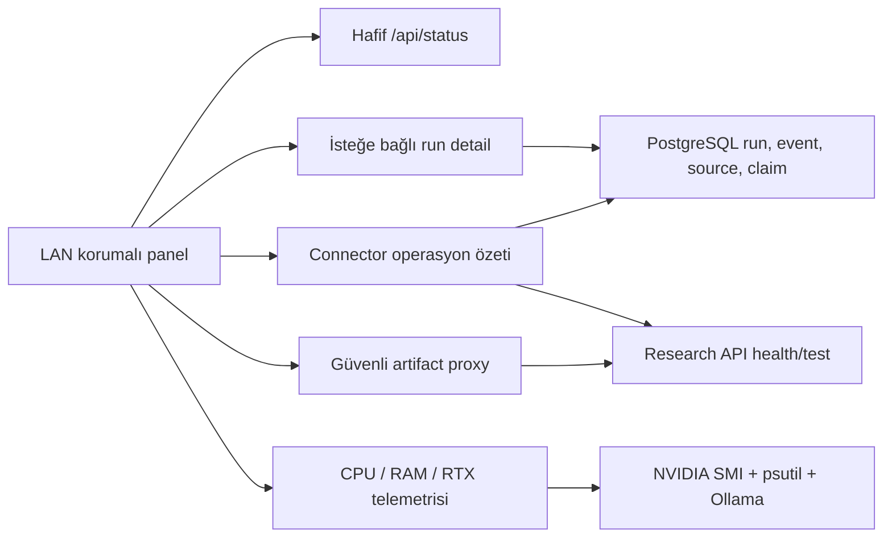

# Kontrol paneli operasyon merkezi — uygulama raporu

Belge sürümü: `1.0`

Platform sürümü: `v0.6.1`

Tarih: `2026-07-17`

## Sonuç

Minimal servis paneli, araştırma kalitesini ve bilgi toplama kararlarını açıklayabilen bir operasyon
merkezine dönüştürüldü. Ana durum isteği hafif tutuldu; kaynaklar, event’ler ve query branch ayrıntıları
yalnız kullanıcı bir araştırmayı açtığında yüklenir.

## Yeni ekranlar

### Araştırma ayrıntısı

- LangGraph aşama zaman çizelgesi, tur ve aşama süresi.
- Raw provider hit → dedup → tarih filtresi → edinim → nihai kaynak hunisi.
- `accept / reserve / reject` admission dağılımı.
- Query branch bazında sorgu, connector, sonuç, başarı ve toplam gecikme.
- Sentinel recall, estimated completeness, relative recall, citation novelty ve reserve false-negative.
- Kaynak başlığı, URL, persistent ID, aile, connector, keşif yöntemi, relevance ve branch provenance.
- LLM çağrı/token/hız, claim ve evidence-link özeti.
- Son 150 yapılandırılmış event ve checkpoint geçmişi.
- Run artifact’larını API token’ını tarayıcıya vermeden indirme.

### Connector operasyon görünümü

- Connector health ve degraded/disabled ayrımı.
- Credential gereksinimi ve yalnız eksik değişken adları; değerler gösterilmez.
- Son 2.500 connector event’inden çağrı başarı oranı.
- Toplam sonuç ve kabul edilmiş kaynak katkısı.
- Ortalama ve p95 gecikme.
- 429, 403, timeout, connection ve citation hata sınıfları.
- Son başarı/hata zamanı ve tek connector bağlantı testi.

### Donanım

- CPU, RAM ve platform diski kullanımı.
- RTX 4060 kullanım, VRAM, sıcaklık, anlık/limit güç.
- Ollama’da bellekte yüklü model ve model VRAM’i.
- Telemetri panel yenilemesinden bağımsız araştırma işlerini değiştirmez.

## Güvenlik

- CIDR allowlist, Trusted Host, CSP ve `X-Frame-Options: DENY` korunmuştur.
- Yönetim ve veri endpoint’leri geçici `X-Control-Token` gerektirir.
- Research API bearer token HTML veya JavaScript’e yazılmaz.
- Artifact indirme panel backend’i üzerinden yetkili proxy olarak yapılır.
- Kaynak ham içeriği panelde gösterilmez; yalnız denetlenebilir metadata gösterilir.
- Credential değerleri hiçbir connector cevabına eklenmez.

## Performans yaklaşımı

- `/api/status` yalnız süreç, kuyruk, kısa run listesi ve sistem telemetrisi getirir.
- Ağır run verisi `/api/runs/{id}/detail` çağrısında istek üzerine alınır.
- Connector operasyon sorgusu ayrı sekme açıldığında çalışır.
- Run detail en fazla 5.000 event, 500 kaynak ve son 150 görünür event ile sınırlıdır.
- Connector istatistiği son 2.500 event ve 5.000 kaynakla sınırlandırılmıştır.

## Doğrulama

- Ruff: geçti.
- Tam test paketi: `103 passed`.
- Timeline süre, kaynak hunisi, admission, connector success/latency/error ve LLM hız özetleri için
  deterministik testler eklendi.
- Run detail’in gerçek test veritabanından timeline, funnel, branch ve quality üretmesi doğrulandı.
- LAN guard, control token ve servis aksiyonu regresyon testleri korunmuştur.

