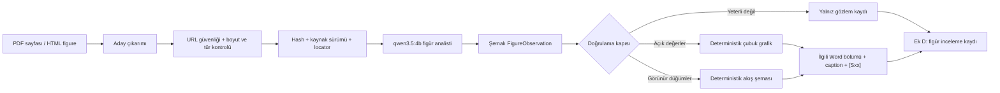

# Kaynak Figürü Anlama ve Word Raporlama Katmanı

Platform sürümü: `v0.9.0`

Belge sürümü: `1.0`

Tarih: `2026-07-29`

## Sonuç

Research Platform artık yalnız kaynak metnini değil, PDF ve HTML içinde karşılaştığı
araştırma figürlerini de inceleyebilir. Uygun figürler kaynak kimliği, sürüm, hash,
sayfa ve caption ile kaydedilir; görünür veri veya süreç adımları doğrulandıktan
sonra rapor için deterministik biçimde yeniden çizilir. Özgün yayın görseli Word
dosyasına kopyalanmaz.

Ana sentez modeli değiştirilmedi. Kurulu `qwen3.5:4b`, RTX 4060 üzerinde yalnız
figür analisti olarak ve ana modelden sonra sıralı çalışır. Böylece görsel anlama
eklenirken iki model aynı anda VRAM tüketmez.

## Mimari

## Kalite ve güvenlik kapıları

- Görselde açıkça yazılmayan sayılar `data_points` alanına alınmaz.
- Yaklaşık veya okunamayan değerlerden grafik üretilmez.
- Çubuk grafik için en az üç açık değer, yeterli konu ilgisi ve en az `0,70`
  analiz güveni gerekir.
- Akış şeması yalnız görünür ve etiketli 3–7 düğümden yeniden çizilir.
- Kaynağa özgü 1–5 puan ölçeği klinik duyarlılık, özgüllük veya AUC yüzdesi
  olarak yorumlanamaz; bulgu ve sınırlılık kaydı otomatik düzeltilir.
- Kaynak sayfasındaki metin güvenilmeyen veri kabul edilir ve komut olarak
  yürütülmez.
- HTML görsel URL'leri edinimden önce ve redirect sonrasında SSRF politikasından
  geçer.
- Özgün yayın görseli yalnız iç provenance nesnesi olarak saklanır; teslim
  raporuna yayınevi görseli kopyalanmaz.

## Word yerleşimi

Figürler rapor sonuna topluca eklenmez. Her `GeneratedResearchFigure`, sentez
bölümünün semantik başlığıyla eşleştirilir:

- süreç veya akış şeması → `Yaklaşımlar ve yöntemler`,
- karşılaştırmalı çubuk grafik → `Bulgular ve karşılaştırmalı sonuçlar`,
- yeniden çizilemeyen fakat yararlı gözlem → ilgili metinsel callout veya `Ek D`.

Her figür inline yerleşir; açıklaması hemen altındadır, `[Sxx]` kaynak etiketi ve
alternatif metni vardır. Bölüm eşleştirmesi ortak tek kelimeyle yapılmaz; bu sayede
“Temel bulgular” ve “Bulgular ve karşılaştırmalı sonuçlar” gibi başlıklarda aynı
grafik tekrarlanmaz.

## Canlı doğrulama

Doğrulama araştırması: `01KYPBWB45RSQ0EFCC5FVRKGCZ`

Canlı kaynaklarda sistem:

1. PDF sayfa 3'teki beş adımlı veri ön işleme akışını okudu ve Türkçe,
   deterministik bir akış şemasına dönüştürdü.
2. PDF sayfa 7'deki üç açık değeri (`4,5`, `4,2`, `4,7`) algıladı.
3. Dikey eksenin yazar tanımlı `1–5 etkinlik puanı` olduğunu korudu; değerlerin
   klinik performans yüzdesi olmadığını Word caption'ına ve audit kaydına yazdı.
4. Karmaşık bir ürün/yetenek matrisini anlayıp bulgu ve sınırlılık kaydına aldı,
   fakat güvenli bir yeniden çizim şeması olmadığı için yeni grafik üretmedi.

Canlı export `24` artifact üretti. Word belgesi:

- `4` inline görsel içeriyor: iki literatür açıklama görseli ve iki
  kaynak-figürü rekonstrüksiyonu,
- `4/4` görsel için alternatif metin taşıyor,
- bütün tablolar sabit `9360` twip sayfa genişliğine uyuyor,
- erişilebilirlik denetiminde `high=0`, `medium=0`, `low=0` verdi,
- `v0.9.0` pipeline bilgisini ve figür provenance ekini içeriyor.

Regresyon sonucu: `154 passed`, Ruff sonucu: temiz.

## Çıktılar

- `16_research_report.docx`: sentez raporu ve bağlamsal figürler
- `17_figure_observations.json`: bütün figür analizleri ve provenance
- `17a_source_figure_reconstruction.png`: güvenli puan grafiği rekonstrüksiyonu
- `17b_source_figure_reconstruction.png`: süreç akışı rekonstrüksiyonu
- `result_bundle.zip` ve `research_bundle.zip`: teslim paketleri

## Bilinen sınır

Bu bilgisayarda LibreOffice/`soffice` bulunmadığından DOCX'in sayfa PNG'lerine
dönüştürülmesi gerçekleştirilemedi. Buna karşılık OOXML yapısı, inline görsel
yerleşimi, alternatif metinler, tablo geometrisi ve erişilebilirlik otomatik
denetimlerle doğrulandı.
