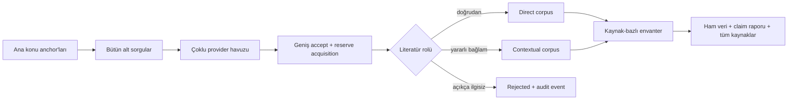

# Yüksek-Recall Literatür Tarama Uygulama Raporu

- Belge sürümü: `1.0.0`
- Platform sürümü: `v0.7.0`
- Tarih: `2026-07-21`
- Önceki karşılaştırma run'ı: `01KY00P7TRX8S53ASDTD371MZ4`
- Nihai canlı kabul run'ı: `01KY1RGA8BS60AYFP14QQ3AQ37`

## 1. Amaç

Platformun varsayılan davranışını “nihai cevap için birkaç kaynak seç” yaklaşımından,
“mümkün olduğunca geniş bir ilgili literatür envanteri oluştur, her kaynağın ne söylediğini
ayrı göster ve yalnız açıkça alakasız olanı dışla” yaklaşımına geçirmek.

Ana ürün çıktısı artık yalnız desteklenmiş claim listesi değildir. Bütün kabul edilen
kaynaklar ham veri, kaynak kataloğu ve kaynak-bazlı literatür envanterinde korunur.

## 2. Yeni davranış

- `ResearchProtocol.research_mode` eklendi.
- Varsayılan `literature_scan`; eski katı precision davranışı `focused_answer` olarak korunur.
- Alt soru ana konuyu içermese bile provider query ana sorunun konu anchor'larını miras alır.
- AgentSearch ve genel web recovery sorguları güvenli uzunluğa sıkıştırılır.
- Bilinmeyen yayın tarihi literatür modunda dışlama değil provenance uyarısıdır.
- Deterministik relevance kapısı exact akademik başlık bigram'ını zorunlu tutmaz.
- Yerel LLM, doğrudan ve bağlamsal literatürü koruyan yüksek-recall classifier olarak çalışır.
- LLM yalnız merkezî konusu açıkça ilgisiz belgeyi düşük skorla dışladığında hard reject uygulanır.
- Düşük metadata puanlı reserve havuzunun acquisition kotası genişletildi.
- Recovery görevleri daha fazla acquisition slotu alır.
- Coverage erken yeterli görünse veya normal gap görevleri tükense bile süre kalıyorsa
  systematic review, external validation, negative result, guideline ve replication
  stratejileriyle yeni tarama yapılır.
- `max_sources: null` iken yapay kaynak tavanı yoktur.

## 3. Yeni çıktı sözleşmesi

`15_literature_inventory.md` her kabul edilen kaynak için şunları üretir:

- başlık ve URL,
- kaynak ailesi ve connector,
- direct/contextual literatür rolü,
- yayın tarihi ve yayın türü,
- kalıcı kimlik,
- discovery ve içerik relevance,
- doğrulanmış claim ve kısa passage veya metadata özeti,
- claim çıkarılamadıysa kaynağın ham paket içinde korunduğu bilgisi.

`05_source_catalog.csv` de literatür rolü, tarih, içerik relevance, evidence claim sayısı ve
raporlanabilir claim sayısıyla genişletildi. Yeni envanter hem raw hem result teslimatının
parçasıdır. Toplam artifact sayısı 18'dir.

## 4. Canlı önce–sonra karşılaştırması

Her iki koşu da sağlıkta yapay zekâ alanında multimodal vision-language modellerinin
radyolojide klinik doğrulama, güvenlik ve gerçek yaşam kanıtlarını araştırdı.

| Ölçüm | Eski davranış | v0.7.0 kabul |
|---|---:|---:|
| Toplama bütçesi | kısa kontrollü koşu | 2 dakika |
| Acquisition çağrısı | 42 | 83 |
| Başarılı acquisition | 35 | 80 |
| Kabul edilen kaynak | 1 | 34 |
| Direct kaynak | ölçülmüyordu | 8 |
| Contextual kaynak | ölçülmüyordu | 26 |
| Connector çeşitliliği | 1 | 5 |
| Claim | 7 | 13 |
| Artifact | 17 | 18 |
| Kaynak kartı | yok | 34/34 |
| Literatür envanteri | yok | 28.327 karakter |

Nihai 34 kaynak şu connector'lardan geldi:

- Crossref: 15
- arXiv: 10
- AgentSearch web: 7
- Europe PMC: 1
- kalıcı yerel corpus: 1

Önceki sistem tek bir JMIR preprint'ine kapanmıştı. Yeni sistem aynı konu ailesinde gerçek
yaşam pneumothorax değerlendirmesi, radyoloji rapor üretimi, HalluCXR, güvenilir medical
foundation model çalışmaları, external validation, sistematik derlemeler, guideline ve
negatif/safety literatürü dahil geniş bir envanter oluşturdu.

## 5. Precision güvenliği

Recall artışı bütün kaynakların eşit kanıt sayılması anlamına gelmez. Yalnız konu kimliğini
yüksek oranda taşıyan sekiz kaynak `direct`; daha genel yöntem, komşu klinik alan, survey,
benchmark veya transfer edilebilir safety çalışmaları `contextual` olarak işaretlendi.

Canlı envanter incelemesinde JMIR preprint sayfasındaki “cite this preprint only for review
purposes” talimatının claim'e dönüştüğü görüldü. `evidence_quality_gate` bu yeni citation-shell
varyantını da fail-closed reddedecek biçimde genişletildi. Nihai kabul envanterinde citation
talimatı bulunmadığı doğrulandı.

## 6. Coverage sonucu

Nihai run `completed_incomplete` olarak tamamlandı:

- kaynak ailesi coverage: `1.0`
- query branch coverage: `0.625`
- claim audit coverage: `1.0`
- discovery observation: `34`
- estimated completeness: `0.0588`
- unresolved major claim: `8`

Bu durum hata değildir. İki dakikada kaynak sayısı ciddi biçimde artmış olsa da sistem
literatürün tamamlandığını iddia etmemiştir. Düşük estimated completeness, daha uzun süre,
çalışan citation provider'ları ve ek akademik connector gerektiğini açıkça gösterir.

## 7. Doğrulama

- Ruff: temiz.
- Tam regresyon: `141 passed`.
- Canlı run: `01KY1RGA8BS60AYFP14QQ3AQ37`.
- Acquisition: `83` çağrı, `80` başarılı.
- Corpus: `34` kaynak; `8 direct`, `26 contextual`.
- Envanter: `34/34` kaynak kartı.
- Citation-shell regresyonu: envanterde bulunmadı.
- Kaynak limiti: uygulanmadı.
- Toplama sonrasında normalizasyon, evidence, audit, synthesis ve export tamamlandı.

## 8. Kalan geliştirme alanları

- OpenAlex credential'ı ve authenticated Semantic Scholar etkinleştirilmelidir.
- PubMed/PMC, OpenCitations, Unpaywall ve CORE ile akademik recall genişletilmelidir.
- 34 kaynağın LLM relevance sınıflaması şu anda seri çalıştığı için NORMALIZE uzun sürmektedir;
  bounded concurrency veya batch classifier uygulanabilir.
- Contextual havuzda komşu sağlık alanları bilinçli olarak korunur; kullanıcı isterse domain,
  çalışma türü ve evidence-grade filtreleriyle görünümü daraltabilmelidir.
- Kaynak kartlarının bir kısmı yalnız metadata özeti taşır. Her kaynak için yapılandırılmış
  amaç–yöntem–örneklem–bulgu–sınırlama çıkarımı sonraki kalite katmanıdır.
- “Bütün literatür bulundu” iddiası ancak uzman etiketli golden corpus ve sentinel DOI setleriyle
  alan bazında doğrulanabilir.

## 9. Kabul kararı

v0.7.0, platformun ürün amacını kaynak seçen cevap ajanından yüksek-recall literatür toplama
altyapısına taşımıştır. Aynı test ailesinde `1 → 34` kaynak artışı ve 34 kaynağın tamamının
ayrı kartla teslim edilmesi ana davranış değişikliğini doğrulamaktadır. Precision güvenliği
direct/contextual ayrımı ve fail-closed evidence gate ile korunmuştur.

