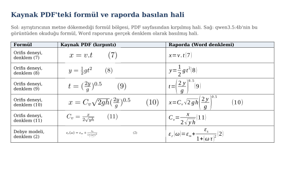

# Formül okuma, görsel yer tutucuları ve HTML kaçışı

Tarih: `2026-09-11`. Dal: `developments-supplementer`. Taban commit: `6e0d7ea`.
Durum: kod ve testler tamam; yalıtık deneme koşusu sürüyor (sonuçlar aşağıda
doldurulacak); canlıya henüz alınmadı.

## Sorun

PDF'lerde iki şey metne yanlış giriyordu:

- **Formüller kayboluyordu.** Docling formülü buluyor ama okumuyordu; passage'a yalnızca
  `<!-- formula-not-decoded -->` yorumu giriyordu. Canlıda 114 PDF'in 36'sında bu işaret
  vardı.
- **HTML karakterleri bozuk geliyordu.** `pH < 5.8` metne `pH &lt; 5.8` olarak giriyordu.
  Canlıda 114 PDF'in 68'inde.

Görseller de aynı şekilde passage'a `<!-- image -->` yorumu olarak giriyordu.

## Ne yaptık

- **HTML karakterleri düzeldi.** Docling artık metni kaçışsız veriyor: `pH < 5.8`.
- **Passage'a HTML yorumu girmiyor.** Formül yerine `[formül N]`, görsel yerine
  `[görsel N]` yazılıyor; küçük ikonlar atılıyor. Her yer tutucunun sayfadaki konumu
  saklanıyor.
- **Formüller okunuyor.** Araştırmanın kullandığı passage'larda formül varsa, formül
  sayfa görüntüsünden kırpılıp `qwen3.5:4b` ile LaTeX olarak okunuyor ve iddia çıkarılırken
  LLM'e bağlam olarak veriliyor. Okuma kaynak metne yazılmıyor, belgelerin kimliğini
  (`content_hash`) değiştirmiyor.
- **Formüller raporda görünüyor.** Word raporunda gerçek denklem olarak (sentez
  raporunda "Ek F. Formül okuma kaydı"), markdown raporunda `$…$` olarak. Denkleme
  çevrilemeyen ya da satıra sığmayan formül kaynaktaki görüntüsüyle basılıyor.
- Formül okuma bir ayarla açılıp kapanıyor (`FORMULA_RESOLUTION_ENABLED`), varsayılan
  **kapalı**.

## Değerlendirilen seçenekler

12 PDF'teki 24 formül üzerinde ölçüldü.

| Seçenek | Ölçüm | Karar |
|---|---|---|
| Docling'in kendi formül modeli (CodeFormulaV2) | 24 formülün 22'si doğru, sonuçlar tekrarlanabilir. Ama ekran kartında **+0,6 GB kalıcı, formüllü sayfada 3–5 GB anlık** ek bellek; imaja C derleyicisi (gcc) gerekiyor, derleyici yoksa hata vermeden formülleri okumadan geçiyor. Formül başına ~1,75 sn. | Reddedildi: 8 GB'lık kart Ollama ile paylaşılıyor, birlikte sığmıyor. |
| Formül bölgesine PDF'in metin katmanını (pdf-inspector / PyMuPDF) koymak | Metin katmanında formül karakteri yok; örneğin bir sayfadaki 6 formülün 6'sı tamamen boş. | Geçersiz: kurtarılacak metin yok. |
| **Docling'in bulduğu formül bölgesini kırpıp `qwen3.5:4b`'ye okutmak** | 24 formülün **23'ü doğru** (bir formülde terim eksik); formül başına ~1,5 sn; **ek bellek yok** (model rapor aşamasında zaten yüklü); okunaklı çıktı (`\text{NaOH}` gibi). | **Seçildi.** |

## Süreçte bulunan ve düzeltilen sorunlar

| Sorun | Çözüm |
|---|---|
| Yerel dal güncel değildi; canlı sistem ayrı bir kopyadan ve daha yeni koddan çalışıyor. | Dal güncellendi, değişiklikler çakışmadan üstüne oturdu; canlıya bu kopyadan hiçbir şey kurulmadı. |
| İddia çıkarma aşamasında PDF'in kendisine erişilemiyordu. | PDF ve formül konumları kaydedilmiş kaynaktan okunuyor. |
| Word'ün sentez raporu kanıt alıntılarını hiç basmıyor; formül rapora hiç düşmeyecekti. | Rapora "Ek F. Formül okuma kaydı" eklendi. |
| Model alıntıyı formülden hemen önceki cümlede kesiyor. | Ek F alıntıya değil, kanıtın geldiği passage'a bakıyor. |
| Word'de karekökler boş basılıyordu (dönüştürme kütüphanesindeki bir hata). Önceki basım testi bunu yakalamamıştı. | Hata onarıldı; basım testi artık her formülün tamamının basıldığını kontrol ediyor. |
| Çok uzun formüller sayfa kenarında kesiliyordu. | Satıra sığmayan formül kaynaktaki görüntüsüyle basılıyor. |
| Okunamayan ya da formül olmayan kırpıntılar (düz metin, yalnız denklem numarası) formül sanılabiliyordu. | Kabul kuralı: matematik işareti olmayan okuma reddediliyor. |

## Doğrulama

| Kontrol | Sonuç |
|---|---|
| Test takımı | **1115 test geçiyor**, 4 atlanıyor (59'u bu işin yeni testi; dalın en güncel haliyle birleşmiş kod üzerinde). |
| Formül ve görsel konumları | 211 sayfada her işaret doğru konumla eşleşti (211/211). |
| HTML karakterleri | 16 PDF'te eski ve yeni çıktının tek farkı düzelen karakterler. |
| Hız | PDF ayrıştırma süresi değişmedi. |
| Uçtan uca deneme (gerçek bileşenler) | 5 formül 3,5 sn'de okundu; LLM formülü iddiada kullandı (*"…is equal to: x = v . t"*); Word'de 5 formülün 5'i doğru basıldı; ekran kartı belleği en fazla 5,6 / 8 GB. |

## Deneme ortamında doğrulama

Canlıdan ayrı bir deneme ortamı kuruldu: kendi veritabanı ve dosya deposu olan, canlıya
bağlı olmayan ayrı bir kopya; formül okuma açık.

**Kısa araştırma koşusu (formüle ulaşmadı).** Arama yalnız 4 kaynak getirdi ve dördü de
konu dışıydı; uygunluk denetimi hepsini doğru olarak eledi, hiçbir PDF işlenmedi. Sebep
deneme ortamında web aramasının olmaması (canlıda PDF'lerin çoğu buradan geliyor) ve çok
dar tutulan bütçe; bu değişiklikle ilgili değil.

**Hat testi (formül yolu doğrudan).** Formüllü olduğu bilinen iki PDF, deneme ortamının
içinden gerçek hattan geçirildi: Docling servisi → formül okuma (Qwen) → veritabanı ve
dosya deposu → iddia çıkarma → Word raporu.

| Ölçüt | Sonuç |
|---|---|
| Ayrıştırma | İki belge de Docling'den geçti; 109'da 6 `[formül N]`, data_12'de 3 `[formül N]` + 1 `[görsel N]`; HTML yorumu ve bozuk karakter kalmadı |
| Formül okuma | 9 formülün 9'u kabul edildi (toplam model süresi 22 sn, ilk yükleme dahil); okumalar veritabanına, kırpıntılar dosya deposuna yazıldı |
| İddia çıkarma | LLM formülleri kullandı, örn. *"Equation (10) can be rearranged to find C_v: C_v = x / (2√(yh))"* |
| Word raporu | "Ek F. Formül okuma kaydı"nda 8 formül gerçek denklem olarak basıldı (iki kaynaktan) |
| Görülen hata | data_12'nin bir formülünü model eksik okudu (daha önce tespit edilen aynı formül); rapora öyle girdi — bkz. Bilinen sınırlar |

Aşağıdaki görsel yapılan işi özetliyor: solda, ayrıştırıcının metne dökemediği formülün PDF
sayfasından kırpılmış hali; sağda, Qwen'in bu görüntüden okuduğu formülün Word raporuna
gerçek denklem olarak basılmış hali (LibreOffice ile basıldı).

## Bilinen sınırlar

- Formüllü PDF'lerin aramadan gelip bütün aşamalardan geçtiği tam bir araştırma koşusu
  henüz yapılmadı; formül okuma açılmadan önce böyle bir koşu izlenmeli.
- Word basımı LibreOffice ile kontrol edildi; Microsoft Word'ün kendisinde bakılmadı.
- Model 24 formülden birini yanlış okudu; raporda kaynakla karşılaştırılmadan fark edilmez.
- Görselin içine gömülü formüller (Docling'in formül olarak işaretlemediği) okunmaz.
