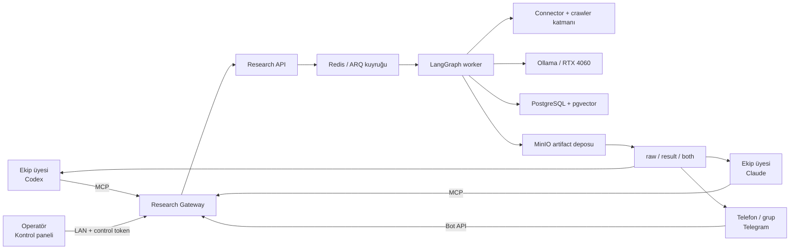
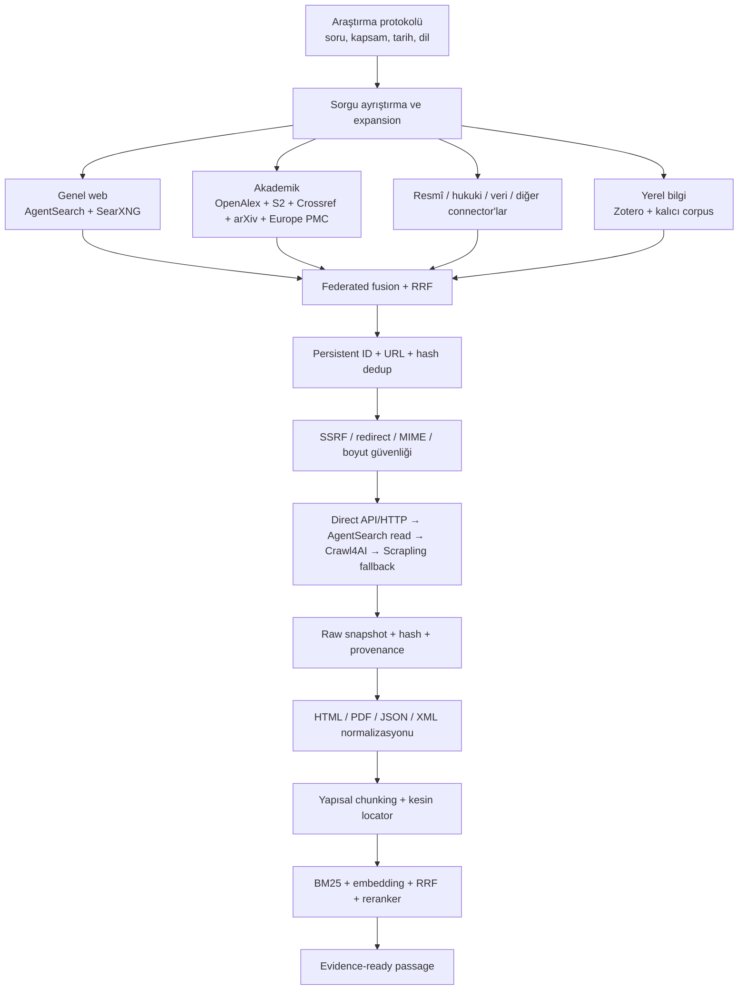
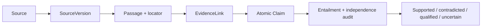
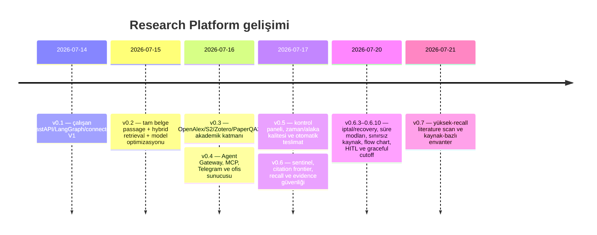

# Research Platform — Yeni Nesil Yerel Araştırma Altyapısı

- Belge sürümü: `1.1.0`
- Platform sürümü: `v0.7.0`
- Tarih: `2026-07-21`
- Belge türü: Ana ürün, mimari ve mühendislik anlatısı
- Çalışma ortamı: Windows ofis sunucusu, RTX 4060 8 GB, Ollama

## 1. Bir cümlede proje

Research Platform; interneti, akademik veri tabanlarını, resmî kaynakları ve kurumun yerel
bilgi birikimini tarayan; bulduğu içeriği kaynak sürümü ve kesin pasaj konumuyla kanıta
dönüştüren; bu kanıtı yerel rapor, ham veri veya ikisi birlikte olacak şekilde Codex,
Claude ve Telegram üzerinden bütün ofisin kullanımına sunan yerel-first bir **Research
Gateway**'dir.

Bu proje yalnız “soru sor, cevap al” biçiminde çalışan bir chatbot değildir. Araştırmayı
kalıcı durumu, bütçesi, denetim izi, kaynak kataloğu, claim ledger'ı ve yeniden üretilebilir
çıktıları olan bir mühendislik sürecine dönüştürür.

> Projenin esas yeniliği tek bir yerel modelin ne kadar zeki olduğu değil; farklı kullanıcıların
> ve daha güçlü genel amaçlı ajanların aynı doğrulanabilir kanıt altyapısını paylaşabilmesidir.

## 2. Neden etkileyici?

Birçok “deep research” demosu arama yapar, metinleri modele ekler ve tek bir cevap üretir.
Research Platform ise araştırmayı üç ayrı ürüne ayırır:

1. **Bilgi toplama sistemi:** En iyi kaynakları bulur, edinir, temizler, parçalar ve indeksler.
2. **Kanıt sistemi:** İddiaları gerçek kaynak pasajlarına bağlar, destek ve çelişkiyi ayırır.
3. **Agent gateway:** Aynı araştırmayı insanlara, Telegram'a, Codex'e ve Claude'a uygun
   biçimlerde teslim eder.

Bu ayrım sayesinde yerel Qwen modeli araştırmayı hazırlayabilir; fakat Codex veya Claude
isterse yerel sentezi nihai gerçek kabul etmek zorunda kalmaz. Ham kaynakları ve seçilmiş
pasajları alıp kendi muhakemesiyle yeniden sentezleyebilir. Böylece RTX 4060 üzerinde çalışan
yerel sistem ile daha güçlü genel amaçlı ajanlar birbirinin rakibi değil, aynı takımın farklı
uzmanları olur.

## 3. Ofiste gerçek kullanım modeli

Ofiste bir ekip üyesi kendi Codex veya Claude kurulumundan araştırma başlatabilir. Başka bir
ekip üyesi aynı anda Telegram'dan yeni iş gönderebilir. İşler Redis kuyruğunda kalıcı run
kimliğiyle sıraya girer. RTX 4060'ın belleğini taşırmamak ve sonuçları birbirine karıştırmamak
için ağır yerel model işleri güvenli biçimde worker tarafından yönetilir.

Araştırmayı başlatan kişi:

- run durumunu ve aktif aşamayı görebilir,
- duraklatabilir, devam ettirebilir veya iptal edebilir,
- yalnız ham veriyi, yalnız sonucu ya da ikisini birlikte isteyebilir,
- iş tamamlanınca doğrulanmış ZIP paketini indirebilir,
- ekip istemci paketiyle çıktıları masaüstündeki klasöre otomatik eşitleyebilir.

Bu entegrasyon prototip düzeyinde bırakılmadı. Sunucu bu bilgisayarda çalışan bir ofis
servisine dönüştürüldü; istemci kurulum scriptleri, Wi-Fi erişimi, kimlik doğrulama, otomatik
başlatma, firewall yardımcıları, masaüstü rapor eşitleme ve operasyon paneli geliştirildi.

## 4. Kullanıcı açısından erişim kolaylığı

Sistemin gücü yalnız arka plandaki mimariden değil, farklı teknik seviyedeki insanlara uygun
erişim yüzeyleri sunmasından gelir.

| Kullanıcı | Arayüz | Yapabildikleri |
|---|---|---|
| Araştırmacı / uzman | Telegram | Soru gönderme, süre seçme, HITL yanıtı, durum, indirme |
| Codex kullanıcısı | MCP araçları | Araştırma başlatma, izleme, ham veriyi parçalı okuma, yeniden sentez |
| Claude kullanıcısı | MCP araçları | Aynı kalıcı run ve teslimat sözleşmesini kullanma |
| Operatör | Kontrol paneli | Servis, kuyruk, run, connector, log, GPU ve artifact yönetimi |
| No-code kullanıcı | Langflow | Sabit ve güvenli bileşenlerle protokol → run → izleme → indirme akışı |
| Geliştirici | REST/OpenAPI | Protokol, connector, corpus, claim, coverage ve artifact API'leri |

Telegram'da süre yazılmazsa dört anlaşılır araştırma modu gösterilir: Hızlı, Standart,
Derin ve Maksimum. İleri kullanıcı süreyi doğrudan dakika olarak yazabilir. Kaynak sayısı
isteğe bağlıdır; boş bırakıldığında yapay bir global kaynak tavanı uygulanmaz ve sistem süre
bütçesi içinde taramaya devam eder.

`max_wall_minutes` bir “cevabı yarıda kes” düğmesi değildir. Bu süre yalnız bilgi toplama
bütçesidir. Süre dolduğunda tamamlanmış belgeler korunur ve normalizasyon, kanıt çıkarma,
denetim, sentez ve export tamamlanana kadar çalışır.

## 5. Yeni nesil agent tasarımı

### 5.1 Tek prompt değil, kalıcı durum makinesi

```mermaid
flowchart LR
    I["INIT"] --> V["VALIDATE_PROTOCOL"]
    V --> D["DECOMPOSE"]
    D --> B["BUILD_QUERY_BRANCHES"]
    B --> S["SEARCH"]
    S --> A["ACQUIRE"]
    A --> N["NORMALIZE"]
    N --> P["CHUNK + INDEX"]
    P --> E["EXTRACT_EVIDENCE"]
    E --> C["ANALYZE_CLAIMS"]
    C --> G["CHECK_COVERAGE"]
    G -->|"yetersiz"| R["PLAN_RECOVERY"]
    R --> S
    G -->|"yeterli / bütçe sonu"| AU["AUDIT"]
    AU --> AR["ADVERSARIAL_REVIEW"]
    AR --> SY["SYNTHESIZE"]
    SY --> X["EXPORT"]
    X --> CO["COMPLETE"]
```

LangGraph akışı her önemli karar noktasını görünür bir düğüm haline getirir. State ve
checkpoint'ler PostgreSQL'de tutulur. Worker kapanırsa çalışma kaybolmaz; yeniden kuyruğa
alınabilir. Pause, resume ve cancel yalnız güvenli sınırlarda uygulanır. SEARCH ve ACQUIRE
sırasında da kısa aralıklarla kontrol edilerek takılı kalan I/O'nun iptali sağlanır.

### 5.2 İnsan ve agent birlikte çalışabilir

Araştırma protokolünde dört Human-in-the-Loop noktası ayrı ayrı açılabilir:

- araştırma öncesi kapsam soruları,
- sorgu planının onayı veya düzeltilmesi,
- bulunan kaynak/domain seçiminin incelenmesi,
- final rapor taslağının onayı veya yönlendirilmesi.

İnsan beş dakika içinde cevap vermezse GPU ve worker boş yere tutulmaz. İş `paused` olur,
interaction ve state PostgreSQL'de korunur. Yanıt geldiğinde kaldığı yerden devam eder;
insanın bekleme süresi araştırma bütçesinden düşülmez.

### 5.3 Yerel ajan sonuç üretir, güçlü ajan karar verebilir

MCP teslimatı üç modludur:

| Mod | Teslim edilen | En uygun kullanım |
|---|---|---|
| `raw` | Ham kaynak, sürüm, provenance, normalize passage, katalog, manifest | Codex/Claude'un kendi sentezi |
| `result` | Yönetici özeti, rapor, evidence matrix, claim ledger, audit | Hızlı insan incelemesi |
| `both` | Ham veri + yerel sentez | En yüksek denetlenebilirlik |

Büyük ham veri tek bir MCP mesajıyla context penceresine dökülmez. Offset ve karakter
bütçesiyle parça parça okunur. Bu, agent-to-agent iletişimde context yönetimini ürünün
merkezine koyan önemli bir tasarım kararıdır.

## 6. Bilgi toplama mimarisi

### 6.1 Dokuz kaynak ailesi

Connector registry web, akademik, kitap/tez, patent/standart, resmî/hukuki, haber/arşiv,
kod/veri, şirket ve grey literature ailelerini ortak bir sözleşme altında toplar. Her
connector capability, credential gereksinimi ve health durumunu bildirir. Anahtarı olmayan
connector sistemi düşürmez; `disabled` veya `degraded` olarak görünür.

### 6.2 Akademik bilgi katmanı

- OpenAlex: DOI, yeniden oluşturulan abstract, OA konumu, sürüm, retraction ve citation.
- Semantic Scholar: S2/CorpusId/DOI/PMID eşleme, ileri–geri citation traversal, açık PDF.
- Crossref: DOI ve yayın metadata keşfi.
- arXiv ve Europe PMC: preprint ve biyomedikal yayın keşfi.
- Zotero Local/Web: ekip kütüphanesi, attachment, tam metin, collection ve tag filtreleri.
- PaperQA2: native hattı değiştirmeyen opsiyonel shadow evidence backend'i.

Aynı çalışma DOI, PMID, PMCID, arXiv, OpenAlex, S2 ve Zotero kimlikleri üzerinden tek
`Source` altında birleştirilir; sağlayıcı cevapları ayrı provenance snapshot'ları olarak
korunur. Preprint ile yayımlanmış sürüm birbirine bağlanabilir. Citation graph PostgreSQL'de
kalıcıdır.

### 6.3 Web'de gezinme ve edinim

AgentSearch/SearXNG URL keşfi yapar. Doğrudan API veya açık HTTP içerik ilk tercihtir.
AgentSearch `/read` yeterli olmazsa Crawl4AI dinamik/yapısal sayfayı işler. Scrapling yalnız
kontrollü HTTP fallback'tir; stealth, paywall aşma veya anti-bot saldırısı açılmaz.

Ham snapshot MinIO'da tutulur. Final URL, redirect zinciri, MIME, dil, edinim stratejileri,
SHA-256 ve zaman bilgisi provenance'a yazılır. Böylece araştırma yalnız bir link listesi
değil, yeniden incelenebilir veri paketi olur.

## 7. Uzun belgeler ve retrieval

Projenin erken sürümünde her belgenin yalnız ilk 12.000 karakterinin modele verilmesi önemli
bir kalite sınırıydı. Bu yaklaşım tamamen kaldırıldı.

Bugünkü sistem:

1. Belgenin tamamını başlık ve bölüm hiyerarşisini koruyarak normalize eder.
2. Yaklaşık 700 token hedef ve 100 token örtüşmeyle yapısal passage'lar üretir.
3. Her passage için kaynak sürümü, SHA-256, bölüm yolu, sayfa ve özgün karakter aralığını saklar.
4. BM25 sözcüksel arama ile yerel embedding aramasını birlikte çalıştırır.
5. Sonuçları Reciprocal Rank Fusion ile birleştirir.
6. Soru kapsamı, prose kalitesi, bölüm ve doküman çeşitliliğiyle yeniden sıralar.
7. LLM'e bütün dokümanı değil, en ilgili passage ve gerekli komşu bağlamı verir.

`embeddinggemma:300m-qat-q4_0` araştırmayı yapan ikinci bir dil modeli değildir; yalnız
passage'ları vektör uzayına taşıyan küçük embedding modelidir. Muhakeme ve kanıt çıkarma
varsayılan olarak `qwen3:4b-instruct-2507-q4_K_M` ile yürür.

Sınırlı golden kabul setinde bu değişiklik kritik bilgi recall'unu `3/9`dan `9/9`a çıkardı;
90 evidence link'in tamamı seçilen passage ve özgün belge karakter aralığında doğrulandı.
Bu sonuç güçlü bir regresyon kanıtıdır; bütün internet için evrensel `%100 recall` iddiası
değildir.

## 8. Kanıt merkezli araştırma kalitesi

Research Platform araştırma kalitesini “güzel görünen cevap” olarak değil, aşağıdaki zincirin
sağlamlığı olarak tanımlar:

Her önemli iddia için kaynak, sürüm, kısa verbatim alıntı, bölüm/sayfa/karakter konumu,
entailment yönü ve güven değeri tutulur. Destekleyen ve çelişen kanıtlar ayrılır. Kaynakların
yazar, kurum, veri seti ve citation-chain bakımından gerçekten bağımsız olup olmadığı ayrıca
işaretlenir.

### 8.1 Fail-closed kanıt güvenliği

Sistem References, Bibliography, How to Cite, footer, yazar bilgisi, menü, “View PDF” ve
benzeri kabuk metinlerinden iddia üretmez. Bibliyografik kayıt, kaynak başlığı veya soru
başlığı tek başına kanıt sayılmaz. `qualified` veya `supported` bir claim için en az bir
geçerli destek passage'ı gerekir.

Sentez yalnız kalite kapısını geçen claim ve alıntıları görebilir. Hiç raporlanabilir iddia
yoksa modelden bunu yaratıcı biçimde doldurması istenmez. Coverage yetersizse çalışma
`completed_incomplete` olarak biter ve eksikler belirsizlik raporunda görünür kalır.

Bu davranış projenin en değerli özelliklerinden biridir: sistem eksik araştırmayı başarılı
gibi pazarlamak yerine kendi yetersizliğini denetlenebilir biçimde teslim eder.

### 8.2 Recall ve completeness mühendisliği

- İlk turda sekiz farklı query branch.
- Connector'a özel kısa query compiler.
- Citation frontier üzerinde bütçeli derinlik `0–2` taraması.
- `accept / reserve / reject` şeklinde üç katmanlı admission.
- Bilinen kritik DOI/URL/başlık için sentinel kaynaklar.
- Coverage açığını kaynak ailesi, otorite, claim ve sorgu dalı bazında tanımlayan recovery.
- Acquisition öncesi novelty kontrolü.
- İki tur yeni kaynak oranı düşükse doygunluk değerlendirmesi.

İzlenen metrikler yalnız tek bir coverage yüzdesinden ibaret değildir: sentinel recall,
estimated completeness, relative recall, citation-frontier novelty, reserve false-negative,
critical connector coverage, source-family coverage, query-branch coverage ve claim audit
coverage birlikte görünür.

Bu metriklerin anlamı özellikle ayrılmıştır. Örneğin claim audit coverage, claim'lerin
denetlendiğini gösterir; hepsinin güçlü biçimde desteklendiğini göstermez. Beşten az anlamlı
discovery observation varsa completeness sahte biçimde `%100` yazılmaz, `null/ölçülmedi`
olarak gösterilir.

## 9. Recovery: “ilk tur yetmedi” demekle kalmayan ajan

Coverage eksikleri yapılandırılmış `CoverageGap` nesnelerine dönüşür. Planner her açık için
ayrı `SearchMission` üretir:

- eksik kaynak ailesi,
- zayıf veya tek kaynaklı major claim,
- bulunmayan karşı kanıt,
- cevapsız query branch,
- eksik otorite seviyesi,
- bulunamayan sentinel kaynak.

Recovery görevi connector, domain, authority, hedef entity, novelty ve acquisition slot
bütçesi taşır. Daha önce görülen kaynak yeniden indirilmez; provenance ve query-branch bilgisi
zenginleştirilir. Böylece araştırma turu aynı sorguyu tekrar etmek yerine teşhis edilmiş
boşluğu kapatmaya çalışır.

## 10. Kontrol paneli: servis ekranından araştırma operasyon merkezine

Kontrol paneli yalnız “servis açık mı?” ekranı değildir. Aşağıdaki görünürlükleri sağlar:

- aktif, sıradaki ve tamamlanan işler; isteğin geldiği kanal ve requester,
- 17 düğümlü flow chart ve aktif aşama ilerleme çubuğu,
- her düğümün ziyaret sayısı ve harcanan süre,
- recovery döngüsünün `PLAN_RECOVERY → SEARCH` dönüşü,
- provider hit → dedup → tarih filtresi → edinim → kabul edilmiş kaynak hunisi,
- query branch ve connector bazında sonuç, hata ve gecikme,
- `accept / reserve / reject` dağılımı,
- source catalog ve branch provenance,
- claim/evidence, coverage ve structured event geçmişi,
- connector health, credential, 429/403/timeout ve p95 gecikme,
- CPU, RAM, disk, RTX 4060 kullanım/VRAM/sıcaklık/güç ve Ollama modeli,
- API, worker, MCP ve Telegram süreçlerini başlatma/durdurma/yeniden başlatma,
- run pause/resume/cancel ve güvenli artifact indirme.

Panel ağır ayrıntıları yalnız run açıldığında yükler; ana görünüm hızlı kalır. Dar ekranlarda
flow chart yatay kaydırılabilir ve aktif düğüm erişilebilirlik semantiği taşır. API token'ı
tarayıcıya verilmez; artifact'ler panel backend'i üzerinden yetkili proxy ile indirilir.

## 11. Yerel model ve RTX 4060 mühendisliği

Model seçimi internet benchmark başlıklarına bakılarak yapılmadı. Modeller bu agent'ın gerçek
görevlerinde, RTX 4060'ın tam-GPU sınırları bulunarak ve ham çıktılar incelenerek test edildi.

İncelenen ana modeller:

- Qwen 3 4B Instruct 2507,
- Qwen 3.5 9B,
- Qwen 3.5 4B,
- Nanbeige4.1 3B.

Context, quantization, GPU/CPU offload, thinking bütçesi, structured JSON tamamlama, formatter,
VRAM ve token hızı ayrı ayrı ölçüldü. Qwen 3.5 9B, 8 GB kartta tam-GPU olarak yalnız yaklaşık
4K context'te verimli kaldığı için bırakıldı. Qwen 3.5 4B çok daha uzun context taşıyabildi;
ancak maksimum-thinking profilinde dahi evidence/entailment güvenilirliği ve gecikme dengesi
varsayılan modeli değiştirmeyi haklı çıkarmadı. Nanbeige planlama ve query üretiminde ilginç
olsa da maksimum profili rutin kullanım için çok yavaştı.

Bu nedenle varsayılan model `qwen3:4b-instruct-2507-q4_K_M` olarak korundu. Buradaki seçim
“en yeni model” yerine **bu donanımda bu pipeline için en güvenilir model** ilkesine dayanır.

Model değerlendirme metodolojisi sonradan bir modeli kazandıracak biçimde değiştirilmedi.
Öznel boyutlar keyfî ağırlıklarla tek bir sahte “zeka puanı”na dönüştürülmedi; ham çıktılar
planlama, sorgu, evidence, entailment, sentez ve güvenlik davranışı üzerinden incelendi. Hız,
VRAM, context, parser hatası ve etiketli retrieval gibi gerçekten nesnel alanlarda sayısal
ölçüm korunmuştur.

## 12. Çıktı paketi ve yeniden üretilebilirlik

Her `both` araştırması aşağıdaki denetlenebilir paketi üretir:

1. `01_executive_summary.md`
2. `02_full_research_report.md`
3. `03_evidence_matrix.csv`
4. `04_claim_ledger.jsonl`
5. `05_source_catalog.csv`
6. `06_contradiction_map.md`
7. `07_coverage_report.md`
8. `08_bibliography.bib`
9. `09_search_protocol.yaml`
10. `10_reproducibility_manifest.json`
11. `11_audit_report.md`
12. `12_uncertainty_report.md`
13. `13_raw_sources.jsonl`
14. `14_raw_passages.jsonl`
15. `15_literature_inventory.md`
16. `raw_bundle.zip`
17. `result_bundle.zip`
18. `research_bundle.zip`

Bir üst ajan yalnız raporu değil, raporu oluşturan ham veriyi ve passage zincirini de alabilir.
Bu, çıktıyı yeniden sentezlenebilir, denetlenebilir ve başka bir modele taşınabilir hale getirir.

## 13. Güvenlik ve etik sınırlar

Platform güçlü bir crawler olmakla birlikte erişim sınırlarını bilerek korur:

- Research API yalnız loopback üzerinde çalışır.
- Ofis ağına yalnız bearer ve CIDR korumalı MCP/panel yüzeyleri açılır.
- PostgreSQL, Redis, MinIO ve Ollama doğrudan LAN'a açılmaz.
- URL ve her redirect sonrasında public-IP/SSRF kontrolü yapılır.
- Yalnız HTTP/HTTPS ve izinli portlar kullanılır.
- MIME, dosya boyutu, redirect ve domain rate-limit politikası uygulanır.
- Browser worker düşük yetkili ve read-only container'dadır.
- Ham içerik güvenilmeyen veri sayılır; web sayfasındaki talimat agent komutu değildir.
- Secret'lar environment'tan okunur ve raporlarda maskelenir.
- Paywall görünürse restricted provenance tutulur; paywall aşılmaz.
- Shadow-library, Anna's Archive/Open-SLUM, Bypass Paywalls, port tarama ve exploit desteği yoktur.

Bu sınırlar araştırma kapasitesini azaltan tesadüfi eksikler değil, kurumsal kullanımı mümkün
kılan bilinçli ürün kararlarıdır.

## 14. İncelenen açık kaynak projeler ve kararlarımız

| Proje / yaklaşım | Karar | Platformdaki rol veya çıkarım |
|---|---|---|
| LangGraph | Çekirdek | Kalıcı, döngüsel, checkpoint'li araştırma state machine'i |
| AgentSearch | Servis olarak kullan | Genel web keşfi ve ilk `/read`; tek arama kaynağı değil |
| Crawl4AI | Ana browser acquisition | JS/yapısal sayfadan temiz içerik ve link çıkarımı |
| Scrapling | Kontrollü fallback | İşlev tekrarını sınırlayan normal HTTP fallback |
| Langflow | No-code kontrol | Runtime politikasını değiştirmeyen dört sabit bileşen |
| OpenAlex + Semantic Scholar | Akademik çekirdek | Kimlik, metadata, OA location ve citation frontier |
| Zotero | Kurumsal hafıza | Ekibin seçilmiş kütüphanesini yerel corpus'a taşır |
| PaperQA2 | Shadow/deneysel | Native evidence hattını değiştirmeden karşılaştırma |
| ReSearch | Eklenmedi | Küçük ve mevcut indeks/connector mimarisini tekrar ediyor |
| Stract | Eklenmedi | Arşivlenmiş/read-only ve lisans/operasyon maliyeti yüksek |
| llm-council | Rafa kaldırıldı | Çok-model kurul yaklaşımı ilginç; mevcut darboğaz discovery iken öncelikli değil |
| Bypass Paywalls | Reddedildi | Hukuki, sözleşmesel ve güvenlik riski; servis mimarisine uygun değil |
| Open-SLUM / shadow libraries | Reddedildi | Provenance, telif ve kurumsal güvenlik riski |

Repolar tek agent kod tabanına kopyalanmadı. Ayrı servisler ve ortak connector adaptörleriyle
bağlandı. Böylece upstream sürüm sabitleme, lisans sınırı, health kontrolü ve gerektiğinde
bileşen değiştirme kolaylaştı.

## 15. Gelişim hikâyesi

Bu gelişim, bir GitHub reposunu denemek için hazırlanan yerel notebook fikrinden; ofisteki
Codex, Claude ve Telegram kullanıcılarının ortak araştırma altyapısına dönüştü. Her önemli
noktada çalışan sürüm Git etiketi ve bağımsız bundle ile korundu. Güncel geri dönüş noktası
`v0.6.10`, commit `0452ade` ve doğrulanmış Git bundle'dır.

## 16. Somut doğrulamalar

- Güncel tam regresyon paketi: `136 passed`.
- İki dakikalık toplama cutoff canlı testinde 177 adayın 79'u tamamlandı, 78'i başarılı
  edinildi; cutoff sonrasında 33 kaynak ve 32 claim işlendi, 17 artifact üretildi.
- Uzun belge golden testinde kritik bilgi recall'u `3/9 → 9/9`; evidence konumu `90/90`.
- Ofis MCP testinde yetkisiz/yanlış token `401`, doğru token `200`.
- LAN üzerinden gerçek MCP initialize, tool listesi ve gerçek run status çağrısı doğrulandı.
- 5 MB üzerindeki birleşik paketin binary chunk teslimatı doğrulandı.
- Worker restart, eski queued/cancel_requested uzlaştırması ve checkpoint recovery test edildi.
- Panelde gerçek run timeline, kaynak hunisi, connector metrikleri ve 17 artifact görüntülendi.
- RTX 4060 canlı telemetrisi ve Ollama model yerleşimi panelden okunabildi.

## 17. “Araştırma kalitesinde mükemmellik” ne demek?

Bu proje için mükemmellik tek bir etkileyici rapor üretmek değildir. Aşağıdaki davranışların
aynı anda sağlanmasıdır:

- önemli kaynakları kaçırmamak,
- alakasız kaynakları rapora sokmamak,
- her iddiayı gerçek passage'a bağlamak,
- bağımsız destek ve karşı kanıt aramak,
- preprint, benchmark, vendor iddiası ve klinik kanıtı ayırmak,
- tarihe ve kaynak ailesine göre coverage ölçmek,
- kaynak yoksa uydurmamak,
- yetersiz araştırmayı açıkça `completed_incomplete` olarak teslim etmek,
- üst ajanın ham veriden bağımsız karar verebilmesini sağlamak,
- bütün süreci tekrar üretilebilir hale getirmek.

Mimari bu mükemmellik tanımına olağanüstü ölçüde yaklaşmıştır. Özellikle kanıt provenance'ı,
fail-closed raporlama, agent-to-agent ham veri teslimi, ofis entegrasyonu ve operasyonel
görünürlük açısından sıradan bir yerel RAG uygulamasının çok ötesindedir.

Ancak teknik olarak dürüst son durum şudur: **platformun kalite mimarisi güçlüdür; internet
ölçeğinde eksiksiz discovery recall'u henüz kanıtlanmış değildir.** 2026-07-20 sağlıkta yapay
zekâ stres koşusunda sistem yüzlerce provider sonucu görmesine rağmen yalnız bir preprint'i
kabul etmiş ve doğru biçimde `completed_incomplete` bitmiştir. Bu test:

- bazı alt sorguların ana konu bağlamını kaybettiğini,
- relevance `focus:not_explicit` kapısının bazı adaylarda fazla sert olduğunu,
- acquisition aday seçiminin provider havuzunu yeterince değerlendiremediğini,
- OpenAlex credential eksikliği ve Semantic Scholar `429` durumunun akademik recall'u
  düşürdüğünü,
- audit edilmiş claim ile bağımsız destekli claim ayrımının panelde daha da görünür olması
  gerektiğini göstermiştir.

Bu teşhis üzerine `v0.7.0` yüksek-recall literatür modu geliştirildi. Aynı sağlık-AI konu
ailesinde iki dakikalık canlı kabul koşusu 83 acquisition çağrısından 80 başarılı edinim,
34 korunan kaynak, beş connector ve 34 kaynak kartı üretti. Kaynakların sekizi `direct`, 26'sı
`contextual` olarak ayrıldı; sistem yine de düşük completeness nedeniyle araştırmayı yanlış
biçimde “tamamlandı” ilan etmedi.

Bu sonuç projenin değerini azaltmaz; kalite kapılarının pazarlama cevabı üretmek yerine gerçek
başarısızlığı teşhis edebildiğini gösterir. Yine de dış sunumda “research kalitesinde kusursuz
olduk” denmemelidir. Daha güçlü ve savunulabilir ifade şudur:

> Research Platform, araştırma kalitesini tesadüfi model başarısından çıkarıp ölçülebilir,
> denetlenebilir ve sürekli geliştirilebilir bir ofis altyapısına dönüştürmüştür.

## 18. Mükemmelliğe kalan öncelikli adımlar

1. Her alt sorguya ana konu/entity bağlamını zorunlu miras bırakmak.
2. Connector'a özel kısa sorgular üretip uzun recovery sorgularını engellemek.
3. Aday acquisition'ında query branch, kaynak ailesi ve connector çeşitlilik kotası uygulamak.
4. Deterministik focus kapısı ile LLM relevance hükmü arasındaki çelişkiyi kalibre etmek.
5. OpenAlex ve authenticated Semantic Scholar'ı üretim credential'larıyla açmak.
6. PubMed/PMC, OpenCitations, Unpaywall ve CORE kapsamını güçlendirmek.
7. “Yoktur/bulunmamıştır” türü negatif claim'ler için çok kaynaklı özel audit kuralı eklemek.
8. Audit execution coverage ile evidence support coverage'ı ayrı metrik yapmak.
9. Doygunluk oluşsa bile coverage zayıfsa kalan süreyi query-repair görevlerine ayırmak.
10. Sağlık, kamu politikası ve şirket araştırmaları için bağımsız, uzman etiketli golden setler
    oluşturmak.

## 19. Nihai ürün anlatısı

Research Platform, tek bir bilgisayar ve RTX 4060 ile başlayan; fakat mimari olarak bir
kurumun ortak araştırma altyapısına dönüşen yeni nesil bir agent sistemidir. İnterneti ve
akademik kaynakları tarar, kurumun Zotero hafızasını kullanır, uzun belgelerin tamamını
indeksler, iddiaları kesin passage'lara bağlar, kendi eksiklerini coverage döngüsüyle arar ve
sonucu hem insanlara hem de daha güçlü ajanlara verir.

Codex ve Claude için bir araştırma aracı, Telegram kullanan ekip üyesi için erişilebilir bir
asistan, operatör için gözlemlenebilir bir servis, kurum için ise provenance'ı korunan yerel
bir bilgi üretim hattıdır.

En etkileyici tarafı bir demo cevabı değil; model, crawler, akademik graph, yerel corpus,
durum makinesi, güvenlik, operasyon, ekip erişimi ve denetlenebilir teslimatı tek bir çalışan
sistemde birleştirmesidir. Proje, “ajan araştırma yaptı” cümlesini “hangi kaynakları, hangi
sürümle, hangi pasajdan, hangi iddia için, hangi eksiklerle ve kim tarafından kullanılmak
üzere topladı?” sorusuna cevap verebilen gerçek bir mühendislik ürününe dönüştürmüştür.
