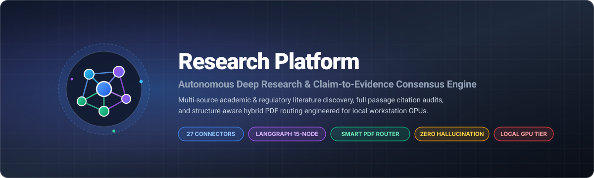
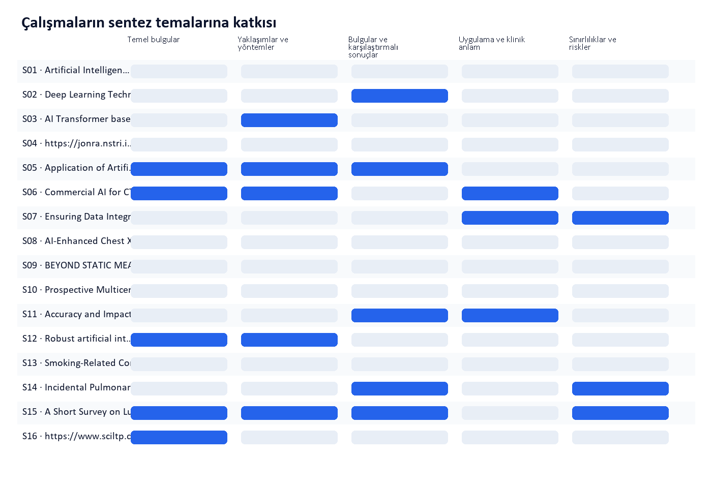

<div align="center">
  

  <br>

  <p align="center">
    <a href="https://github.com/chnclsr/research-platform"></a>
    <a href="https://www.python.org/"></a>
    <a href="tests/"></a>
    <a href="LICENSE"></a>
    <a href="docs/ARCHITECTURE.md"></a>
    <a href="docs/ARCHITECTURE.md"></a>
    <a href="system_architecture_diagram.html"></a>
  </p>

  <table align="center" width="100%">
    <thead>
      <tr>
        <th width="33%" align="center">Discovery &amp; Evidence</th>
        <th width="33%" align="center">Orchestration &amp; Parsing</th>
        <th width="33%" align="center">Storage &amp; Access Tier</th>
      </tr>
    </thead>
    <tbody>
      <tr valign="top">
        <td>
          <b>27 Connectors (9 Families)</b><br>
          Academic, Patents, Regs &amp; Web<br><br>
          <b>Multi-Round Saturation</b><br>
          Frontier &amp; Citation Expansion<br><br>
          <b>Claim-to-Passage Audits</b><br>
          Contradiction &amp; Direction Maps
        </td>
        <td>
          <b>LangGraph 14-Node Engine</b><br>
          HITL Gate &amp; Recovery Loops<br><br>
          <b>Smart PDF Layout Router</b><br>
          Fast Path (2.6ms) + Docling Gating<br><br>
          <b>Hardware Capacity Engine</b><br>
          Dynamic GPU VRAM &amp; CPU Sizing
        </td>
        <td>
          <b>PostgreSQL Relational Core</b><br>
          Deterministic State Checkpoints<br><br>
          <b>MinIO S3 Snapshot Store</b><br>
          Immutable BLOB &amp; Figure Vault<br><br>
          <b>Qdrant Vector Engine</b><br>
          Dense Hybrid Passage Retrieval
        </td>
      </tr>
    </tbody>
  </table>
</div>

---

> **Ingest global academic literature, patents, regulatory filings, and web intelligence across 27 connectors.**  
> Research Platform turns a single office workstation into an auditable, high-throughput evidence service. Codex, Claude, Telegram users, and operations consoles submit complex research inquiries to a deterministic 14-node LangGraph pipeline, executing structure-aware parsing, passage-level quote audits, and cross-source synthesis with zero hallucinations.

The local deployment hosts its language, embedding, and figure-understanding models on a single **NVIDIA RTX 4060 (8 GB VRAM)** with CPU capacity auto-scaling. It does not replace general-purpose reasoning agents; it equips them with a durable research back end: broad multi-source discovery, provenance validation, verifiable citations, coverage diagnostics, and publication-ready deliverables.

## What we built

- A multi-round LangGraph research runtime with PostgreSQL checkpoints.
- A registry of **27 connectors across 9 source families**.
- High-recall literature scanning with query branching, citation-frontier expansion, and
  coverage-driven recovery.
- Structure-aware parsing and hybrid passage retrieval instead of truncating long documents.
- Claim-to-passage links with source version, location, quotation, direction, and confidence.
- Separate supporting, conflicting, and uncertain evidence.
- Local thematic synthesis designed for small language models.
- Auditable Markdown and Word reports, evidence matrices, source catalogs, literature
  inventories, bibliography, coverage reports, and reproducibility manifests.
- Source-figure intelligence: the agent can inspect figures found in papers, explain them,
  and place useful source excerpts into the relevant Word-report section with provenance.
- A shared MCP gateway for Codex and Claude, a Telegram interface, and an office operations
  console.
- `raw`, `result`, and `both` delivery contracts for downstream agents.

## System Architecture & End-to-End Flow


> **Architectural Specifications & Interactive Explorers:**
> - Complete subsystem breakdowns, 14-node LangGraph state machine, Smart Router pipeline, and database dictionaries: **[docs/ARCHITECTURE.md](docs/ARCHITECTURE.md)**
> - Standalone browser-based interactive diagram with real-time light/dark theme toggles: **[system_architecture_diagram.html](./system_architecture_diagram.html)**

| View | Focus & Coverage | Architectural Subsystems |
|---|---|---|
| **1. End-to-End User & DB Lifecycle** | Complete system data flow from entrypoint to persistent storage | Telegram / Operations UI -> LangGraph Engine -> Parser Registry (`SmartPdfParser` p=20) -> PostgreSQL (`runs`, `sources`, `passages`, `evidences`) + MinIO S3 Snapshot + Qdrant Vector DB |
| **2. LangGraph 14-Node State Machine** | Formal state machine transitions and recovery loops | `VALIDATE_PROTOCOL` (HITL) -> `DECOMPOSE` -> `BUILD_QUERY_BRANCHES` -> `SEARCH` -> `ACQUIRE` -> `NORMALIZE` -> `CHUNK_INDEX` -> `RETRIEVE_PASSAGES` -> `EXTRACT_EVIDENCE` -> `ANALYZE_CLAIMS` -> `AUDIT` -> `CHECK_COVERAGE` (`expand` recovery loop / `finish`) -> `SYNTHESIZE_EXPORT` |
| **3. Smart Router Deep-Dive** | Page-routed hybrid PDF parsing pipeline | Fast path (`pdf-inspector` 2.6 ms/page) -> Gate & Critic (`critic_ceza_dokumu`, non-drawing quality veto) -> `_AGIR_KAPI` Semaphore -> Docling Engine (1.55s/page) -> Quarantine Gate & `# Page N` heading hierarchy |
| **4. Quarantine & Decision Matrix** | Safety verification and fallback routing | Page triage flowchart, 5.0 dead band degradation tolerance, >50% text loss threshold, heavy acceptance vs fast fallback |

---

## One Workstation, an Office-Wide Research Service


Authenticated MCP, Telegram, control-panel, and Langflow entrypoints converge on the
owner-scoped API. Redis separates urgent and normal work; the capacity-gated worker overlaps
runs while serializing model calls, and keeps PostgreSQL, MinIO, acquisition, Docling, and
Ollama behind the service boundary.

## Research Lifecycle & Stage Flow


Collection does not stop merely because one plausible source was found. In
`literature_scan` mode, accepted direct and contextual sources remain in the corpus and
literature inventory. If `max_sources` is left empty, time and saturation—not an arbitrary
source count—govern collection.

`max_wall_minutes` is a **collection budget**, not a report-kill switch. Once the budget is
reached, the platform stops starting new searches and acquisitions, then completes
normalization, evidence extraction, audit, synthesis, and export from everything already
collected.

## Source coverage

| Family | Connectors |
|---|---|
| General web | AgentSearch / SearXNG |
| Academic | OpenAlex, Semantic Scholar, Crossref, arXiv, Europe PMC, Zotero Local, Zotero Web |
| Books and theses | Open Library, OpenAlex dissertations |
| Patents and standards | EPO OPS, IETF Datatracker, trusted standards-domain search |
| Official and legal | Federal Register, EUR-Lex, configurable official registries |
| News and archives | GDELT, Internet Archive CDX, AgentSearch News |
| Code and data | GitHub, Hugging Face, Zenodo, DataCite |
| Company sources | SEC EDGAR, verified company domains |
| Grey literature | Zenodo Grey, institutional repositories |

Credential-dependent connectors remain visible in capability and health reporting but are
disabled when a key is unavailable. Their absence does not crash the run.

## Showcase research

Three English, end-to-end runs demonstrate the product on medical AI, energy policy, and
industrial robotics. Together they retained **75 source records**, extracted **204 claims**,
and produced passage-audited reports plus Word deliverables.

| Research case | Rounds | Sources | Claims | Examples |
|---|---:|---:|---:|---|
| Multimodal AI in radiology, 2024–2026 | 4 | 37 | 106 | [Markdown report](showcase/radiology/02_full_research_report.md) · [Word report](showcase/radiology/16_research_report.docx) · [Theme map](showcase/radiology/16b_theme_evidence_map.png) |
| Small modular reactors: cost, schedule, and regulation | 7 | 9 | 40 | [Markdown report](showcase/small-modular-reactors/02_full_research_report.md) · [Word report](showcase/small-modular-reactors/16_research_report.docx) · [Theme map](showcase/small-modular-reactors/16b_theme_evidence_map.png) |
| Humanoid robots in production: evidence vs expectations | 13 | 29 | 58 | [Markdown report](showcase/humanoid-robots/02_full_research_report.md) · [Word report](showcase/humanoid-robots/16_research_report.docx) · [Theme map](showcase/humanoid-robots/16b_theme_evidence_map.png) |

The matrix below comes from a production lung-cancer CT research run. Each row is a retained
study, each column is a synthesis theme, and each blue cell identifies a direct evidence
contribution used by that theme.



### Structure-Aware Parsing & Extraction Benchmark

The platform replaces legacy flat text extraction with a selective hybrid parser architecture. Benchmark measurements across 261 test pages evaluate extraction latency, ligature defect elimination, and heading context preservation:


These examples are intentionally not presented as “perfect scores.” All three reached full
claim-audit coverage, but the strict stopping policy classified them as
`completed_incomplete` when family, branch, or estimated-completeness gates remained unmet.
The reports are still delivered, and the unresolved gaps remain visible. See the
[showcase guide](showcase/README.md) for exact run metadata and interpretation.

## Auditable output contract

A complete run can produce:

1. Executive summary
2. Full research report
3. Evidence matrix
4. Claim ledger
5. Source catalog
6. Contradiction map
7. Coverage report
8. BibTeX bibliography
9. Search protocol
10. Reproducibility manifest
11. Audit report
12. Uncertainty report
13. Raw sources
14. Raw passages
15. Literature inventory
16. Research report in Word
17. Figure observations and selected source-figure excerpts
18. Raw, result-only, and combined bundles

The exact artifact count varies when a run contains no usable figures or a particular
optional output has no data.

### Inspecting how a run parsed its PDFs

PDFs do not go through one extractor. Each page is inspected first, and only the pages
that need it -- a scanned page, a page holding a table, a page whose text fails a quality
check -- are re-extracted by the heavy engine. Every one of those decisions is recorded,
and one command turns the record into a readable report:

```bash
python scripts/inspect_bundle.py <run_id>                              # routing summary
python scripts/inspect_bundle.py <run_id> --heavy                      # + each heavy page
python scripts/inspect_bundle.py <run_id> --fast                       # + pages kept by Inspector
python scripts/inspect_bundle.py <run_id> --all                        # + every PDF page
python scripts/inspect_bundle.py <run_id> --heavy --md outputs/reports # markdown per run
python scripts/inspect_bundle.py <run_id> --pdf outputs/inputs         # the bytes sent
```

The run id is enough: the bundle is looked up in the report-sync folder and then in
object storage, so a run that finished a minute ago can be inspected without waiting for
the next sync. Pointing `--md` at a directory names the file after the run instead of
overwriting the previous report. The selection is appended automatically: `--fast`
writes `_fast.md`, `--heavy` writes `_heavy.md`, `--all` writes `_all.md`, and explicit
page selections write `_page-3-8.md`. The same suffixing applies when `--md` receives an
explicit filename, and an already present suffix is not duplicated.

The report answers four questions per source:

| Question | Answer in the report |
|---|---|
| which pages went to the heavy engine | with the reason -- `has_table_yuksek`, `low_quality`, `needs_ocr` |
| what it produced | the page markdown, tables included |
| which pages stayed with Inspector | `untouched`, heavy-engine `fallback`, or output-check `quarantined` |
| where it ran | device and the docling/torch/GPU build that produced the text |
| what it cost | parse time split into routing and heavy engine |

Device and build are recorded because they change the output: the same PDF and the same
Docling build do not produce identical text on CPU and CUDA (measured on a 261-page
corpus, 7 pages differ and one loses a markdown table), and `content_hash` is the sha256
of that text.

The same fields are in `10_reproducibility_manifest.json` under `parsing`, for a
consumer that wants them as data rather than as a report.

## Local model stack

The validated office deployment uses:

- `qwen3:4b-instruct-2507-q4_K_M` for research reasoning and structured extraction.
- `embeddinggemma:300m-qat-q4_0` for local dense retrieval.
- `qwen3.5:4b` for source-figure inspection.

Lexical retrieval remains available when the embedding model is unavailable. The provider
interface also supports an OpenAI-compatible remote model, while Ollama remains the default.

## Quick start

### Requirements

- Windows 10/11
- Python 3.11+
- Docker Desktop
- Ollama
- A running AgentSearch service, by default at `http://localhost:3939`

Install the local Ollama models, then run:

```powershell
Set-ExecutionPolicy -Scope Process Bypass
.\scripts\setup_windows.ps1
```

Before first use, copy the relevant example environment file and replace `API_TOKEN`,
`SERVICE_TOKEN`, `SESSION_SECRET`, `MINIO_SECRET_KEY`, and any connector credentials.
Never commit a populated `.env` file.

### Create the first account

The operations console requires a sign-in and shows each person only their own research.
There is no sign-up form, so the first account is created from the shell:

```powershell
docker compose exec api research-admin bootstrap you@example.com
```

This also assigns any pre-existing runs to that account, and refuses to run a second time
once an account exists. Adding people, roles, API keys and offboarding are covered in
[OFFICE_TEAM_SETUP.md](OFFICE_TEAM_SETUP.md#hesap-yönetimi).

Main local endpoints:

- API and OpenAPI: `http://127.0.0.1:8000/docs`
- MCP gateway: `http://127.0.0.1:8010/mcp`
- Operations console: `http://127.0.0.1:8020`
- Langflow: `http://127.0.0.1:7860`
- MinIO console: `http://127.0.0.1:9001`

For office-network deployment, follow [OFFICE_TEAM_SETUP.md](OFFICE_TEAM_SETUP.md).

## Agent access

The MCP tool layer lets Codex and Claude:

- start a research run;
- inspect progress, sources, claims, and coverage;
- pause, resume, cancel, or answer HITL checkpoints;
- retrieve only the synthesized result, only the relevant raw corpus, or both.

Example client configurations are available in
[`examples/codex_mcp_config.toml`](examples/codex_mcp_config.toml) and
[`examples/claude_mcp.json`](examples/claude_mcp.json). Tokens must come from the
`RESEARCH_MCP_TOKEN` environment variable, not a committed configuration file.

Agents act as a person, not as the installation. Issue each user their own API key —
from the console, or with `research-admin issue-key <email> --name <label>` — and use it
as the bearer credential. Runs the agent starts are owned by that user and are invisible
to everyone else; a revoked key stops working immediately.

Telegram commands:

```text
/research [raw|result|both] [minutes] [--hitl] <question>
/status <run_id>
/get <run_id> [raw|result|both]
/pause <run_id>
/resume <run_id>
/cancel <run_id>
```

## Human-in-the-loop

Four optional checkpoints can be enabled independently:

- planning questions;
- plan review;
- source review;
- outline review.

Waiting for a human does not consume the research budget. State is persisted in PostgreSQL,
so the worker does not need to remain occupied while a run is paused.

## Development

```powershell
py -3.12 -m venv .venv
.\.venv\Scripts\pip.exe install -e ".[dev]"
$env:TESTING="true"
.\.venv\Scripts\ruff.exe check .
.\.venv\Scripts\python.exe -m pytest -q
```

Run migrations with:

```powershell
.\.venv\Scripts\alembic.exe upgrade head
```

For the current engineering rationale and milestone narrative, read
[docs/PRODUCT_OVERVIEW.md](docs/PRODUCT_OVERVIEW.md). Detailed implementation reports remain
in the repository as the project’s engineering notebook.

## Safety boundaries

The platform deliberately does **not** implement:

- paywall bypassing;
- shadow-library access;
- active cyberattacks, exploitation, or port scanning;
- arbitrary instructions found inside acquired web content.

Acquisition permits HTTP/HTTPS only, validates DNS and redirects against private-address
access, applies content limits, records provenance, and treats source text as untrusted data.

Research is private to the person who started it. Ownership is enforced in the data layer
rather than at the routes, because the console reads this data both through the API and
directly from the database — a filter on one door would leave the other open. A run
belonging to someone else reads as missing, never as forbidden, so run ids cannot be probed
for existence. Corpus reuse across runs is scoped to the owner's own history by default
(`CORPUS_SCOPE`). Administrators can see every run and are the only ones who can start or
stop the stack, read service logs, or test connectors.
