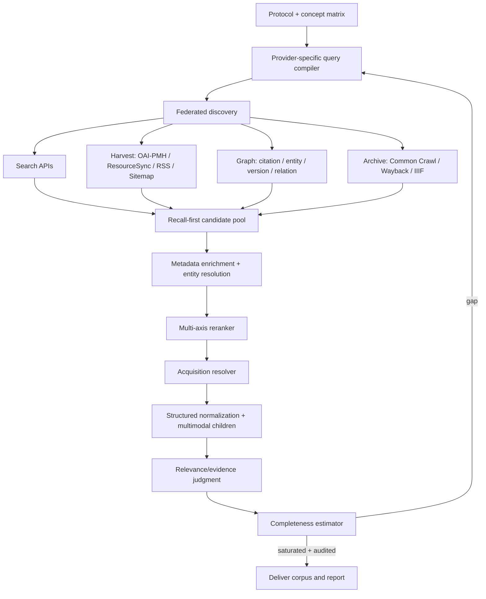

# Bilgi toplama kalitesini mükemmelleştirme araştırması

Belge sürümü: `1.0`

Platform sürümü: `v0.5.3`

Tarih: `2026-07-17`

## Yönetici kararı

Platformun bilgi toplama temeli doğru kurulmuş: çoklu connector registry, kaynak ailesi dengesi,
kalıcı kimlik/URL/hash deduplication, tarih filtresi, AgentSearch–Crawl4AI edinim zinciri, uzun belge
chunking’i, BM25+dense+RRF pasaj retrieval ve coverage geri besleme döngüsü var. Fakat bugün sistemin
“en iyi kaynakları kaçırmadığını” söylemek mümkün değil.

En büyük sorun yeni connector sayısı değil, **recall güvence protokolünün eksikliği**. Sistem kaç
kaynak/aile bulduğunu ölçüyor; fakat kaçırılmış kaynak nüfusunu, bilinen kritik kaynakların bulunup
bulunmadığını, connector’ların birbirinden bağımsız katkısını ve citation graph’ın dışına taşan yeni
kaynak oranını ölçmüyor.

Birinci öncelik şu dört değişiklik olmalıdır:

1. `citation_depth` gerçek bir backward/forward citation-chasing kuyruğuna dönüştürülmeli.
2. Aramadan önce “bilinen kritik kaynak/sentinel” kümesi kurulmalı ve her turda yakalanması denetlenmeli.
3. Coverage, kaynak sayısından `relative recall + connector overlap + graph saturation + authority` modeline
   yükseltilmeli.
4. OpenAlex, Semantic Scholar ve Zotero’nun canlı bağlantıları düzeltilmeden yeni connector çalışmasına
   başlanmamalı.

İkinci öncelik, genel amaçlı protokol connector’larıdır: PubMed/PMC, CORE, Unpaywall, OpenCitations,
OpenAIRE, OAI-PMH/ResourceSync, sitemap/RSS/WebSub ve Common Crawl. Bunlar tek tek niş kaynak eklemekten
daha fazla marjinal kapsama sağlar.

## Araştırma yöntemi

Bu çalışma iki dala ayrıldı:

- **Dal A:** Mevcut kaynak ailelerinde yüksek recall ve yüksek otorite yakalama başarısı nasıl artırılır?
- **Dal B:** Hangi yeni kaynak aileleri, tarama yüzeyleri ve edinim yöntemleri eklenmelidir?

Yerel kodda connector registry, query mission üretimi, candidate admission, citation ilişkileri,
coverage/recovery, acquisition ve passage retrieval akışları satır düzeyinde incelendi. Canlı connector
health çıktısı alındı. Bulgular; sistematik arama rehberleri, resmi API/protokol belgeleri ve birincil
bilgi erişim çalışmalarıyla karşılaştırıldı.

Cochrane’ın güncel rehberi yüksek duyarlılık için birden çok veritabanı, serbest metinle kontrollü
konu başlıklarının birlikte kullanılması, dil/yayın durumu kısıtlarından kaçınma, trial registry,
regülatör kaynakları ve citation searching öneriyor. Ayrıca göreli recall ve citation search’te yeni
ilgili kayıt çıkışını arama tamlığı sinyali olarak kullanıyor
([Cochrane Handbook, Chapter 4](https://training.cochrane.org/handbook/current/chapter-04)). PRESS,
sorgunun araştırma sorusuna çevirisini, Boolean/proximity işleçlerini, konu başlıklarını, metin
terimlerini, sözdizimini ve filtreleri ayrı ayrı denetliyor
([PRESS 2015](https://pubmed.ncbi.nlm.nih.gov/27005575/)). Citation searching’in nasıl uygulanıp
raporlanacağı TARCiS ile standartlaştırılmış durumda
([TARCiS, BMJ 2024](https://www.bmj.com/content/385/bmj-2023-078384)).

## Mevcut sistemin kanıta dayalı denetimi

### Güçlü taraflar

- Arama, edinim, normalizasyon, passage retrieval ve claim/evidence aşamaları ayrılmış.
- Kaynaklar DOI/PMID/arXiv/URL/hash gibi kimliklerle birleştirilebiliyor.
- Connector ve mission dengesi tek sağlayıcının bütün acquisition bütçesini tüketmesini önlüyor.
- Tarih kapsamı discovery ve acquired content aşamalarında doğrulanıyor.
- Uzun belgeler section-aware, örtüşmeli pasajlara ayrılıyor; yalnız ilk 12.000 karakter yaklaşımı
  kaldırılmış.
- Corpus retrieval BM25, local embedding, RRF, section sinyali ve çeşitlilik kısıtlarını birlikte
  kullanıyor.
- İçerik merkezî olarak alakasızsa deterministik ve LLM tabanlı admission gate uygulanıyor.

### Kritik açıklar

#### 1. Citation graph keşif yapmıyor

`citation_depth` açıkken yalnız citation capability’si olan connector’ların ilk beş sonucunda
`fetch_citations` çağrılıyor. Dönen ilişkiler `citation_relations` olarak saklanıyor; fakat cited/citing
çalışmalar `ConnectorCandidate` üretilerek SEARCH/ACQUIRE kuyruğuna eklenmiyor. Dolayısıyla bugün
`citation_depth=2`, iki hop’luk literatür taraması değil, iki hop hedefi olan bir metadata kaydıdır.

Bu, en yüksek etkili eksiktir. Citation searching ana aramanın yerine değil, başlangıç seed kümesinden
sonra tamamlayıcı yöntem olarak kullanılmalıdır; TARCiS de backward/forward aramayı bu şekilde
konumlandırır.

#### 2. Query alanı erken daralıyor

- LLM en fazla sekiz sorgu üretse de `initial_missions` yalnız ilk beşini kullanıyor.
- Her mission `results_per_connector=30` olsa bile `result_limit=min(10, ...)` nedeniyle connector
  başına ilk on kayıtla sınırlanıyor.
- İlk turda toplam source bütçesinin yalnız %40’ı acquisition’a ayrılıyor.
- Acquisition’dan önce lexical/focus tabanlı hard gate uygulanıyor. Metadata’sı zayıf ama içeriği
  güçlü kayıtlar burada kaybedilebilir.
- Provider’a özgü sorgu çevirisi yok: aynı doğal dil sorgusu Crossref, arXiv, Europe PMC ve web
  motoruna gönderiliyor. MeSH, field search, proximity, publication type ve provider filtreleri
  sistematik üretilmiyor.

#### 3. RRF var ama federated rank fusion zayıf

Her sağlayıcının sıra puanı `1/(60+rank)` olarak ekleniyor; bu sinyal yalnız akademik candidate
relevance içinde en fazla `0.10` bonus etkisi yapıyor. Provider güvenilirliği, sorgu–provider uygunluğu,
birden fazla bağımsız motorda görünme, citation/authority/recency ve exact-entity sinyalleri gerçek bir
learning-to-rank ya da güçlü deterministic reranker’da birleşmiyor.

#### 4. Coverage “var mı?”yı ölçüyor, “en iyisini bulduk mu?”yı değil

Bugünkü coverage’ın ana girdileri aile başına kabul edilmiş kaynak, query branch’te evidence ve major
claim audit oranıdır. Şunlar ölçülmüyor:

- sentinel kaynak recall’ı,
- connector başına benzersiz ilgili kaynak katkısı,
- connector overlap’ından tahmin edilen kaçırılmış kaynak sayısı,
- backward/forward graph frontier’ında yeni ilgili kaynak oranı,
- konuya özgü çekirdek yazar, kurum, venue ve standart kapsamı,
- aynı çalışmanın farklı raporlarının tek study altında birleşmesi,
- false-negative admission örneklemesi,
- kapalı/sağlıksız kritik connector nedeniyle oluşan epistemik eksik.

#### 5. Resmî kaynak çözümleme genelleşmemiş

`OFFICIAL_ENTITY_REGISTRY` yalnız MCP, Codex, Claude Code ve Telegram için elle yazılmış alan adları ve
seed URL’ler içeriyor. Genel araştırma sorularında kurum–ürün–mevzuat–ülke çözümlemesi dinamik değil.
Resmî alanın bulunması yeniden genel web aramasına kalıyor.

#### 6. Canlı academic omurga eksik çalışıyor

17 Temmuz 2026 health denetiminde:

- `openalex`: API key eksik, disabled,
- `openalex_dissertations`: aynı nedenle disabled,
- `semantic_scholar`: public throttling nedeniyle degraded ve worker tarafından atlanıyor,
- `zotero_local`: bağlantı başarısız,
- `zotero_web`: library scope eksik,
- `epo_ops`: credentials eksik.

Bu durumda registry geniş görünse de etkili akademik discovery Crossref, arXiv ve Europe PMC’ye
daralıyor. Yeni connector eklemeden önce bu health borcu kapanmalıdır.

## Dal A — Mevcut kaynaklarda en iyi kaynakları kaçırmama sistemi

### A1. Arama protokolünü concept matrix’e dönüştür

Her soru için tek sorgu listesi yerine şu yapı üretilmelidir:

```text
Araştırma sorusu
  ├─ ana kavramlar
  │    ├─ eş anlamlılar / kısaltmalar / eski adlar
  │    ├─ kontrollü vocabulary (MeSH vb.)
  │    ├─ entity alias + persistent ID
  │    └─ TR/EN + gerekli bölgesel dil varyantları
  ├─ çalışma/kaynak türleri
  ├─ zaman ve coğrafya
  ├─ otorite/kurum hedefleri
  └─ karşı kanıt / başarısızlık / eleştiri terimleri
```

Ardından her connector için query compiler çalışmalıdır. PubMed sorgusu MeSH ve field tags, arXiv
`ti/abs/cat`, Crossref bibliographic/author/container filtreleri, web motoru phrase/domain/filetype,
GitHub repository/code/release/advisory alanlarını kullanmalıdır. Cochrane, yüksek duyarlılık için az
sayıda ana concept’in her biri içinde geniş OR terimleri ve serbest metin+controlled vocabulary
bileşimini önerir.

### A2. Sentinel/known-item validation ekle

Planlayıcı, ilk keşif turunda 5–20 adet “bu konuda bulunması beklenen” kaynak belirlemelidir:

- protokolde kullanıcı seed’i,
- bilinen review/guideline/standard,
- resmî kurumun canonical dokümanı,
- ana çalışma veya yaygın referans,
- bir karşı kanıt.

Her query ailesi bu sentinel setini retrieve edebiliyor mu diye test edilmelidir. Retrieve edemiyorsa
sorgu otomatik olarak PRESS-benzeri denetimden geçmeli; eksik alias, subject heading, tarih/field
filtresi veya provider sözdizimi düzeltilmelidir. Sentinel yalnız değerlendirme içindir; rapora zorla
dahil edilmemelidir.

### A3. Recall-first candidate pool ile precision-first acquisition’ı ayır

Discovery aşamasında düşük metadata yüzünden hard reject uygulanmamalıdır. Üç bölge önerilir:

- **accept:** yüksek güvenle acquisition,
- **reserve:** düşük metadata güveni; semantik rerank veya ucuz metadata enrichment sonrası karar,
- **reject:** açık entity/date/policy uyuşmazlığı veya güvenlik ihlali.

İlk tur candidate pool geniş tutulmalı; pahalı acquisition ve LLM yalnız rerank sonrası yapılmalıdır.
Her turda reject havuzundan rastgele ve uncertainty-sampled bir bölüm denetlenerek false-negative oranı
ölçülmelidir.

### A4. Gerçek graph expansion uygula

Her kabul edilmiş scholarly/standard/patent/legal kaynak şu graph görevlerini üretebilmelidir:

- backward references,
- forward citations,
- related/recommended works,
- aynı yazarın/kurumun konuya yakın eserleri,
- aynı çalışma/protokol/preprint/published/correction/retraction sürümleri,
- dataset–paper, software–paper, patent-family ve regulation-amendment ilişkileri.

Öncelik seed kalitesi, edge türü, bağımsızlık ve novelty ile belirlenmeli; frontier yalnız URL değil
`persistent_id + relation + depth + parent` taşımalıdır. OpenCitations REST/SPARQL arayüzü bu graph için
bağımsız açık bir katman sunar ([OpenCitations API](https://opencitations.net/querying/)); Semantic
Scholar Academic Graph da citations/references/related alanlarını sağlar
([S2 Academic Graph API](https://api.semanticscholar.org/api-docs/graphs)).

### A5. Tamlığı tek eşikle değil, çoklu durdurma kuralıyla ölç

Önerilen durdurma koşulları birlikte sağlanmalıdır:

1. Sentinel recall hedefi sağlandı.
2. Son iki turda connector başına benzersiz ilgili kaynak getirisi düştü.
3. Citation frontier’ın son hop’unda yeni ilgili çalışma oranı düştü.
4. Connector overlap matrisi yeni bir kaynak popülasyonu işaret etmiyor.
5. Her major claim için yeterli bağımsız/otoriter kanıt veya açık “kanıt bulunamadı” sonucu var.
6. Kaynak ailesi, dönem, dil, coğrafya ve belge türü strata’larında kritik boşluk yok.
7. Reject audit kabul edilebilir false-negative sınırında.

Gerçek ilgili küme bilinmediğinde **relative recall** kullanılabilir: tüm yöntemlerin birleşiminden oluşan
nihai ilgili kümenin ne kadarını her query/connector/tur buldu? Connector listeleri arasındaki overlap
üzerinden capture–recapture tahmini de eksik kaynak nüfusu için uyarı verebilir; fakat connector’ların
bağımsız olmadığı durumlarda yalnız yardımcı sinyal olmalıdır. Literatürde bu yöntem doğrudan sistematik
arama tamlığı için incelenmiştir
([capture–recapture çalışması](https://www.sciencedirect.com/science/article/pii/S0895435611001107)).

Active-learning taramasında sabit “N alakasız kayıttan sonra dur” yerine hedef recall’a güven düzeyi
bağlayan istatistiksel kurallar kullanılmalıdır
([Callaghan & Müller-Hansen](https://pmc.ncbi.nlm.nih.gov/articles/PMC7700715/)).

### A6. Relevance, authority ve evidence utility’yi ayır

Tek `relevance_score` yerine en az şu eksenler saklanmalıdır:

- topical relevance,
- source authority / primaryness,
- evidence utility (sorudaki hangi iddiayı destekleyebilir),
- independence,
- recency ve temporal validity,
- acquisition/full-text availability,
- metadata/extraction confidence,
- contradiction potential,
- novelty.

Reranker bu eksenleri protokole göre ağırlıklandırmalı. Bir resmî belge “relevant” diye otomatik doğru
veya yeterli sayılmamalı; bir bağımsız çalışma da resmî olmadığı için düşürülmemelidir.

### A7. Query ve connector performans defteri tut

Her run sonunda aşağıdakiler kalıcı evaluation verisine dönüşmelidir:

- query → connector → retrieved/unique/acquired/relevant/cited sayıları,
- ilk relevant kaynağa kadar rank,
- relevant kaynakların hangi yöntemle ilk bulunduğu,
- duplicate ve version merge oranı,
- acquisition başarı/parse kalite oranı,
- citation chasing’in ek katkısı,
- reject audit false-negative örnekleri,
- provider latency/rate-limit/degraded dönemleri.

Bu geçmiş, sonraki run’larda konuya göre connector routing ve bütçe tahsisini iyileştirir; ancak düşük
performanslı connector tamamen kapatılmaz, küçük bir exploration kotası korunur.

## Dal B — Yeni kaynaklar, tarama alanları ve yöntemleri

### B0 — Önce mevcut omurgayı çalıştır

| İş | Neden |
|---|---|
| OpenAlex API key ve polite-pool yapılandırması | Akademik graph ve dissertation connector’ını geri getirir. |
| Semantic Scholar API key + merkezi rate limiter/cache | Public throttling yüzünden connector’ın tamamen atlanmasını önler. |
| Zotero local health ve web library scope | Ekibin küratörlü corpus’unu gerçek first-class kaynak yapar. |
| EPO OPS credential | Patent ailesini gerçek API düzeyine çıkarır. |
| Health-aware coverage | Kritik connector kapalıysa run “tam” görünmemeli; raporda açık capability gap olmalı. |

### B1 — En yüksek marjinal değerli genel connector’lar

| Connector/protokol | Rol | Öncelik gerekçesi |
|---|---|---|
| PubMed + PMC/NCBI E-utilities | Biyomedikal metadata, full text, linked records | Europe PMC ile örtüşür ama PubMed indexing/MeSH ve Entrez link ağı ayrı recall sağlar. E-utilities 38 Entrez veritabanında search/link/fetch sunar ([NCBI](https://www.ncbi.nlm.nih.gov/sites/books/NBK25501/)). |
| CORE | OA repository metadata + full text | Binlerce repository’den harmonize full text sağlar; discovery ile acquisition’ı birlikte güçlendirir ([CORE API](https://core.ac.uk/services/api)). |
| Unpaywall | DOI → yasal OA location/version | Paywall aşmadan publisher/repository açık kopyasını çözer; API ve bulk snapshot sunar ([Unpaywall API](https://data.unpaywall.org/products/api)). |
| OpenCitations | Bağımsız citation graph | Citation chasing’i OpenAlex/S2 bağımlılığından çıkarır. |
| OpenAIRE Graph | Publication–dataset–software–project bağı | Research product türlerini ve ScholeXplorer ilişkilerini birlikte sunar ([OpenAIRE APIs](https://graph.openaire.eu/docs/apis/home/)). |
| Generic OAI-PMH harvester | Kurumsal repository, tez, grey literature | OAI-PMH repository interoperability için düşük eşikli standarttır ([OAI-PMH](https://www.openarchives.org/pmh/)). |
| ResourceSync | Değişen repository’leri incremental sync | Sitemap tabanlı created/updated/deleted senkronizasyonu sağlar ([NISO ResourceSync](https://www.niso.org/publications/z3999-2017-resourcesync)). |
| RSS/Atom + WebSub | Haber, kurum, dergi TOC ve update feed | Polling yerine yaşayan araştırma ve değişiklik uyarısı sağlar ([W3C WebSub](https://www.w3.org/TR/websub/)). |
| Sitemap/structured-data crawler | Resmî site ve yayıncı tamlığı | Search engine rank’ine bağlı kalmadan URL envanteri çıkarır. |
| Common Crawl CDX | Kaybolan/değişen açık web ve geçmiş snapshot | URL index ve açık WARC arşivi sunar ([Common Crawl Index](https://index.commoncrawl.org/)). |

### B2 — Protokole göre açılan alan connector’ları

#### Sağlık ve bilim

- ClinicalTrials.gov API; kayıtlar hafta içi günlük yenileniyor ve OpenAPI şeması var
  ([ClinicalTrials.gov API](https://clinicaltrials.gov/data-api/api)).
- WHO ICTRP, EU CTIS ve uygun ulusal trial registry’leri.
- openFDA/FDA, EMA, WHO, NICE ve regülatör safety/approval belgeleri.
- PubMed/PMC yanında domain veri tabanları: Europe PMC mevcut; konuya göre bioRxiv/medRxiv,
  ChemRxiv, SSRN ve disiplin repository’leri.
- Retraction/correction/expression-of-concern kontrolü Crossref relation/update metadata üzerinden
  zorunlu kalite kapısı olmalı.

#### Resmî, hukuki ve kamu verisi

- GovInfo API/bulk/RSS/sitemap: üç ABD devlet erkinin doküman ve metadata erişimi
  ([GovInfo Developer Hub](https://www.govinfo.gov/developers)).
- CourtListener/RECAP: case law, docket, oral argument ve bulk/API erişimi
  ([CourtListener coverage](https://www.courtlistener.com/help/coverage/)).
- EUR-Lex için yalnız domain web araması yerine CELLAR/SPARQL, ELI kimliği, amendment/corrigendum ve
  consolidated-version ilişkileri.
- `data.europa.eu` Search API + SPARQL/DCAT-AP
  ([resmî API listesi](https://data.europa.eu/en/which-apis-are-available-and-where-can-i-find-information-about-them)).
- CKAN/DCAT/SPARQL ve SDMX için generic connector. World Bank ve OECD resmî SDMX servisleri bu katmanla
  kapsanabilir ([World Bank SDMX](https://datahelpdesk.worldbank.org/knowledgebase/articles/1886701-sdmx-api-queries),
  [OECD API](https://www.oecd.org/en/data/insights/data-explainers/2024/09/api.html)).

#### Türkiye profili

- TR Dizin API, Türkçe hakemli yayın ve TÜBİTAK proje kayıtlarında yüksek marjinal değer taşır
  ([TR Dizin entegrasyon belgesi](https://development.trdizin.gov.tr/)).
- TÜİK Veri Portalı ve ulusal yayımlama takvimi, resmî istatistik sorularında aktive edilmelidir
  ([TÜİK Veri Portalı](https://veriportali.tuik.gov.tr/tr/)).
- Resmî Gazete, Mevzuat Bilgi Sistemi, TBMM, Anayasa Mahkemesi ve erişime açık resmî karar portalları
  ayrı doğrulanmış-domain connector’ları olmalıdır.
- YÖK Ulusal Tez Merkezi ve DergiPark için resmî izin/arayüz varsa connector; yoksa robots ve kullanım
  koşullarına uygun domain discovery uygulanmalıdır.

#### Kod, yazılım ve siber güvenlik

- GitHub yalnız repository search değil releases, commits, issues, discussions ve advisories alanlarına
  ayrılmalı.
- GitLab, PyPI, npm, Maven Central, crates.io, NuGet ve container registry metadata connector’ları.
- Software Heritage, silinmiş/değişmiş kaynak kodun kalıcı provenance’ı için.
- OSV, NVD/CVE, CISA KEV ve vendor advisory connector’ları. OSV package/version ve alias ilişkilerini
  makine okunur API ile sunar ([OSV](https://osv.dev/)).
- Siber araştırma pasif kaynaklarla sınırlı kalmalı; port tarama/exploit bu sisteme eklenmemeli.

#### Kitap, tez, arşiv ve kültürel miras

- BASE API/OAI, binlerce repository’nin konu alt kümelerini harvest edebilir
  ([BASE OAI](https://oai.base-search.net/)).
- Google Books metadata, WorldCat/Library of Congress uygun API’leri ve ulusal kütüphane katalogları.
- Europeana Search/Record/IIIF API’leri binlerce kültürel kurumun metadata ve medyasını kapsar
  ([Europeana APIs](https://api.europeana.eu/en)).
- IIIF Presentation/Image/Content Search/Change Discovery; taranmış kitap, gazete, el yazması, görsel,
  ses ve video compound object’lerini standart biçimde taşır
  ([IIIF specifications](https://iiif.io/api/)).

### B3 — Yeni edinim ve normalizasyon yöntemleri

Önerilen resolver sırası:

```text
Resmî API / bulk / feed
  → yapılandırılmış tam metin (JATS, TEI, XML, JSON, HTML, EPUB)
  → yasal OA location çözümü (Unpaywall/CORE/OpenAIRE)
  → doğrudan PDF/office/media
  → Crawl4AI browser extraction
  → kontrollü browser snapshot
  → OCR / layout / multimodal extraction
```

PDF ve dosya extraction tek parser’a bırakılmamalıdır:

- **GROBID:** bilimsel PDF’lerde başlık, bölüm, kaynakça, in-text citation ve PDF koordinatlarını TEI’ye
  dönüştürür ([GROBID](https://grobid.readthedocs.io/en/latest/Principles/)).
- **Docling:** genel PDF/Office/HTML/EPUB/görsel/ses, reading order, tablo, formül, figure ve OCR için
  güçlü genel katmandır ([Docling](https://github.com/docling-project/docling)).
- **Apache Tika:** binin üzerinde dosya türünde MIME detection, metadata ve text extraction fallback’idir
  ([Apache Tika](https://tika.apache.org/index.html)).
- OCR çıktısı confidence, dil, bounding box ve sayfa görseliyle saklanmalı; düşük confidence pasajlar
  claim kanıtı olmadan önce ikinci OCR/VLM denetimine gitmelidir.

Screenshot bütün sayfanın temel representation’ı olmamalıdır. HTML/structured data esas, screenshot
görsel kanıt ve layout fallback olmalıdır. Tablo, grafik ve şekiller ayrı child artifacts olarak
çıkarılmalı; caption, page/bounding-box, OCR/table cells ve kaynak sürümüyle ilişkilendirilmelidir.

Ses/video için resmî transcript/caption önce; yoksa lisans ve kullanım koşullarına uygun local ASR,
speaker/timestamp provenance ile kullanılmalıdır.

### B4 — Lisanslı kaynakları yanlış biçimde otomatikleştirme

Embase, Scopus, Web of Science, IEEE Xplore, ACM DL, ISO/IEC, ProQuest, Lexis/Westlaw gibi kaynaklar
yüksek değerli olabilir. Bunlar `credential_required/licensed` connector olarak tanımlanabilir; anahtar
ve kurumsal yetki yoksa disabled görünmelidir. Paywall bypass, shadow library veya oturum/DRM atlatma
eklenmemelidir. Discovery metadata’sı bulunabilir; full text yalnız yasal erişimle edinilmelidir.

## Önerilen hedef mimari



## Ölçüm ve kabul planı

Yeni kalite çalışması “kaç kaynak geldi?” ile test edilmemelidir. En az 20 golden topic önerilir:

- güncel akademik/teknik,
- klinik çalışma ve regülatör,
- kamu politikası/hukuk,
- şirket/ürün iddiası,
- kod ve güvenlik,
- Türkçe yerel kaynak,
- tarihsel/arşiv,
- kitap/tez,
- veri/istatistik,
- tartışmalı konuda karşı kanıt.

Her topic için uzman/kıdemli agent tarafından sentinel ve pooled relevance set hazırlanır. Ölçümler:

| Boyut | Ölçüm |
|---|---|
| Recall | sentinel recall, pooled relative recall, citation-added recall |
| Kaynak katkısı | connector unique relevant yield ve ablation kaybı |
| Tamlık | overlap/capture–recapture uyarısı, graph frontier novelty |
| Ranking | recall@K, nDCG/MRR yalnız discovery sıralaması için |
| Edinim | full-text success, parse completeness, table/figure/OCR coverage |
| Provenance | passage location çözülme ve content-hash doğrulama oranı |
| Güvenlik | SSRF, prompt injection, secret leakage ve archive bomb testleri |
| Güncellik | scope içi recall ve yanlış tarih kabulü |
| Çok dillilik | dil/geography strata recall farkı |
| Hata denetimi | reject-pool false-negative ve LLM judge disagreement |

Connector, query compiler, ranker, graph expansion ve parser değişiklikleri ayrı ablation olarak
ölçülmelidir. Böylece gelişmenin yeni kaynak eklemekten mi, daha iyi sorgudan mı, citation chasing’den mi
yoksa parsing’den mi geldiği anlaşılır.

## Uygulama sırası

### Faz 1 — Recall güvence çekirdeği

1. OpenAlex/S2/Zotero canlı bağlantılarını düzelt.
2. Citation relation → candidate frontier dönüşümünü uygula.
3. Sentinel validation, pooled relative recall ve connector contribution kayıtlarını ekle.
4. Hard reject’i accept/reserve/reject modeline çevir; reject audit ekle.
5. Provider-specific query compiler ve controlled-vocabulary arayüzünü kur.

### Faz 2 — Genel kapsama protokolleri

1. PubMed/PMC, CORE, Unpaywall, OpenCitations, OpenAIRE.
2. Generic OAI-PMH, ResourceSync, RSS/Atom/WebSub, Sitemap.
3. Common Crawl CDX ve gerçek archive/version resolver.
4. Dynamic official entity/domain resolver; ROR/ORCID/Wikidata benzeri kimlik katmanı.

### Faz 3 — Yapılandırılmış ve multimodal edinim

1. GROBID scientific PDF service.
2. Docling general document service; Tika fallback.
3. Table/figure/caption/OCR child artifacts ve coordinate provenance.
4. Transcript/caption ve düşük-confidence multimodal denetim.

### Faz 4 — Alan profilleri

Health/clinical, legal-government, Turkey, software-security, statistics-data, historical-archive ve
company-intelligence profilleri ayrı connector/routing politikalarıyla eklenmelidir. Bütün connector’ları
her soruda çalıştırmak hem gürültü hem rate-limit üretir; profil seçimi broad exploration kotasını
koruyarak yapılmalıdır.

## Sonuç

En iyi sonraki yatırım “daha çok crawler” değildir. Önce mevcut discovery’nin gerçekten yüksek recall
ürettiğini kanıtlayan ölçüm ve graph döngüsü kurulmalıdır. Bugünkü en somut kalite hatası citation
ilişkilerinin yeni adaylara dönüşmemesi; en somut operasyonel hata ise OpenAlex/S2/Zotero omurgasının
canlıda kullanılamamasıdır.

Bu iki alan düzeltildikten sonra PubMed/PMC + CORE + Unpaywall + OpenCitations + OpenAIRE ve generic
OAI-PMH/ResourceSync/RSS/Sitemap katmanı, platformu yalnız “çok sayıda API’ye sorgu atan” bir sistemden
kaçırdığı kaynakları ölçebilen, yaşayan ve denetlenebilir bir bilgi toplama altyapısına dönüştürür.
