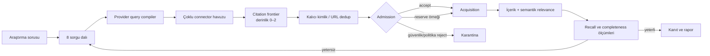

# Bilgi toplama kalite paketi — uygulama raporu

Belge sürümü: `1.0`

Platform sürümü: `v0.6.0`

Tarih: `2026-07-17`

## Sonuç

`v0.5.3` çalışma noktası değiştirilmeden önce Git etiketi ve bağımsız bundle ile donduruldu. Kalite
paketi bunun üzerine `v0.6.0` olarak uygulandı. Ana değişiklik daha fazla connector eklemekten önce
“en iyi kaynakları kaçırmadık mı?” sorusunu ölçülebilir hale getirmektir.

## Korunan geri dönüş noktası

- Git etiketi: `v0.5.3-research-quality-baseline`
- Commit: `a3d99bcd54118243b132a472d737f3a0aee06b56`
- Bundle: `checkpoints/research-platform-v0.5.3-research-quality-baseline.bundle`
- Bundle SHA-256: `B19332D9EAA0C1B279602FF845335C77F02E95368BDBC70F5C3B7B5B55B3D83E`

Bu paket tam Git geçmişini içerir; `git clone <bundle> <klasör>` ile bağımsız geri dönüş yapılabilir.

## Uygulanan değişiklikler

### 1. Arama recall’ı

- İlk tur artık üretilen sekiz query branch’in tamamını kullanır; eski sınır beşti.
- `results_per_connector` değeri artık sessizce 10’a kırpılmaz.
- Query compiler Crossref, OpenAlex, Semantic Scholar, Europe PMC, arXiv, GitHub ve haber
  sağlayıcılarına kısa, sağlayıcıya uygun sorgu üretir.
- Tarih kapsamı serbest metne gömülmez; connector’ın API tarih alanlarında tutulur.

### 2. Gerçek citation chasing

- Semantic Scholar reference ve citation kayıtları yeni `ConnectorCandidate` nesnelerine dönüşür.
- OpenAlex backward ve forward citation sorguları gerçek work metadata’sını getirir.
- `citation_depth=2` iki seviyeli BFS yürütür.
- Bir turun citation API yükü 12 seed ile sınırlıdır; aday sayısı ve kullanılan seed sayısı audit
  event’lerine yazılır.

### 3. Üç katmanlı kaynak kabulü

| Katman | Davranış | Amaç |
|---|---|---|
| `accept` | Normal acquisition’a girer | Yüksek discovery güveni |
| `reserve` | Küçük, sıralı audit örneği acquisition’a girer | Başlık/özet metadata’sı zayıf doğru kaynakları geri kazanmak |
| `reject` | Acquisition’a girmez | Prompt injection, domain politikası ve açık entity mismatch |

Reserve kaynağın içerik sonrası gerçekten ilgili çıkması `reserve_false_negative_rate` olarak ölçülür.
Bu oran yükselirse araştırma “yeterli” sayılmaz; eşik protokolden değiştirilebilir.

### 4. Yeni kalite ölçümleri

| Ölçüm | Ne söyler? | Varsayılan eşik |
|---|---|---:|
| `sentinel_recall` | Önceden bilinen kritik kaynakların bulunma oranı | `1.00` |
| `estimated_completeness` | Connector incidence/capture-recapture ile tahmini havuz tamlığı | `0.75` |
| `relative_recall` | Reserve audit olmasaydı bulunacak ilgili kaynak payı | Tanısal |
| `citation_frontier_novelty` | O turdaki yeni ilgili kaynakların citation frontier’dan gelen payı | `≤0.05` |
| `reserve_false_negative_rate` | Düşük discovery puanına rağmen içerikte ilgili çıkan pay | `≤0.10` |
| `critical_connector_coverage` | Protokolde gerekli connector’ların kullanılabilirlik oranı | `1.00` |

Completeness tahmini en az beş ilgili kaynak ve anlamlı discovery gözlemi olduğunda stopping kararına
katılır. Bu sayı mutlak recall garantisi değildir; bağımsız arama yöntemlerinin ortak havuzundaki görünmeyen
kaynak nüfusu için erken uyarıdır.

### 5. Connector davranışı

Semantic Scholar API anahtarı olmadığında connector artık yanlış biçimde `unhealthy` sayılmaz. Public mod
`degraded` olarak açık kalır; shared throttling nedeniyle yavaştır. `required_connectors` alanıyla kritik bir
connector devre dışıysa coverage açıkça başarısız olur. OpenAlex anahtarı halen gereklidir; bu güvenlik ve
operasyon tercihi değiştirilmemiştir.

## Protokol kullanımı

Tam örnek: `examples/protocol_high_recall.yaml`.

Sentinel listesi araştırma başlamadan önce kullanıcı veya alan uzmanı tarafından bilinen DOI, URL ya da
başlıklarla doldurulmalıdır. Sentinel, cevabı sisteme öğretmez; arama zincirinin bariz bir kritik kaynağı
kaçırıp kaçırmadığını ölçer.

## Doğrulama

- Ruff: geçti.
- Birim ve entegrasyon testleri: `96 passed`.
- Citation depth testi: depth 1 ve depth 2 kaynaklarının gerçek candidate havuzuna girdiğini doğruluyor.
- Güvenlik regresyonu: prompt-injection benzeri discovery sonucu reserve’a değil hard reject’e gidiyor.
- Public Semantic Scholar health testi: anahtarsız modun kullanılabilir/degraded kaldığını doğruluyor.
- Sentinel, query compiler, incidence completeness ve reserve admission testleri eklendi.

## Bilinen sınırlar ve sonraki doğrulama

- Capture-recapture tahmini connector sonuçlarının bağımsızlığı varsayımına duyarlıdır; mutlak recall diye
  sunulmamalıdır.
- Public Semantic Scholar yoğun kullanımda 429 üretebilir. Üretim kalitesi için API anahtarı önerilir.
- OpenAlex ve Zotero credential/bağlantısı bu kod paketiyle kendiliğinden oluşmaz; kontrol panelinde eksik
  connector olarak görünür.
- Gerçek alan araştırmasında sentinel’lı golden set çalıştırılmadan “mükemmel recall” iddiası yapılmamalıdır.
- Sonraki kaynak genişletme sırası: PubMed/PMC, OpenCitations, Unpaywall, CORE ve Lens/EPO lisans durumuna
  göre patent citation graph’tır.

