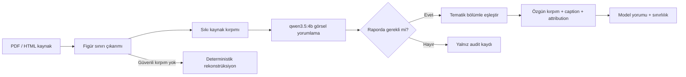

# Kaynak Figürünü Word Raporuna Yerleştirme

Platform sürümü: `v0.9.1`

Belge sürümü: `1.0`

Tarih: `2026-07-30`

## Amaç

Modelin kaynak figürleri hakkındaki yorumlama yeteneği korunmuştur. Bu sürümün
farkı, rapor bir grafiğe dayanarak açıklama yaptığında okuyucunun aynı grafiği
rapor içinde gerçekten görebilmesidir.

Beklenen blok:

```text
Kaynak figürünün kırpımı
→ paper caption'ı + [Sxx] + sayfa
→ paper başlığı ve URL
→ lisans/hak notu
→ modelin figür yorumu ve sınırlılığı
```

## Çalışma akışı



## PDF figürünü ayırma

Sistem artık figür işaretli bütün sayfayı görsel olarak kullanmaz.

- PyMuPDF ile vektör çizim sınırları ve raster image block'ları alınır.
- Caption konumu figürün üstünde veya altında aranır.
- Aynı grafiğe ait iç içe çizim sınırları tekilleştirilir.
- Birden fazla kutudan oluşan dikey akış şemaları component clustering ile tek
  figür halinde birleştirilir.
- Aynı sayfadaki bağımsız grafikler ayrı candidate ve ayrı hash olur.
- Figür, eksen ve legend kaybolmayacak küçük bir kenar payıyla yüksek çözünürlükte
  PNG olarak kırpılır.

HTML kaynaklarında mevcut `figure`, `figcaption`, `img`, `alt` ve kaynak URL
bilgileri kullanılır.

## Model kararı ve yorumlama

Görsel analist mevcut alanlara ek olarak şunları üretir:

- `include_in_report`: figürü görmenin rapordaki bir iddiayı anlamaya gerçekten
  katkı sağlayıp sağlamadığı,
- `selection_reason`: figürün neden gerekli olduğu,
- `recommended_section`: hangi sentez bölümüne yerleşeceği.

Ana bulgular, sınırlılıklar, figür türü, eksenler, seriler, görünür veri noktaları,
güven ve ilgi puanları korunur. Ana bulgu güvenlik filtresinde boş kalırsa Word
yorum kutusu `selection_reason` alanını kullanır; böylece figür açıklamasız
bırakılmaz.

## Word davranışı

Özgün figür:

1. ilgili tematik bölümün sentez metninden sonra inline yerleşir,
2. hemen altında kaynak caption'ı, `[Sxx]` ve sayfa bulunur,
3. paper başlığı ve URL gösterilir,
4. lisans bilgisi veya “lisans metadata'sı yok” uyarısı yazılır,
5. modelin yorumu ve sınırlılığı mavi bir kanıt kutusunda verilir.

Görsel oranı korunur. Geniş grafikler en fazla `6,25 inç`, uzun akış şemaları en
fazla `6 inç` yüksekliğe göre ölçeklenir. Bütün görseller inline ve alt metinlidir.

## Kullanım ve hak politikası

Kaynak figürü kırpımları varsayılan olarak kurum içi araştırma incelemesi içindir.
Kaynak metadata'sında açık lisans varsa URL gösterilir. Lisans bilinmiyorsa bu
durum açıkça yazılır ve dış dağıtım öncesi hak/lisans doğrulaması istenir.

Bu özellik kapatılabilir:

```env
FIGURE_SOURCE_EMBEDDING_ENABLED=false
```

Varsayılan seçim sınırları:

```env
FIGURE_SOURCE_MAX_EXPORTS=5
FIGURE_SOURCE_MIN_CONFIDENCE=0.70
```

## Canlı doğrulama

Araştırma: `01KYPBWB45RSQ0EFCC5FVRKGCZ`

Word'e dört özgün figür kırpımı yerleştirildi:

1. ticari akciğer BT ürünlerinin görev/yetenek matrisi,
2. beş adımlı CT veri ön işleme akış şeması,
3. güvenlik tekniklerinin karşılaştırmalı çubuk grafiği,
4. `AI Performance Metrics` çubuk grafiği.

Doğrulama sonuçları:

- Word içinde `6` inline görsel: iki literatür görünümü + dört kaynak figürü,
- dört kaynak görselinin Word media hash'i kırpım dosyalarıyla birebir aynı,
- dört figür için dört model yorum kutusu,
- `6/6` alternatif metin,
- bütün tablolar `9360` twip genişliğinde,
- erişilebilirlik denetimi: `high=0`, `medium=0`, `low=0`,
- regresyon: `155 passed`,
- Ruff: temiz.

## Render sınırı

Bu bilgisayarda LibreOffice/`soffice` bulunmadığı için DOCX sayfaları PNG olarak
render edilemedi. OOXML görsel türü, boyutu, sırası, alt metinleri, kaynak
hash'leri, caption metinleri, yorum kutuları ve tablo geometrisi yapısal olarak
doğrulandı.
