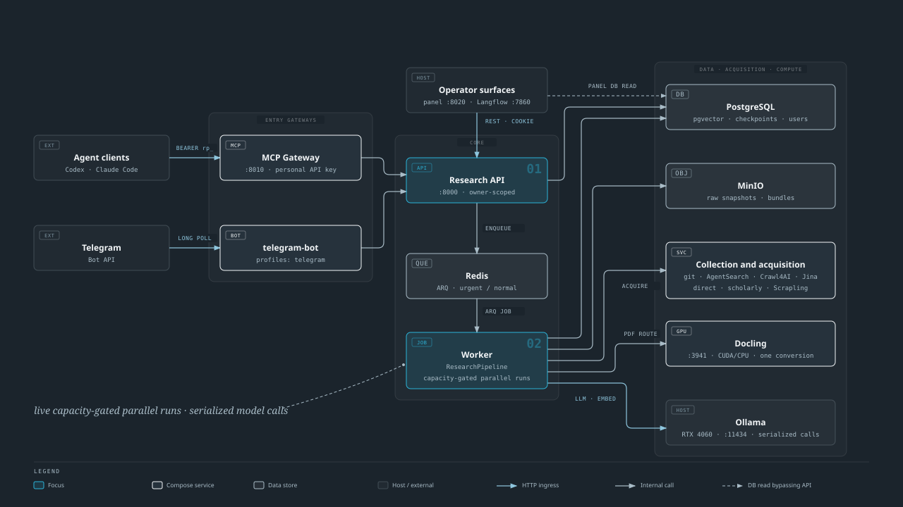
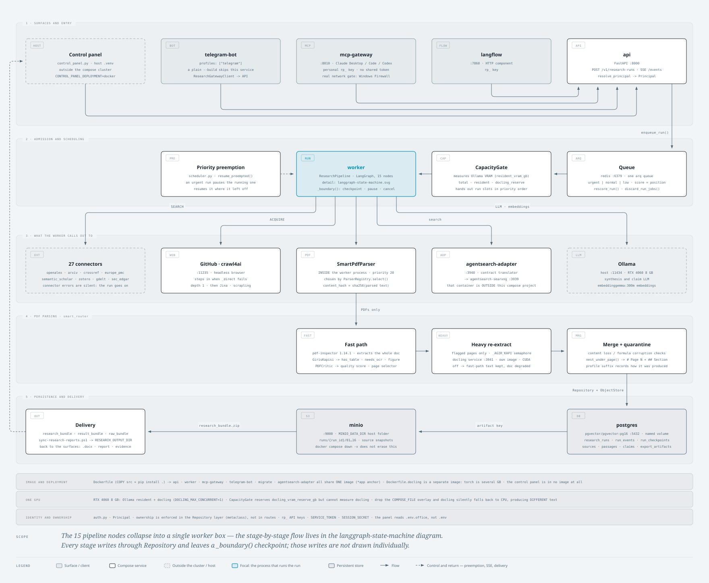
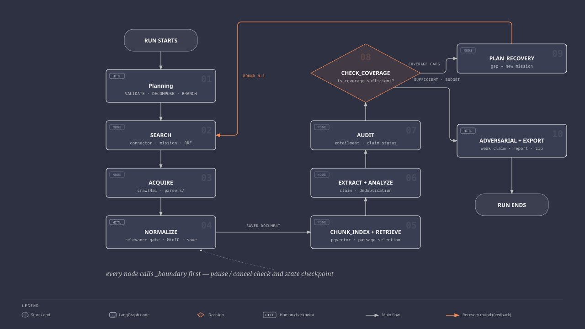
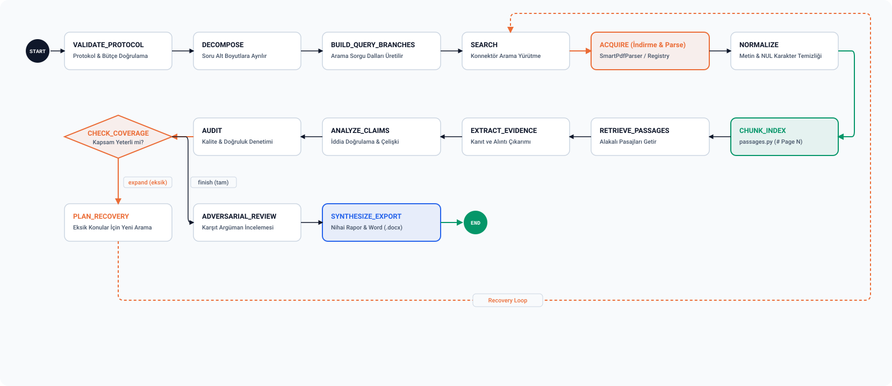
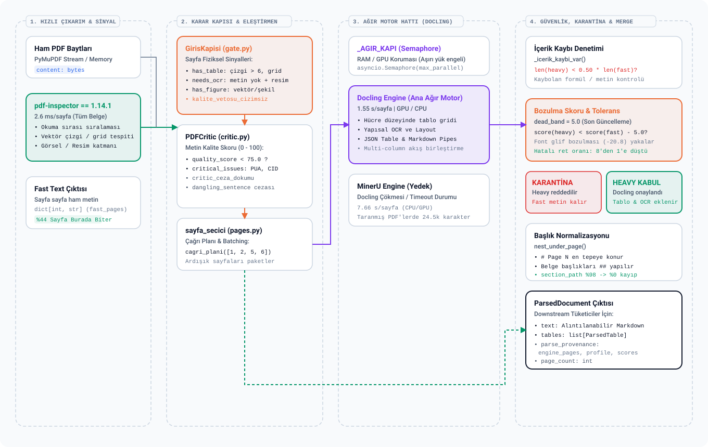
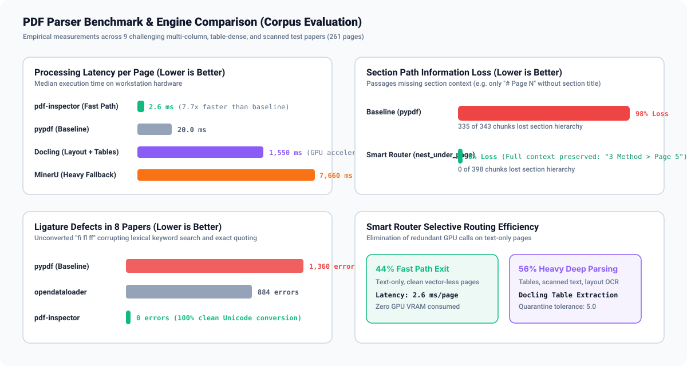
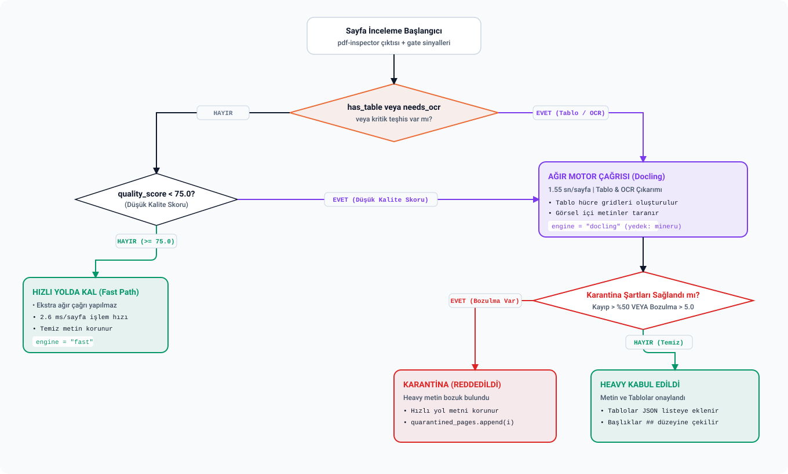

# Research Platform System Architecture & Subsystems Specification

This document provides the formal architectural specification of Research Platform (v0.10.7+), detailing the workstation deployment model, entrypoint gateways, LangGraph state machine, the Smart Router hybrid PDF parsing pipeline, quarantine safety gates, and persistent storage schemas.

For a standalone browser-based interactive view with real-time light/dark theme toggles and tabbed navigation, see [system_architecture_diagram.html](../system_architecture_diagram.html).

---

## 1. Workstation Deployment & Infrastructure Tier

The platform transforms a single workstation (e.g. NVIDIA RTX 4060 with 8 GB VRAM) into a secure, multi-client evidence engine. Network-facing entry gateways authenticate incoming requests and dispatch asynchronous research jobs to host-isolated background workers.



### Ingress & Security Model
- **Authenticated Gateways:** The MCP server (`:8010`), Telegram bot, and Operations Console (`:8020`) authenticate requests using individual API keys (`BEARER rp_...`).
- **Private Host Tier:** The Redis task queue, PostgreSQL database, MinIO object store, and Ollama inference engine are bound to loopback/private Docker networks, inaccessible to external networks.
- **Asynchronous Execution:** The Research API (`:8000`) enqueues long-running research tasks onto Redis as ARQ jobs, which are processed by dedicated pipeline workers.

---

## 2. End-to-End Data & Storage Lifecycle

Workloads flow from user interfaces through the LangGraph runtime, engage the Smart Router for structured document parsing, and commit to relational tables, S3 object storage, and vector indexes.



### Subsystem Breakdown

1. **Client & Ingress Layer:**
   - **Telegram Interface (`telegram_bot.py`):** Accepts `/research` commands, streams live progress, handles Human-In-The-Loop (HITL) button interactions, and delivers completed Word (`.docx`) deliverables directly to users.
   - **Operations Console (`control_panel.py`):** FastAPI-powered web console providing real-time Server-Sent Events (SSE), research run tracking, and configuration management.
   - **Admin CLI & REST API (`admin_cli.py`, `api.py`):** Programmatic endpoints (`POST /api/v1/research/start`) for headless orchestration.

2. **LangGraph Agent Core (`pipeline.py`):**
   - Coordinates multi-round evidence discovery across 27 connectors and 9 source families.
   - Maintains state checkpointing backed by PostgreSQL `research_runs` records.

3. **Parser Registry & Smart Router (`parsers/`, `smart_router/`):**
   - Automatically selects the optimal parser based on MIME type and priority.
   - Routes PDF documents to `SmartPdfParser` (Priority `20`), executing fast inspection and selective deep layout analysis.

4. **Persistence & Vector Storage Tier:**
   - **PostgreSQL (`research_runs`, `sources`, `passages`, `evidences`, `reports`):** Enforces relational integrity and auditability.
   - **MinIO S3 Snapshot Store:** Persists immutable raw document bytes, extracted figures, and binary report artifacts.
   - **Qdrant Vector Database:** Indexes passage embeddings (`dense_vector [1536f]`) with structured metadata filters (`source_id`, `section_path`).

---

## 3. Research Lifecycle & Multi-Round Exploration

Collection does not stop merely because an initial source was discovered. The platform performs multi-round exploration governed by collection time budgets and saturation gates.



### Gating and Stopping Rules
- **Collection Budget (`max_wall_minutes`):** Serves as a search budget rather than an immediate kill switch. When exhausted, new searches stop while ongoing normalization, evidence extraction, audit, and synthesis run to completion.
- **Saturation Gate:** Evaluates whether subsequent search rounds produce novel claims or redundant citations before terminating collection.

---

## 4. LangGraph 14-Node State Machine

The research execution graph is implemented with LangGraph `StateGraph`, maintaining deterministic state transitions, human checkpointing, and conditional recovery loops.



### Node Execution Sequence

| Step | Node Identifier | Operational Role |
|---|---|---|
| 01 | `VALIDATE_PROTOCOL` | Validates search parameters, quotas, and budget boundaries. Supports HITL plan approval. |
| 02 | `DECOMPOSE` | Deconstructs complex research queries into structured sub-hypotheses and analytical dimensions. |
| 03 | `BUILD_QUERY_BRANCHES` | Generates targeted search queries tailored for academic, legal, standards, and general web connectors. |
| 04 | `SEARCH` | Executes parallel connector scans across academic databases (PubMed, arXiv, Semantic Scholar, Crossref, etc.). |
| 05 | `ACQUIRE` | Downloads candidate source artifacts and invokes `ParserRegistry.select("pdf")` for structured extraction. |
| 06 | `NORMALIZE` | Cleans raw text, strips invalid Unicode / NUL characters, and standardizes document structure. |
| 07 | `CHUNK_INDEX` | Segments parsed text into retrievable passages (`passages.py`), preserving `# Page N` and heading hierarchy, then indexes dense vectors in Qdrant. |
| 08 | `RETRIEVE_PASSAGES` | Performs hybrid (dense embedding + BM25 lexical) passage retrieval against sub-hypothesis targets. |
| 09 | `EXTRACT_EVIDENCE` | Extracts atomic claim-to-passage links with verbatim quotations, direction (supporting/conflicting), and confidence scores. |
| 10 | `ANALYZE_CLAIMS` | Reconciles claims across sources, builds the contradiction map, and aggregates empirical evidence. |
| 11 | `AUDIT` | Verifies source coverage, validates quote precision, and computes citation completeness. |
| 12 | `CHECK_COVERAGE` | **Decision Gate:** Evaluates whether evidence coverage satisfies protocol requirements. Routes to `expand` (triggering `PLAN_RECOVERY`) or `finish` (proceeding to synthesis). |
| 13 | `PLAN_RECOVERY` | If coverage is incomplete, formulates gap-targeted search queries and loops back to `SEARCH`. |
| 14 | `ADVERSARIAL_REVIEW` | Subject syntheses to counter-argument verification and stress-testing. |
| 15 | `SYNTHESIZE_EXPORT` | Generates the comprehensive research dossier, executive summaries, Markdown reports, and formatted Word (`.docx`) deliverables. |

---

## 5. Smart Router & Hybrid PDF Parsing Pipeline

PDF documents exhibit high variability, ranging from simple clean text to complex multi-column layouts with dense tables and scanned images. The Smart Router architecture isolates heavy compute resources while guaranteeing extraction quality.



### Pipeline Stages

1. **Fast Path Inspection (`pdf-inspector`):**
   - Processes the full PDF at **2.6 ms/page**.
   - Analyzes physical reading orders, vector ruling lines, and embedded image layers without heavy neural nets.
   - Clean, text-only pages (typically ~44% of corpus) are extracted immediately.

2. **Karar Kapisi (Physical Gate) & PDFCritic:**
   - **`gate.py` (`GirisKapisi`):** Detects `has_table` (vector line counts > 6 or grid structures), `needs_ocr` (zero text + image presence), and `has_figure`. Enforces `kalite_vetosu_cizimsiz` to avoid unnecessary heavy parser invocations on clean vector-less pages.
   - **`critic.py` (`PDFCritic`):** Computes a 0–100 `quality_score`, flagging Private Use Area (PUA) glyphs, CID font errors, and dangling sentences. Pages scoring `< 75.0` are escalated to heavy processing.

3. **Heavy Engine Lane (`engines.py`):**
   - Protected by `_AGIR_KAPI` (`asyncio.Semaphore`) to avoid VRAM exhaustion on local hardware (e.g. RTX 4060 8GB).
   - **Primary Engine (Docling):** Executes deep layout analysis and table cell grid reconstruction at **1.55 s/page**.
   - **Fallback Engine (MinerU):** Engaged automatically if Docling encounters a timeout or syntax crash.

4. **Security, Quarantine & Merge (`merge.py`):**
   - Compares heavy extraction output against fast path text.
   - Rejects degraded outputs into quarantine and maintains clean fast text.
   - Wraps sections using `nest_under_page()`: prepends `# Page N` at root and shifts document headings to `##` level, reducing section path loss from **98% to 0%**.

### Empirical Benchmark & Defect Measurement



---

## 6. Quarantine Gate & Decision Matrix

To ensure that heavy OCR/layout models never corrupt clean text, all heavy outputs pass through a deterministic verification gate.



### Verification Rules & Thresholds

1. **Content Loss Guard (`_icerik_kaybi_var`):**
   $$\text{len}(\text{text}_{\text{heavy}}) < 0.50 \times \text{len}(\text{text}_{\text{fast}})$$
   If heavy engine output drops more than 50% of the character volume, the output is rejected immediately to protect against truncated tables or dropped text blocks.

2. **Dead Band Degradation Tolerance (`dead_band = 5.0`):**
   $$\text{score}(\text{text}_{\text{heavy}}) < \text{score}(\text{text}_{\text{fast}}) - 5.0$$
   A calibrated margin of 5.0 prevents false rejections caused by minor stylistic variations while catching severe font glyph corruption (which typically drops scores by >20 points).

3. **Fallback Safety Contract:**
   - When quarantine triggers, the page is recorded in `quarantined_pages` and the fast path text is preserved.
   - The overall pipeline never crashes on a single page failure.

---

## 7. Database Schema & Data Dictionary

### Core Tables

#### `research_runs`
Tracks top-level research lifecycle state, checkpoints, and user ownership.
- `run_id` (`TEXT`, PK): Unique ULID identifying the execution.
- `user_id` (`TEXT`, Indexed): Owner account identifier.
- `status` (`TEXT`): Lifecycle state (`pending`, `running`, `paused_hitl`, `completed`, `failed`).
- `protocol` (`JSONB`): Configuration payload, query dimensions, connector selections, and budgets.
- `hitl_history` (`JSONB`): Checkpoint responses and human approval logs.
- `created_at`, `updated_at` (`TIMESTAMPTZ`): Monotonic timestamps.

#### `sources`
Maintains immutable records of acquired literature, patents, papers, and web assets.
- `source_id` (`TEXT`, PK): ULID assigned upon acquisition.
- `run_id` (`TEXT`, FK): Parent research run.
- `url` (`TEXT`), `canonical_url` (`TEXT`): Origin and normalized URLs.
- `content_hash` (`TEXT`): SHA-256 digest of the raw content.
- `parser_id` (`TEXT`): Engine used (`smart_pdf`, `pymupdf`, `html_structured`).
- `parse_provenance` (`JSONB`): Page counts, engine decisions, quarantine flags, and critique scores.
- `status` (`TEXT`): Access classification (`open`, `restricted`, `paywalled`).

#### `passages`
Stores granular, citable text passages extracted from normalized sources.
- `passage_id` (`TEXT`, PK): ULID.
- `source_id` (`TEXT`, FK): Origin source record.
- `text` (`TEXT`): Extracted verbatim text block.
- `token_count` (`INTEGER`): Token length.
- `section_path` (`TEXT`): Structural location (e.g. `3 Methodology > Page 5`).
- `page_number` (`INTEGER`): Explicit physical page reference derived from `# Page N`.

#### `evidences`
Relational claim-to-passage links establishing factual basis.
- `evidence_id` (`TEXT`, PK): ULID.
- `run_id` (`TEXT`, FK): Parent research run.
- `passage_id` (`TEXT`, FK): Cited passage.
- `claim_text` (`TEXT`): Extracted claim proposition.
- `direction` (`TEXT`): Empirical alignment (`supports`, `contradicts`, `neutral`).
- `confidence_score` (`FLOAT`): Model certainty metric.

#### `reports`
Stores synthesized deliverables and reproduction metadata.
- `report_id` (`TEXT`, PK): ULID.
- `run_id` (`TEXT`, FK): Parent research run.
- `synthesis_markdown` (`TEXT`): Full structured report.
- `citations_json` (`JSONB`): Linked bibliography and citation ledger.
- `token_cost` (`INTEGER`), `wall_seconds` (`FLOAT`): Cost and resource metrics.

---

## 8. Verification and Test Coverage

The platform architecture is continuously verified by automated unit and integration tests covering:
- Parser priority selection and fallback cascades (`test_parsers.py`).
- Gate signal calibration, quality scores, and quarantine dead band thresholds (`test_smart_router.py`).
- End-to-end LangGraph state transitions and recovery loops (`test_pipeline.py`).
- Database migrations and relational integrity (`tests/`).

Run the full verification suite:
```powershell
.\.venv\Scripts\pytest.exe -q
```
