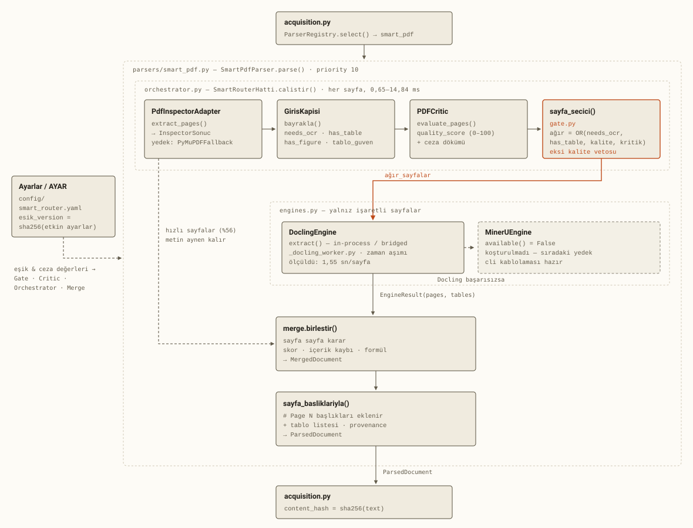
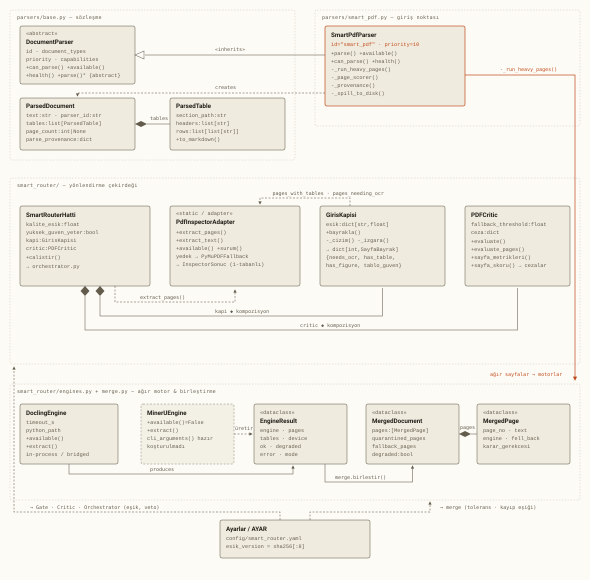
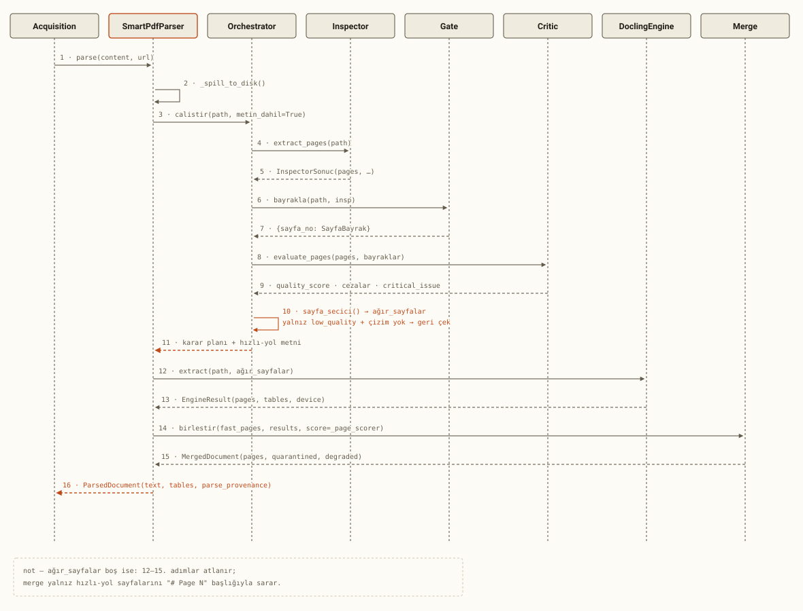

# Smart PDF Router — Mimari

> **Kaynak:** `src/research_platform/parsers/`, kod okunarak çıkarıldı.

Üretimde kayıtlı parser `smart_pdf` (öncelik 10), tek belgeyi tek motora göndermek
yerine **her sayfayı ayrı yönlendirir**: ucuz bir denetimden geçirir, yalnız sorunlu
sayfaları pahalı motora yollar, ikisini geri birleştirir.

Aşağıdaki üç çizim aynı sistemi üç açıdan gösteriyor — bileşenlerin akışı, sınıfların
yapısı, tek bir `parse()` çağrısının zaman içindeki seyri.

Kalibre edilmemiş alanlar ve koşturulmamış yollar bilerek diyagramlara dahil edildi:
**mimarinin neyi henüz yapmadığı da mimarinin bir parçası.**

---

## Şekil 1 / 3 — Uçtan uca hat

`SmartPdfParser.parse()` çağrıldığında sayfalar önce ucuz bir gözden geçirmeden geçer;
yalnız işaretlenenler ağır motora düşer. İki yol `merge.birlestir()`'de tek belgede
birleşir.

**Çizgi anlamları:** düz ok = veri akışı (senkron çağrı) · kesikli ok = yapılandırma
ya da opsiyonel bağımlılık · kalın ok = yönlendirme kararı · soluk kesikli kutu =
tanımlı ama koşturulmuyor.

> **Ölçüldü** (9 belge, 261 sayfa): sayfaların **%56'sı** hızlı yolda
> kalıyor (115 sayfa ağır motora gidiyor). Kapı maliyeti 0,65–14,84 ms/sayfa,
> Docling 1,55 sn/sayfa — kapı **100+ kat ucuz**.
> `MinerUEngine.available()` şu an her zaman `False`; kablolama hazır ama hiç koşmadı.

---

## Şekil 2 / 3 — Sınıf yapısı

Dört dosya kümesi: sözleşme (`base.py`), giriş noktası (`smart_pdf.py`), yönlendirme
çekirdeği (`smart_router/`), ağır motor ve birleştirme. `Ayarlar` hepsine eşik/ceza
değeri akıtan tek yapılandırma kaynağı.

**İlişki anlamları:** içi boş üçgen uçlu çizgi = **kalıtım** (`SmartPdfParser` bir
`DocumentParser`'dır) · dolu baklava (◆) = **kompozisyon** (`SmartRouterHatti`,
`GirisKapisi` ve `PDFCritic`'i kendi yaşam döngüsünde tutar) · kesikli ok =
**bağımlılık** ya da yapılandırma akışı · turuncu çizgi = ağır motoru tetikleyen yol.

Bağlantılar kutuların içinden geçmesin diye kutu satırlarının üstündeki ve altındaki
boş şeritlerde, kesişmeyecek derinlik sırasıyla yönlendirildi.

---

## Şekil 3 / 3 — Tek bir `parse()` çağrısının seyri

Ağır yolun devreye girdiği örnek: en az bir sayfa işaretlenmiş. Hiç sayfa
işaretlenmezse ağır motor ve birleştirme adımları atlanır, `merge.birlestir()` yalnız
hızlı-yol metnini sarar.

**Not:** ağır sayfa listesi boşsa 12–15. adımlar atlanır; merge yalnız hızlı-yol
sayfalarını `# Page N` başlığıyla sarar. `MinerUEngine` bu akışta görünmüyor:
`available()` her zaman `False` döndürdüğü için `_run_heavy_pages()` onu hiç
çağırmıyor, sırada yalnız duruyor.

---

`ROUTER_VERSION = orchestrator_v1` · `ESIK_VERSION = <profil>_sha256[:8]` ·
`ENGINE_VERSION = engines_v1`

`ESIK_VERSION` elle yazılmaz, etkin ayarlardan türetilir — bir eşik değişince sürüm de
değişir, yani provenance yalan söyleyemez.

Kalibre edilmemiş alanlar (`kalite_esik`, kuyruk skoru) ve koşturulmamış yollar
(MinerU kablolaması) bilerek diyagramlarda tutuldu. Ölçüm geçmişi ve karar
gerekçeleri: [`previous_reports/PDF_PARSER_V0.1.0_RC1_REPORT.md`](../previous_reports/PDF_PARSER_V0.1.0_RC1_REPORT.md).
