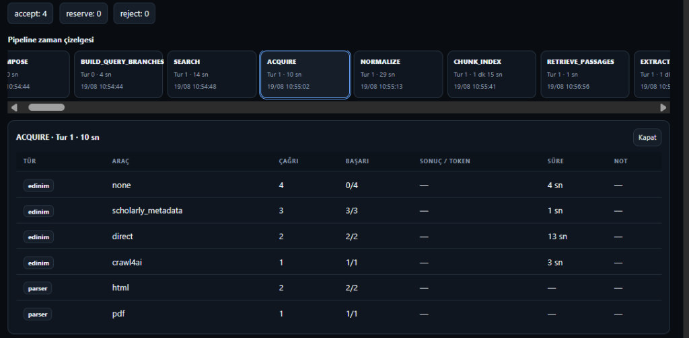
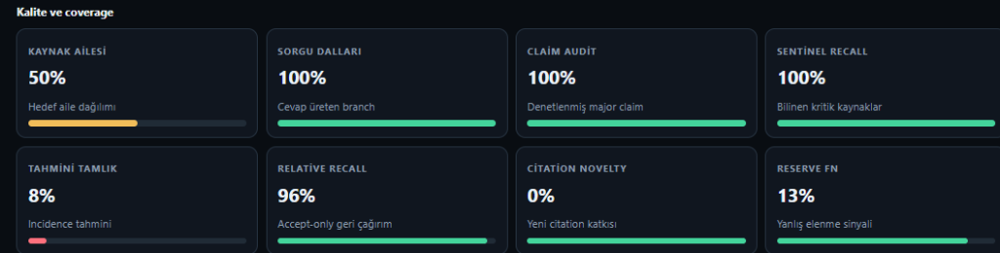

# Research Platform — Geliştirme, Mimari ve Yeni Özellikler Bilgilendirme Raporu

**Tarih:** 19 Ağustos 2026  
**Sürüm:** Platform `v0.10.0` / Dokümantasyon `v1.0`  
**Hedef Kitle:** Mühendislik & Araştırma Ekibi  

---

## 📌 Yönetici Özeti

Bu rapor; platformda hayata geçirilen üç ana mimari ve operasyonel geliştirmeyi, yenilenen sistem mimarisi ve veri akış diyagramlarını, kontrol paneli telemetrisini ve ekibin bilmesi gereken kritik metrikleri bir araya getirmektedir:

1. **Granüler Ayrıştırıcı ve Araç Telemetrisi:** Jenerik `pdf`/`html` etiketleri yerine o an fiilen çalışan ayrıştırıcı motorun özgün kimliği (`pymupdf_fast`, `pypdf`, `html_structured`, `plain_text`) kontrol panelinde canlı izlenebilir ve veritabanı/dosya sistemi kökenine (provenance) kaydedilir hale getirildi.
2. **Yenilenen Sistem & Pipeline Akış Diyagramları:** Çok kullanıcılı güvenlik mimarisi, Long Poll Telegram entegrasyonu, kişisel API anahtarları (`Bearer rp_`), izole depolama ve LangGraph tabanlı aşama akışları görselleştirildi.
3. **Zorunlu Planlama Modu (HITL Plan Review) & Süre Bütçesi:** Araştırma başlamadan önce alt soruları, sorgu dallarını ve stratejiyi insan onayına sunan planlama kapısı eklendi; süre parametresi (`max_wall_minutes`) zorunlu hale getirildi.
4. **Kalite ve Kapsam (Quality & Coverage) Metrikleri:** Kontrol panelinde sunulan 8 istatistiksel kalite göstergesinin çalışma mantığı belgelendi.

---

## 1. Granüler Araç & Ayrıştırıcı (Parser/Connector) Telemetrisi

Platform artık sadece bir belgenin indirildiğini değil, **hangi connector**, **hangi indirme yöntemi** ve **hangi parser motoru** ile metne dönüştürüldüğünü ayrıştırır ve raporlar.



### 1.1. Yeni Parser Motorları ve Hiyerarşi
* **`pymupdf_fast` (Öncelik: 10):** PyMuPDF (`fitz`) motoru. İki sütunlu akademik makaleleri insan okuma sırasına göre (`sort=True`) sütunları birbirine karıştırmadan ayrıştırır.
* **`pypdf` (Öncelik: 0):** Saf Python tabanlı yedek motor. PyMuPDF'in bulunamadığı veya hasarlı PDF dosyalarında otomatik devreye girer.
* **`html_structured` (Öncelik: 10):** Web sayfalarındaki tabloları Markdown formatına çeviren, kod bloklarını koruyan yapılandırılmış HTML parser'ı.
* **`plain_text` (Öncelik: 0):** Düz metin, JSON ve XML anahtar-değer ağacı ayrıştırıcısı.

### 1.2. Otomatik Fallback ve Dosya Sistemi Kökeni (Provenance)
* Birincil motor (`pymupdf_fast`) hasarlı bir dosyada hata verirse, edinim aşaması düşmeden otomatik olarak `pypdf` motoruna geçer.
* Hangi motorun ayrıştırma yaptığı şu 3 katmanda kalıcı olarak saklanır:
  1. **PostgreSQL:** `source_versions.provenance -> parser_id`
  2. **MinIO Nesne Deposu:** `{run_id}/sources/{content_hash}.pdf` (orijinal ham baytlar)
  3. **Yerel Çıktı Paketi:** `13_raw_sources.jsonl` ve `18_structured_extracts.json` dosyaları.

---

## 2. Yenilenen Sistem & Veri Akış Diyagramları

### 2.1. Genel Sistem Mimarisi (`system-architecture.svg`)
Sistem; istemciler, ağ geçitleri, çekirdek işleyici ve veri servisleri olmak üzere 4 ana katmandan oluşur.


* **Long Poll Telegram Botu:** Gelen webhook portu açmak yerine Telegram sunucularına güvenli giden bağlantı (Long-polling) açarak komutları çeker.
* **Kişisel API Anahtarları (`Bearer rp_`):** Kullanıcı bazlı yetkilendirme sağlar; her kullanıcının araştırması ve geçmişi (`CORPUS_SCOPE=owner`) izole tutulur.
* **Service Token (`X-Actor-User`):** Telegram botu ve Kontrol Paneli, kullanıcı adına API çağrısı yaparken bu servis kimliğini sunar.

### 2.2. Pipeline ve Literatür Tarama Akışı (`pipeline-flow.svg`)
LangGraph tabanlı araştırma motoru, soruyu alt boyutlara ayırıp atıf ağaçlarını derinlemesine tarayarak sentezler.


---

## 3. Zorunlu Planlama Modu (HITL Plan Review) ve Süre Parametresi

### 3.1. Nasıl Çalışır?

```
[Kullanıcı Sorusu + Süre (Örn: 30 dk)]
                  │
                  ▼
         1. DECOMPOSE Aşaması ➔ LLM soruyu 3-8 anlamsal alt soruya ayırır
                  │
                  ▼
     2. BUILD_QUERY_BRANCHES ➔ Arama dalları ve araştırma planı oluşturulur
                  │
                  ▼
      ⏸️ PLAN ONAY KAPISI (Awaiting Input)
         ├─ Web Kontrol Paneli: Sarı Onay Kartı
         └─ Telegram: Özet Mesaj + /respond <id> approve|reject
                  │
        ┌─────────┴─────────┐
        ▼                   ▼
    [ONAYLANDI]         [REDDEDİLDİ + GEREKÇE]
        │                   │
        ▼                   ▼
   SEARCH & ACQUIRE    DECOMPOSE'a Geri Dönülür (Plan Yeniden Kurulur)
```

### 3.2. Alt Sorular Nasıl Üretilir?
Model, verilen ana soruyu anlamsal ayrıştırma (**Semantic Decomposition**) ile alt odaklara böler (örneğin teşhis doğruluğu, duyarlılık/özgüllük, klinik iş akışı, segmentasyon). Her alt soru bağımsız bir arama dalına dönüşür.

### 3.3. Metrikler ve Bağlayıcı Olmayan Sınırlar
* **Süre (max_wall_minutes):** Zorunlu ve **bağlayıcı** üst tavandır. Süre dolduğunda yeni arama kesilir, eldeki veriler analiz edilir.
* **Bağlayıcı Olmayan Sınırlar (`max_sources`, `max_rounds`):** Sistem `literature_scan` ve `exhaustive_until_budget` modunda çalıştığı için tur sayısı (örneğin 3 tur) bittiğinde araştırmayı erken kesmez; süre ve bilgi kapsamı elverdiği sürece atıf zincirlerini derinleştirmeye devam eder.
* **Planı Atlamak:** Otomasyon veya acil aramalar için `--plansiz` bayrağı ile plan onayı atlanıp doğrudan aramaya başlanabilir.

---

## 4. Kalite ve Kapsam (Quality & Coverage) Metrikleri

Kontrol panelinde araştırmanın doygunluğunu ve güvenilirliğini gösteren 8 temel metrik bulunur:



| Metrik | Açıklama ve Çalışma Mantığı | Hedef / İdeal |
|---|---|---|
| **Kaynak Ailesi** | Akademik makale, resmi regülasyon, web/haber kaynakları arasındaki hedef dağılım dengesi. | `%100` |
| **Sorgu Dalları** | Üretilen alt soruların kaç tanesine geçerli kanıt/cevap bulunduğunu ölçer. | `%100` |
| **Claim Audit** | Rapordaki ana iddiaların kaynak pasajlarıyla doğrulanma (grounding) oranı. Halüsinasyonu engeller. | `%100` |
| **Sentinel Recall** | Önceden tanımlanmış kritik mihenk taşı makalelerin (benchmark papers) bulunma oranı. | `%100` |
| **Tahmini Tamlık** | **Chao2 / Capture-Recapture** tür tahminleme istatistiği. Farklı motorların (OpenAlex, CrossRef, SearXNG vb.) getirdiği kaynakların kesişimine bakarak literatürün ne kadarına ulaşıldığını tahmin eder. | `%70+` |
| **Relative Recall** | Sistemin doğrudan `Accept` havuzuna aldığı kaynakların kalitesi. Yüksek olması filtrenin ilk hamlede doğru çalıştığını gösterir. | `%90+` |
| **Citation Novelty** | O turda bulunan kaynakların kaçının anahtar kelime aramasından değil, makale atıf ağaçlarından (citation frontier) geldiği. | Tur 2+: `%30+` |
| **Reserve FN** | Yanlış elenme oranı. Sınırda (Reserve) bırakılan belgelerden kaçının gerçekten ilgili çıktığı. Düşük olması filtrenin gereksiz katı olmadığını gösterir. | `< %20` |

---

## 5. Ekip İçin Hızlı Başlangıç Komutları

* **Telegram Üzerinden Araştırma Başlatma:**
  ```text
  /research 30 AI in lung CT imaging diagnostic accuracy and clinical workflow
  ```
* **Planı Onaylama:**
  ```text
  /respond <run_id> approve
  ```
* **Plana Müdahale Etme (Gerekçeli Revizyon):**
  ```text
  /respond <run_id> reject radyolog iş yükü ve maliyet tasarrufuna da odaklan
  ```
* **Plan Kapısını Atlayarak Doğrudan Başlatma:**
  ```text
  /research 20 --plansiz Soru metni...
  ```
