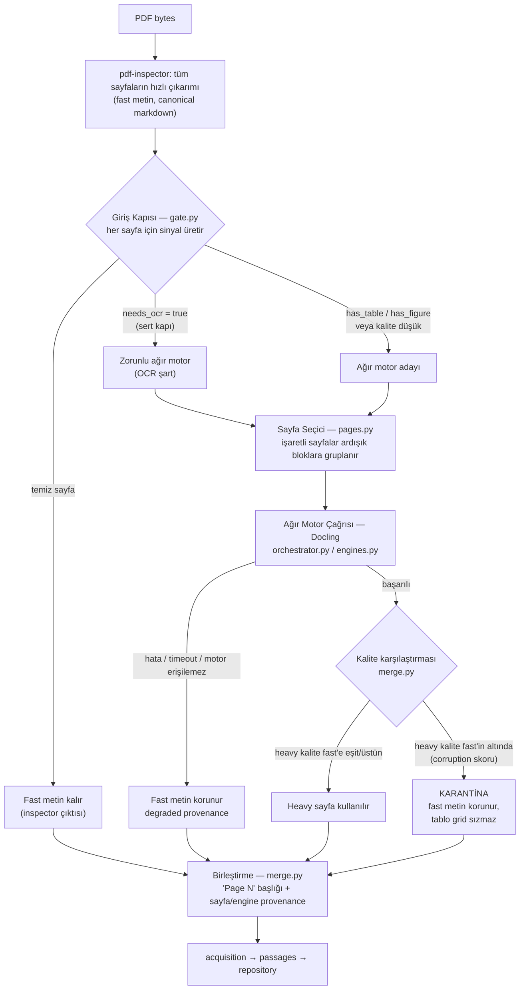

# PDF Parser A-B-C Uçtan Uca Çalışma Raporu

<!-- CODEX-2026-08-18: A, B ve C kollarındaki kodu, ölçüm kanıtlarını,
başarısız sonuçları ve açık işleri tek güncel kaynakta birleştiren ana rapor. -->

**Tarih:** 18 Ağustos 2026
**Son güncelleme:** 20 Ağustos 2026
**Üretim deposu:** bu `research-platform` klonu
**Dal:** `pdf-parser-degerlendirme`
**Sürümlenen ölçüm alanı:** `research/pdf-parser`

Bu belge A, B ve C kollarında ne yapıldığını baştan sona tek yerde anlatır.
Eski `A_KOLU_OZET.md`, `A_B_KOLU_SONUC.md` ve `C_KOLU_SONUC.md` dosyaları
ayrıntı/tarihsel kayıt olarak durur; güncel genel durum için ana kaynak bu
belgedir.

## 1. Yönetici Özeti

Başlangıçta sistem bir PDF için tek parser seçiyor ve belgenin tamamını o
parser'a veriyordu. Ayrıca ilk smart-router prototipinde gerçek pdf-inspector
yerine PyMuPDF tabanlı bir mock kullanıldığı için kalite kararı yanlış girdiye
bakıyordu.

Bugün ulaşılan akış — kapının nerede karar verdiği, ne zaman ağır motora
gidildiği ve fallback/karantinanın nasıl işlediği:



Not: MinerU, Docling'e sıralı fallback olarak kodda hazır ama motor sınıfı
bugün bilinçli olarak `unavailable` dönüyor (bkz. bölüm 4.7) — yani şemadaki
tek gerçek ağır motor şu an Docling.

| Kol | Amaç | Güncel durum |
|---|---|---|
| A | Yönlendirme mantığını gerçek parser ve sayfa düzeyinde kurmak | Tamamlandı ve ölçüldü |
| B | Mantığı production parser/acquisition sözleşmesine bağlamak | Temel zincir çalışıyor; A/B commitleri GitHub dalında |
| C1 | Fast, heavy ve routed çıktıyı referansa karşı ölçmek | 180 TR + 50 EN, 230/230 çıktı |
| C2 | Route ve algılama eşiklerini kalibre etmek | Tarama tamam; kabul edilen production route eşiği yok |
| C3 | Merge, fallback ve karantina güvenliği | Temel koruma tamam; semantik denetim eksik |

**Dürüst sonuç:** Çıktı veren ve parser katmanında uçtan uca çalışan bir teknik
RC var. Ancak ortak route kararı İngilizcede kötü genelliyor, çok sayfalı ve
gerçek taranmış PDF doğrulaması yok, production Docling köprüsü yavaş ve tüm
deep-research servisi canlı API/kuyruk/veritabanı ile uçtan uca sınanmadı.

20 Ağustos'taki Codex bağımsız internet denemesinde 3 belge/14 sayfada HIZLI
bırakılan 4 sayfada güçlü route kaçağı görülmedi; ancak ağır hatta seçilen bir
sayfada Docling'in %47,2 içerik kaybı mevcut merge tarafından kabul edildi.
Router sayfayı yakaladı, karantina yanlış karar verdi. Ayrıntı ve sınırlar Bölüm
J'dedir.

## 2. Başlangıç Araştırması: Neden Hibrit Parser

Önce 9 yerel PDF ve OpenDataLoader'ın 200 belgeli resmi benchmark'ında parserlar
karşılaştırıldı. Resmi benchmark'ın PDF, referans ve metrik kodu değiştirilmeden
kullanıldı.

| Motor | Overall | Okuma sırası | Tablo | Başlık |
|---|---:|---:|---:|---:|
| Docling | **0,894** | 0,910 | **0,934** | **0,827** |
| pdf-inspector | 0,876 | **0,915** | 0,814 | 0,788 |
| PyMuPDF4LLM | 0,869 | 0,907 | 0,790 | 0,783 |
| MinerU | 0,857 | 0,871 | 0,911 | 0,800 |
| OpenDataLoader | 0,838 | 0,913 | 0,427 | 0,760 |
| pypdf | 0,576 | 0,870 | 0,000 | 0,000 |

Bu sonuç tek motor seçmek yerine şu tasarımı destekledi:

- pdf-inspector hızlı yol ve okuma sırası için güçlü.
- Docling tablo ve karmaşık düzen için en yüksek genel sonucu verdi.
- Taranmış PDF'de text-layer motorları başarısız; OCR motoru gerekiyor.
- Ağır motor saniyeler, yönlendirme sinyalleri milisaniyeler sürüyor.

Kanıt: `out/_resmi_benchmark_tum.log` ve `resmi_benchmark_sonuc.json`.

## 3. A Kolu: Yönlendirme Mantığı

### 3.1 A1: Mock kaldırıldı, canonical çıktı sabitlendi

**Sorun:** `inspector.py` gerçek pdf-inspector Markdown'ı yerine PyMuPDF düz
metni veriyordu. Her fiziksel satır ayrı paragraf gibi göründüğü için critic
belgeyi olduğundan kötü sayıyordu.

**Yapılan:** Gerçek `pdf_inspector.process_pdf().markdown` canonical hızlı çıktı
oldu. Mock ve üretim davranışı ayrıldı.

**Ölçülen sonuç:**

| Ölçüm | Önce | Sonra |
|---|---:|---:|
| Hızlı yolu kullanabilen belge | 0/9 | 3/9 |
| `table_irregularity` çalışan belge | 0/9 | 8/9 |
| `heading_incoherence` çalışan belge | 0/9 | 6/9 |

Bu, ilk kararların bir kısmının PDF kalitesini değil mock biçimini ölçtüğünü
kanıtladı.

### 3.2 A2: Critic sayfa düzeyine indirildi

Belgeye tek puan vermek yerine her sayfa ayrı değerlendirildi. Belge puanı sayfa
puanlarından türetildi; boş/ölçülemeyen sayfa otomatik olarak en kötü sayfa
sayılmadı.

Ölçülen critic maliyeti yaklaşık `0,42-0,92 ms/sayfa`. Sayfa bazlı skorlar 9/9
belgede eski belge skorundan `+9,9` ile `+23,4` daha yüksek çıktı. Bu aynı zamanda
eski `75` eşiğinin yeni ölçek için doğrudan kullanılamayacağını gösterdi.

### 3.3 A3: Critic giriş kararından çıkış denetimine taşındı

Eski düşünce "PDF'e bak, parser seç" idi. Yeni sıra "önce ucuz çıkarım yap,
çıktıyı değerlendir, gerekirse ağır motor kullan" oldu. Böylece temiz sayfalar
gereksiz yere ağır motora gitmiyor.

Sınırlama: İlk post-critic yalnız bozuk karakter, tekrar, kırık satır gibi
motorlar arasında karşılaştırılabilir bozulma sinyallerini görebiliyor. Formül
anlamı ve yanlış kelime gibi semantik kayıpları güvenilir biçimde göremiyor.

### 3.4 A4: Giriş kapısı ve sayfa seçici

Kapı sayfa başına `needs_ocr`, `has_table`, `has_figure`, tablo güveni ve kalite
sinyali üretiyor. Tek yapısal skor artık yol seçmiyor.

| Sinyal | Recall, yerel / bench | Precision, yerel / bench |
|---|---:|---:|
| Tablo | 0,93 / 0,98 | 0,55 / 0,51 |
| Yüksek güven tablo | 0,60 / 0,79 | 0,75 / 0,87 |
| Şekil | 0,99 / 0,99 | 0,69 / 0,62 |
| Vektörel şekil | 0,97 / 0,93 | 0,48 / 0,23 |

Şekil recall'ı eski kuraldaki `0,63` seviyesinden `0,99` seviyesine çıktı.
Precision'ın düşük olması daha sonra C'de gerçek maliyet/kalite problemi olarak
doğrulandı; bu yalnız teorik bir risk olarak kalmadı.

### 3.5 A5: Sayfa tabanı ve ardışık ağır çağrılar

Farklı araçların 0/1 tabanlı sayfa numaraları tek yerde normalize edildi.
İşaretlenen sayfalar ardışık bloklara bölündü; örneğin 3-5 tek Docling çağrısı,
8 ayrı çağrı oluyor.

Ölçüm:

| Koşu | Toplam | Sayfa başına |
|---|---:|---:|
| 12 ardışık sayfa, tek sıcak çağrı | 18,56 sn | 1,55 sn |
| 12 dağınık sayfa, 12 çağrı | 29,28 sn | 2,44 sn |

Production süreç köprüsünde ayrıca yaklaşık `5,2 sn/çağrı` başlangıç maliyeti
ölçüldü. Bu nedenle bloklama production'da daha da önemli.

### 3.6 A6: Metrik ve sinyal onarımları

- `char_drop_ratio` gerçek karşılaştırma tabanına bağlandı.
- Eski `vector_table_drop` yerine ölçülmüş `has_table` sinyali kullanıldı.
- Unicode gürültüsü yanlış ölçeklenmek yerine görünürlük sinyaline çevrildi.
- Belge anlamı gerektiren running-header/repetition metrikleri belge düzeyinde kaldı.
- OCR hedefi ölçülmemiş `miner-VL` iddiasından Docling/MinerU gerçek sonuçlarına taşındı.
- `has_figure` raster ve vektör sinyallerini birleştirecek şekilde düzeltildi.

### 3.7 A7: Yapısal skor yalnız kuyruk önceliği oldu

17 farklı özelliğin aynı `0-100` aralığıyla normalize edilmesi skoru anlamsız
hale getiriyordu; örneğin taranmış belge yalnız `4,3` puanla en düşük skoru
alıyordu. Bu skor parser seçmekten çıkarıldı, yalnız iş sırasını belirliyor.

### 3.8 A8-A10: Devralınan borçlar

| İş | Yapılan | Sonuç |
|---|---|---|
| A8 legacy giriş | `router.py` legacy, `pipeline.py` uyumluluk katmanı olarak işaretlendi | Mentör benchmark'ı bozulmadı |
| A9 çift inspector | Kapı hazır inspector sonucunu kullanıyor | Karar aynı; 8/9 belgede kapı %27-37 ucuzladı |
| A10 `critical_issue` | Kritik ve uyarı ayrımı sayfa seçiciye bağlandı | 261 sayfada 0 yol değişimi; yanlış alarm olabilecek 60 ek ağır sayfa engellendi |

### 3.9 A kolu toplam sonucu

9 belge ve 261 sayfada:

| Yol | Sayfa | Oran |
|---|---:|---:|
| Hızlı | 114 | %44 |
| Ağır | 139 | %53 |
| OCR | 8 | %3 |

Kontrol maliyeti belgeye göre `0,65-14,84 ms/sayfa`; ağır motor maliyeti
saniye düzeyinde. A kolu "sayfa seçmek ucuz" tezini kanıtladı. Fakat bu aşamada
"seçilen sayfada Docling gerçekten daha iyi mi" sorusu henüz ölçülmemişti; C1
bu boşluk için yazıldı.

Kanıtlar: `out/a_kolu_kosu.json`, `out/kapi_korpus.json`,
`out/kapi_bench.json`, `out/critic_olcum.json`.

## 4. B Kolu: Production Sözleşmesine Entegrasyon

### 4.1 SmartPdfParser ve tek production kaynak

Router kodu `research-platform/src/research_platform/parsers/smart_router/`
altına taşındı. `SmartPdfParser`, mevcut `DocumentParser` sözleşmesine uydu ve
registry'de PDF için öncelikli parser oldu.

İlk production commit: `432eb06`.

### 4.2 Registry ve sayfa numaralarının korunması

`priority = 10` ile deterministik registry seçimi sağlandı. Markdown birleşirken
`# Page N` başlığı bir kez ekleniyor, sayfanın kendi H1 başlıkları bir seviye
indiriliyor. `passages.py` iç içe bölüm yolunda da `Page N` buluyor.

Ölçülen sonuç: Metin katmanı olan 8/9 belgede sayfa numarası taşıyan pasaj oranı
eski `%22-52` aralığından `%100`'e çıktı.

Commit: `0d02465`.

### 4.3 Ağır motor gerçekten bağlandı

Router daha önce yalnız karar veriyor, Docling'i çağırmıyordu. Docling için iki
çalışma şekli eklendi:

- Aynı process içinde import.
- `SMART_ROUTER_DOCLING_PYTHON` ile ayrı Python köprüsü ve gerçek timeout.

Eksik/timeout olan sayfa kaybolmuyor; fast metin korunuyor ve degraded/fallback
provenance yazılıyor.

Taranmış sentetik belgede çıktı `68` karakterden `25.036` karaktere çıktı ve
acquisition'ın `<400` filtresinden geçer hale geldi.

Commit: `bb1d277`.

### 4.4 Provenance uçtan uca taşındı

`ParsedDocument -> AcquiredDocument -> SourceVersion.provenance` zincirine şu
bilgiler eklendi:

- Parser profili.
- Router/eşik/engine sürümü.
- Her sayfanın motoru ve yönlendirme nedeni.
- Fallback, degraded ve karantina durumu.

Mevcut JSON alanı kullanıldığı için veritabanı migration'ı gerekmedi. Content
hash yalnız metinden üretilmeye devam ediyor.

Commit: `314a3df`.

### 4.5 Async acquisition ve ağır iş sınırı

Senkron parser çağrıları `asyncio.to_thread` ile event loop dışına alındı.
`SMART_ROUTER_MAX_CONCURRENT_HEAVY` ile ağır motor eşzamanlılığı varsayılan 1'e
sınırlandı; 300 saniye kuyruk bekleme sonunda görünür degraded sonuç dönüyor.

Commit: `f2141b3`.

### 4.6 Tablolar prose dışında grid olarak taşındı

Docling'in hücre grid'i `headers` ve `rows` biçiminde `ParsedTable` alanına
taşındı. Markdown tablo da korunuyor.

Türkçe makalede 7 tablo alındı; başlık/satırlar dolu, Türkçe karakter bozulması
ve replacement character yoktu.

Commit: `b71f613`.

### 4.7 Health, karantina ve bozulmanın görünür olması

- Health ağır motorun gerçekten erişilebilir olup olmadığını raporluyor.
- Parse exception boş belge gibi görünmek yerine traceback/provenance taşıyor.
- Heavy metin corruption skorunda fast'ten düşükse fast sayfa korunuyor.
- Content hash aynı olsa bile parse provenance güncelleniyor.
- Docling sonrası MinerU için sıralı fallback zinciri hazırlandı.

MinerU motor sınıfı bugün bilinçli olarak `unavailable` dönüyor; CLI yolu gerçek
production akışında denenmedi. Bu nedenle iki çalışan ağır motor varmış gibi
iddia edilemez.

Commit: `8e661a8`.

### 4.8 C sırasında bulunan production güvenlik düzeltmeleri

Codex işaretli güncel değişiklikler:

- Router paketi import edilemiyorsa registry plain `PdfParser`'a düşüyor.
- Engine çağrısının beklenmedik exception'ı belgeyi çökertmeden degraded oluyor.
- Geçici PDF yazma hatasında dosya temizleniyor.
- Gate ham tablo/grid sinyallerini calibration için provenance'a taşıyor.
- Karantinaya alınan heavy sayfanın tablo grid'i merged sonuca sızmıyor.

Bu değişiklikler `CODEX-2026-08-18` yorumuyla işaretli ve RC1 hazırlığında
ayrı bir hardening commitine alınmıştır.

### 4.9 B kolu test durumu

- A/B commitli aşamanın tarihsel sonucu: `36 passed`.
- C güvenlik düzeltmeleriyle güncel parser hedef testi: `39 passed`.
- Python 3.10/3.11 aynı yönlendirmeyi verdiği ve parser'ın paralel kullanımda
  durumsuz kaldığı ayrıca sınandı.
- Tam repository test takımı mevcut ortamda bağımlılık/Python koleksiyon
  sorunları nedeniyle tamamlanmadı. Bu yüzden "tüm platform testleri geçti"
  denemez.

## 5. C Kolu: Korpus, Doğrulama ve Kalibrasyon

### 5.1 Korpus envanteri

Dört kaynak tek schema v2 manifestoya bağlandı:

| Kaynak | Kayıt | PDF | Metin referansı | Sayfa etiketi | C1 uygun |
|---|---:|---:|---:|---:|---:|
| OCRTurk | 180 | 180 | 180 | 180 | 180 |
| DocLayNet ICDAR | 1.016 | 0 | 0 | 498 | 0 |
| OmniDocBench | 1.651 | 0 | 0 | 1.651 | 0 |
| OpenDataLoader benchmark | 200 | 200 | 200 | 200 | 200 |
| **Toplam** | **3.047** | **380** | **380** | **2.529** | **380** |

Önemli bulgular:

- C1'e uygun 380 PDF'nin tamamı tek sayfa.
- 10 referans 200 karakterden kısa.
- DocLayNet'te public/groundtruth arasında 498 kopya görüntü var.
- DocLayNet ve OmniDocBench PDF içermediği için PDF parser kalite koşusuna
  doğrudan giremiyor.
- OCRTurk'te 107 `source.json` UTF-8 BOM taşıyor; adaptör `utf-8-sig` kullanıyor.
- OCRTurk'ün kendi eval kodunda tablo ikame maliyetinin yönü güvenilir bulunmadı;
  bağımsız C1 metriği kullanıldı.

### 5.2 Yazılan C altyapısı

| Dosya | Görev |
|---|---|
| `research/pdf-parser/scripts/korpus_kaynak.py` | Dört kaynak için ortak adaptör |
| `research/pdf-parser/scripts/korpus_envanteri.py` | Atomic manifest, özet ve otomatik uyarılar |
| `research/pdf-parser/scripts/c1_orneklem.py` | Cache/doğrulama için ortak deterministik örneklem |
| `research/pdf-parser/scripts/c1_docling_cache.py` | Docling modelini bir kez yükleyen SHA-256 cache |
| `research/pdf-parser/scripts/c1_metrik.py` | Karakter, token, uzunluk ve yapı utility metriği |
| `research/pdf-parser/scripts/c1_dogrulama.py` | Fast/heavy/routed çıktı ve puan üretimi |
| `research/pdf-parser/scripts/c2_kalibrasyon.py` | Route/table/figure eşik taraması ve karar raporu |
| `research/pdf-parser/tests/test_calibration.py` | Manifest, metrik, örneklem ve calibration testleri |

Cache ile doğrulayıcı başlangıçta farklı ilk 50 İngilizce belgeyi seçti ve 22
cache-miss oluştu. Bu hata gizlenmedi: ortak `c1_orneklem.py` yazıldı, 22 eksik
çıktı yeniden üretildi ve son koşu `230/230`, hata 0 oldu.

### 5.3 C1 kalite koşusu

Koşulan küme:

- OCRTurk: 180/180 Türkçe belge.
- OpenDataLoader: deterministik seçilmiş 50/200 İngilizce belge.
- Toplam: 230/230 başarılı parse ve üç çıktı türü.
- Her belge için `fast`, `heavy`, `routed` Markdown: 230'ar dosya.

Tüm belgelerde ortalama utility:

| Dil | Fast | Heavy | Routed |
|---|---:|---:|---:|
| Türkçe, 180 | 0,8028 | 0,8336 | **0,8354** |
| İngilizce, 50 | **0,8906** | 0,8685 | 0,8700 |

Routed çıktının bileşenleri:

| Dil | Karakter benzerliği | Token F1 | Yapı benzerliği | Utility |
|---|---:|---:|---:|---:|
| Türkçe | %83,1 | %88,9 | %61,5 | %83,5 |
| İngilizce | %81,8 | %96,8 | %70,0 | %87,0 |

Bu oranlar anlamsal doğruluk değildir. Referans Markdown'a göre karakter sırası,
token kapsamı ve yapıyı ölçer. Tablo hücresinin doğru sütuna ait olması, formül
anlamı ve alıntı sadakati için ayrı ölçüm gerekir.

Heavy motor Türkçede ortalamayı artırdı. İngilizcede fast motor ortalamada hem
heavy hem routed çıktıdan daha iyi. Tek route politikasının iki dile genellenmesi
başarılı olmadı.

### 5.4 C2 calibration sonucu

Referansı 200 karakterden kısa 9 koşu dışlandı; 221 belge kullanıldı. "Heavy
faydalı" tanımı `heavy utility - fast utility >= 0.02`.

| Ölçüm | Sonuç |
|---|---:|
| Heavy'nin faydalı olduğu belge | 74/221 |
| Mevcut route TP / FP / FN / TN | 55 / 79 / 19 / 68 |
| Route precision | 0,410 |
| Route recall | 0,743 |
| Fast-path oranı | 0,394 |

Dil kırılımı:

| Dil | Belge | Faydalı heavy | Precision | Recall | Fast oranı |
|---|---:|---:|---:|---:|---:|
| Türkçe | 172 | 68 | 0,520 | 0,765 | 0,419 |
| İngilizce | 49 | 6 | **0,088** | **0,500** | 0,306 |

Kabul kapısı `precision >= 0.60`, `recall >= 0.90`, `fast_rate >= 0.30` idi.
336 route adayı tarandı; hiçbiri üç koşulu birlikte sağlamadı. Bu nedenle:

- `candidate_not_applied = null`.
- `route_target_met = false`.
- Production `gate.py` eşikleri değiştirilmedi.

19 false-negative vakanın 18'inde şekil var; 16'sında kalite skoru 100. Yalnız
kalite eşiğini artırmak bu belgeleri ayıramıyor.

Tablo sinyali için en iyi tarama adayı:

- `inspector AND v2`.
- Precision `0,833`, recall `0,896`, F1 `0,863`.
- Holdout doğrulaması olmadığı için uygulanmadı.

Şekil adayı recall `1,0` verdi fakat precision `0,416` ve ağır-yol oranı yaklaşık
`%91,4`; maliyet açısından kabul edilmedi.

### 5.5 C3 merge ve karantina sonucu

Çalışan korumalar:

- Ağır motor sayfa üretmezse fast sayfa korunuyor.
- Ağır metin corruption skorunda daha kötüyse karantinaya alınıyor.
- Karantinadaki ağır sayfanın table grid'i structured çıktıya sızmıyor.
- Engine yok/exception olduğunda degraded provenance oluşuyor.
- Router import edilemiyorsa registry plain PDF parser'a düşüyor.

Kalan sınır: corruption critic yanlış kelimeyi, formülün anlam değişimini veya
okuma sırası bozulmasını her zaman anlayamıyor. Örneğin `data_130` fast utility
`0,5080`, heavy/routed `0,3223`; heavy çıktı semantik/yapısal olarak kötüleştiği
halde mevcut karantina bunu engelleyemedi. Buna karşılık `data_4` fast `0,5099`,
heavy/routed `0,9410`; ağır motorun büyük kazancı da gerçek.

### 5.6 C performans sonucu

Kalıcı değerlendirme worker'ında Docling:

| Dil | Ortalama | Medyan | p95 |
|---|---:|---:|---:|
| Türkçe | 5,27 sn | 4,23 sn | 13,27 sn |
| İngilizce | 2,41 sn | 1,60 sn | 6,86 sn |
| Birleşik | 4,65 sn | - | 13,14 sn |

230 belgenin toplam Docling çıkarım süresi 17,83 CPU-dakika. Bu worker modeli
bir kez yükler. Production bridge ise belge başına process/model açabildiği için
tek sayfalık çağrıda yaklaşık `8-13 sn` görülebiliyor. Benchmark hızlandırıldı,
production worker henüz hızlandırılmadı.

### 5.7 C test sonucu

- C ölçüm testleri: `11 passed`.
- Production parser hedef testleri: `39 passed`, bir `pytest-asyncio` config
  uyarısı; test hatası değil.
- `py_compile` C betiklerinde başarılı.

## 6. Bugün Sistem Gerçekte Ne Yapabiliyor

**Yapabiliyor:**

- PDF bytes alıp SmartPdfParser ile parse etmek.
- Metin katmanlı sayfaları hızlı çıkarıp sayfa bazında yönlendirmek.
- Docling erişilebiliyorsa seçili sayfalarda ağır çıkarım/OCR yapmak.
- Ağır motor yoksa veya hata verirse sayfayı kaybetmeden fast metni korumak.
- Sayfa numaralarını Markdown/passage içinde taşımak.
- Docling tablolarını Markdown ve grid olarak taşımak.
- Her sayfanın motorunu, kararı ve degradation durumunu kaydetmek.
- Acquisition zincirine parser çıktısını vermek.

**Henüz kanıtlanmadı veya yapılamıyor:**

- Ortak production route eşiğinin Türkçe ve İngilizcede güvenilir olması.
- Çok sayfalı referanslı belgelerde sayfa sınırı/merge doğruluğu.
- Gerçek taranmış, dengeli OCR korpusunda recall/precision.
- Formül, tablo hücresi ve alıntı doğruluğunun semantik olarak denetlenmesi.
- MinerU'nun production fallback olarak gerçekten çalışması.
- Tüm deep-research API, queue, DB ve worker deployment'ının canlı E2E testi.
- Production köprüsünde kalıcı model ve kabul edilebilir throughput.
- Tam repository test takımının temiz ortamda geçmesi.

## 7. Çıktılar Nerede ve Hangi Sırayla Okunmalı

1. **Bu rapor:** `reports/PDF_PARSER_V0.1.0_RC1_REPORT.md`.
2. **İnsan okunur calibration:**
   `research/pdf-parser/results/c1_rc1/calibration_report.md`.
3. **Koşu özeti:** `research/pdf-parser/results/c1_rc1/summary.json`.
4. **Tüm karar ve adaylar:**
   `research/pdf-parser/results/c1_rc1/calibration_summary.json`.
5. **Yanlış route vakaları:**
   `research/pdf-parser/results/c1_rc1/route_errors.csv`.
6. **336 route adayı:**
   `research/pdf-parser/results/c1_rc1/route_threshold_sweep.csv`.
7. **900 tablo adayı:**
   `research/pdf-parser/results/c1_rc1/table_threshold_sweep.csv`.
8. **A kolu kararları:**
   `research/pdf-parser/results/a_b_evidence/a_kolu_kosu.json`.
9. **Kapı ve critic ölçümleri:** `research/pdf-parser/results/a_b_evidence/`.
10. **İlk parser benchmark:**
    `research/pdf-parser/results/resmi_benchmark_sonuc.json`.
11. **Belge bazında tahminler ve yan yana fast/heavy/routed Markdown:** yeniden üretim sırasında
    `research/pdf-parser/out/c1_runs/<run-id>/markdown/` altında oluşur; boyutu
    gereksiz büyütmemek ve yerel yolları sürümlememek için Git'e eklenmedi.

`route_errors.csv` içindeki 98 satır "98 parse tamamen bozuk" anlamına gelmez.
Bunlar 79 gereksiz heavy yönlendirme ve 19 faydalı heavy motoru kaçırma vakasıdır.
İçerik kalitesi için yeniden üretilen Markdown ve belge bazındaki skorlar birlikte okunmalı.

## 8. Kod Nerede

### Production ve Git'te olan A/B kodu

`research-platform/src/research_platform/parsers/smart_pdf.py`
`research-platform/src/research_platform/parsers/smart_router/`
`research-platform/src/research_platform/parsers/registry.py`
`research-platform/src/research_platform/passages.py`
`research-platform/src/research_platform/acquisition.py`
`research-platform/src/research_platform/repository.py`

A/B tabanı `8e661a8` commitidir; RC1 commitleri bu tabanın üzerindedir.

### Sürümlenen C ölçüm kodu

`research/pdf-parser/scripts/korpus_*.py`
`research/pdf-parser/scripts/c1_*.py`
`research/pdf-parser/scripts/c2_kalibrasyon.py`
`research/pdf-parser/tests/test_calibration.py`

### RC1 production C güvenlik düzeltmeleri

`smart_pdf.py`, `gate.py`, `orchestrator.py`, `merge.py`, `tests/test_parsers.py`.
Bu bloklar `CODEX-2026-08-18` yorumuyla işaretlidir.

## 9. Kalan Kod ve Araştırma İşleri

### RC doğrulama durumu

1. Parser sürümü platform paket sürümünden ayrılarak `pdf-parser-v0.1.0-rc1`
   etiketiyle adlandırıldı; mevcut global sürüm uyumsuzluğu ayrı iştir.
2. C güvenlik düzeltmelerinin hedefli testleri geçti.
3. Production Docling köprüsüyle bir text-layer ve bir taranmış PDF smoke testi geçti.
4. Bilinen sınırlamalar bu raporda açıklandı.

### Kalite için P0/P1

1. Ağır çıktının büyük içerik kaybını corruption skorundan bağımsız yakalayan
   merge koruması ve regression testi (Bölüm J).
2. İngilizce aşırı yönlendirmeyi azaltan dil/belge-tipi duyarlı sinyal.
3. Kalite 100 + şekil içeren false-negative grubunu ayıran okuma sırası/layout sinyali.
4. Codex seti artık regression setidir; düzeltmeden sonra yeni ve görülmemiş bir
   holdout ile route/table/merge doğrulaması.
5. Çok sayfalı referanslı PDF seti.
6. Gerçek taranmış Türkçe/İngilizce OCR seti.

### Production performansı ve dayanıklılık

1. Docling'i belge başına başlatmak yerine kalıcı worker/process havuzu.
2. Worker crash/timeout/restart ve memory sınırı testleri.
3. Gerçek production concurrency altında throughput ve p95 ölçümü.
4. MinerU fallback yolunu gerçekten bağlamak veya iddiadan çıkarmak.

### Deep-research kalite katmanı

1. Formül ve tablo hücre doğruluğu metriği.
2. Okuma sırası ve alıntı sadakati denetimi.
3. Semantik post-critic veya seçici ikinci değerlendirme.
4. Parser provenance'ın claim/citation çıktısında denetlenmesi.

## 10. Sürüm Kararı

İç test sürümü **`pdf-parser-v0.1.0-rc1`** etiketiyle hazırlanmıştır. Dürüst tanımı:

> Çalışan sayfa-yönlendirmeli PDF parser teknik RC; production route eşikleri
> kalibre edilmemiştir ve İngilizce genelleme başarısızdır.

Şu an production-ready etiketi dürüst olmaz. RC'nin amacı platform geliştiricisinin
gerçek PDF'lerle sistemi kullanması, provenance/fallback davranışını görmesi ve
kalan kalite çalışmalarının aynı kod tabanı üzerinde ilerlemesidir.

## 11. Yeniden Üretim Komutları

```powershell
# A/C ölçüm testleri
cd <research-platform-klonu>
$env:PYTHONPATH='src'
python -m pytest -q research\pdf-parser\tests\test_calibration.py

# Manifest
python research\pdf-parser\scripts\korpus_envanteri.py

# Docling cache
<docling-python> research\pdf-parser\scripts\c1_docling_cache.py --dataset ocrturk --limit 180
<docling-python> research\pdf-parser\scripts\c1_docling_cache.py --dataset opendataloader_bench --limit 50

# C1 ve C2
python research\pdf-parser\scripts\c1_dogrulama.py --run-id rc1 --heavy-cache research\pdf-parser\out\c1_docling_cache --dataset ocrturk
python research\pdf-parser\scripts\c1_dogrulama.py --run-id rc1 --heavy-cache research\pdf-parser\out\c1_docling_cache --dataset opendataloader_bench --limit 50
python research\pdf-parser\scripts\c2_kalibrasyon.py research\pdf-parser\out\c1_runs\rc1

# Production parser hedef testleri
python -m pytest -q tests\test_parsers.py
```

## D. Eşik Profili Kod Dışına Alındı (2026-08-19)

<!-- CLAUDE-2026-08-19: config/smart_router.yaml taşıması ve ölçülen sapma kontrolü. -->

Yönlendirmeyi belirleyen 44 sayı `gate.py`, `critic.py` ve `smart_pdf.py` içinde
dağınık duruyordu. Bunlar kalibrasyon çıktısıdır — C2 zaten 900 tablo ve 336 route
adayı tarıyor — ve kalibrasyon çıktısı üç dosyaya elle kopyalanamaz.

**Taşınanlar** (`config/smart_router.yaml`):

| Blok | Değer | Eski yeri |
|---|---:|---|
| `kapi` (metin/tablo/şekil) | 11 | `gate.ESIK` |
| `yonlendirme` | 2 | `gate.sayfa_secici` varsayılanları |
| `birlestirme.karantina_tolerans` | 1 | **yoktu, yeni** |
| `birlestirme.corruption` | 2 | `smart_pdf._page_scorer` gömülü |
| `critic_ceza` | 28 | `critic.SAYFA_CEZA` |

**Taşınmayanlar, bilerek:** `KRITIK_TETIKLEYICI` / `UYARI` kümeleri (sayı değil
teşhis tanımı), `priority = 10` (registry sözleşmesi), timeout/eşzamanlılık/köprü
(çıktıyı değil dağıtımı ilgilendirir, `.env`'de kaldı).

**Sürüm artık türetiliyor.** `esik_version` elle yazılan bir sabitti; bu, tanımladığı
değerlerle uyumsuz kalabilir ve provenance hata vermeden yanlış bilgi verebilirdi.
Artık **etkin ayarların** sha256'sından üretiliyor:
`gate_v2_2026-08-18_A10_kalibre_edilmedi` → `gate_v2_kalibre_edilmedi_f671e1af`.
Birleştirilmiş sonucun hash'lenmesi sayesinde yorum değişikliği yeni sürüm
uydurmuyor, varsayılanları tekrarlayan bir profil de profilsiz koşuyla aynı sürümü
alıyor.

**Yokluk güvenli.** Dosya yok, okunamıyor, YAML bozuk, pyyaml kurulu değil, değer
yanlış tipte veya negatif — her biri yerine geçtiği varsayılana düşüyor, sebebini
yazıyor ve `parser health()` üzerinden görünüyor. Yazdığım ilk sürüm kendi hatasını
yakaladı: `yaml.YAMLError` ne `OSError` ne `ValueError` türevi, dar `except` bozuk
bir profilin bütün PDF hattını çökertmesine izin veriyordu.

**Ölçülen sapma: sıfır.** 9 belge / 261 sayfada yönlendirilen yol, karar nedeni,
kapı sinyali, kalite skoru, karantina sonucu ve üç metin (fast/heavy/routed) taşıma
öncesiyle **bayt bayt aynı**. Kapı tespit oranları da birebir yeniden üretildi
(tablo 0,93/0,55 · şekil 0,99/0,69 · vektörel 0,97/0,48). Yalnız `esik_version`
değişti, o da taşımanın amacı. Üretim testleri `45 passed` (39 mevcut + 6 yeni).

**Taşırken bulunan tutarsızlık:** aynı iki bozulma sinyali hatta iki farklı
katsayıyla ölçülüyor — kapı skorunda gibberish ×300 / unicode 10,0, karantina
karşılaştırmasında ×100 / 20,0. İkisi de artık aynı dosyada; hangisinin doğru
olduğu D12 kalibrasyon sorusu.

Commit: `cedaf46`.

## E. GPU Ölçümü — Mimarinin Temel Varsayımı Sınandı (2026-08-19)

<!-- CLAUDE-2026-08-19: RTX 4060'lı ikinci makinede Docling hız/determinizm/eşdeğerlik. -->

Bütün sayfa yönlendirme mimarisi tek bir ölçülmüş orana dayanıyordu: kapı
12 ms/sayfa, Docling 3.618 ms/sayfa → **~300×**. Bu oran GPU'suz bir makinede
alınmıştı (Intel UHD 770). GPU'lu bir makineye erişilince üç soru ölçüldü.

**Ortam:** PC_6605 · RTX 4060 8 GB · CUDA 13.2 · torch 2.13.0+cu132 ·
Docling **2.120.3** (bizim koşumuz 2.120.1) · Python 3.12.7.

### E.1 Hız — aynı makinede CPU ve GPU

Karşılaştırma **aynı makinede** yapıldı; farklı makinelerin sayılarını kıyaslamak
işlemci ve GPU farkını birbirine karıştırırdı.

| Belge | Sayfa | CPU sn | GPU sn | hızlanma |
|---|---:|---:|---:|---:|
| turkce_makale | 6 | 17,42 | 6,92 | 2,52× |
| resnet_2sutun_gorsel | 12 | 16,41 | 7,24 | 2,27× |
| vgg_tablo_agirlikli | 14 | 40,26 | 9,80 | 4,11× |
| attention_tablo | 15 | 16,58 | 6,14 | 2,70× |
| bert_2sutun_dipnot | 16 | 18,99 | 7,46 | 2,54× |
| sybil_tip_2sutun | 17 | 34,99 | 11,25 | 3,11× |
| gpt3_uzun_75sayfa | 75 | 165,94 | 59,60 | 2,78× |
| gpt4_uzun_gorsel | 100 | 67,28 | 19,97 | 3,37× |
| taranmis_bert_2sutun_dipnot | 6 | 45,38 | 10,01 | 4,53× |
| **TOPLAM** | **261** | **423,2** | **138,4** | **3,06×** |

**GPU katkısı 3,06×**, 6,8× değil. Yeni makinenin CPU'su tek başına eski
makinemizden **2,23×** hızlı (1.622 vs 3.618 ms/sayfa); aynı makinede taban
alınmasaydı GPU'ya haksız yere 6,8× yazılacaktı.

En çok hızlanan iki belge taranmış (4,53×) ve tablo ağırlıklı (4,11×) olanlar —
GPU'dan en çok OCR ve tablo yapı modeli faydalanıyor.

### E.2 Yönlendirme hâlâ ödüyor mu — evet, ama daha az

| | GPU'da süre |
|---|---:|
| Tüm belgeyi Docling'e vermek | 138,4 sn |
| Yalnız seçilen 147 sayfa (%56) | 82,2 sn |
| Bunun boşa gideni (34 sayfa) | 14,9 sn |
| Mükemmel router olsaydı | 67,3 sn |
| **Yönlendirmenin kazancı** | **56,2 sn = %41** |

Oran **300×'ten 44×'e** düştü (kapı 11,95 ms/sayfa, GPU Docling 530 ms/sayfa —
kapı ölçümü eski makinede alındığı için bu üst sınır değil kaba bir alt sınır).
Yönlendirme ölmedi ama **gerekçesi değişti**: baskın gerekçe artık "zaman
kazandırıyor" değil, "gereksiz ağır çağrıyı ve kalite kaybını engelliyor".

### E.3 Determinizm — geçti

Aynı PDF, GPU'da 3 koşu, çıktı SHA-256'sı **birebir aynı**. Yani GPU inference bu
hatta tekrarlanabilir ve `content_hash` sözleşmesi tek bir cihazda korunuyor.

Sınır: üç koşu **aynı süreçte, aynı converter nesnesiyle** yapıldı. Süreçler arası
ve sürücü yeniden başlatması sonrası tekrarlanabilirlik **ölçülmedi**.

### E.4 Eşdeğerlik — GEÇMEDİ, ve asıl bulgu bu

Aynı makine, aynı Docling sürümü, tek fark cihaz:

| | sonuç |
|---|---|
| CPU ile GPU çıktısı birebir aynı olan belge | **5 / 9** |
| Farklı olan | **4 / 9** — sybil_tip_2sutun, gpt3_uzun_75sayfa, gpt4_uzun_gorsel, taranmis_bert |

**GPU çıktısı CPU çıktısına eşdeğer değil.** Bunun sonucu doğrudan üretim
sözleşmesine dokunuyor: `registry.py` "aynı baytlar her koşuda aynı çıktıyı
vermeli" diyor ve `content_hash = sha256(metin)` ile belge tekilleştirme, snapshot
anahtarları ve pasaj offsetleri buna bağlı. Aynı belge bir kez CPU bir kez GPU
işçisine düşerse **iki farklı content_hash** üretir → yinelenen source version,
kayan pasaj offsetleri. Yani **cihaz artık sözleşmenin parçası**; provenance'a
yazılmalı ve bir koşu boyunca sabit kalmalı.

Sayfa düzeyinde, bizim 2.120.1/CPU çıktımıza karşı 261 sayfanın **9'u** farklı:
resnet(1) · sybil(1) · gpt3(2) · gpt4(2) · taranmis(3). Bunların 8'i cihaz farkının
kanıtlandığı belgelerde; resnet s.5 tek başına sürüm farkına (2.120.1→2.120.3)
kalıyor.

İki sayfada fark önemsiz değil:
- `gpt3` s.50: **1.307 → 465 karakter (−%64)**, bir markdown tablosu tamamen kayboldu.
- `gpt4` s.33: Devanagari çevriyazılı Marathi satırı büyük ölçüde eridi.

**Bu iki kaybın cihazdan mı sürümden mi geldiği bu koşuda ayrılamadı** — ölçüm
betiği CPU ve GPU sayfa çıktısını aynı dizine yazdığı için yeni makinenin CPU
sayfa metni korunmadı. Betik cihaza göre ayrı dizin yazacak şekilde düzeltilip
koşu tekrarlandı; **atıf G bölümünde çözüldü.**

### E.5 Bu koşudan çıkan işler

1. `gpu_docling_olc.py` cihaza göre ayrı çıktı dizini yazmalı; yeni makinede CPU
   koşusu tekrarlanıp `gpt3` s.50 ve `gpt4` s.33 kaybı cihaz/sürüm olarak ayrılmalı.
2. Cihaz (`cpu`/`cuda`) provenance'a yazılmalı — `esik_version` gibi.
3. Süreçler arası determinizm ölçülmeli (aynı süreçteki tekrar yetmez).
4. GPU'lu ve GPU'suz işçiler **aynı havuzda karıştırılmamalı**, yoksa dedup bozulur.

Ham çıktı: `out/gpu/` — `gpu_docling_cpu.json`, `gpu_docling_cuda.json`,
`gpu_docling_cuda_step3_determinizm.json`, `gpu_docling_json_cuda/`, koşu logları.

## F. GPU Bulgusunun Ardından Yapılan Düzeltmeler (2026-08-19)

<!-- CLAUDE-2026-08-19: E bolumundeki olcumlerden dogan dort kod degisikligi. -->

E bölümündeki ölçümler dört somut işi tetikledi; hepsi yapıldı.

### F.1 Cihaz artık provenance'a giriyor

GPU ve CPU çıktısının eşdeğer olmaması, cihazı üretim sözleşmesinin parçası
yapıyor. Kaynak tahmin değil, Docling'in kendi çözümleyicisi:
`docling.utils.accelerator_utils.decide_device(AUTO)`.

Zincir: `_docling_worker.cihaz()` → worker JSON çıktısı → `EngineResult.device`
→ `MergedDocument.engine_devices` → `ParsedDocument.parse_provenance.engine_devices`.
Hem süreç içi hem köprülü yol raporluyor; Docling kurulu değilse
`bilinmiyor (ModuleNotFoundError)` yazıyor, sessizce bir varsayılan uydurmuyor.

Bu, operatörün "bu belge hangi hızlandırıcıda ayrıştırıldı" sorusunu
cevaplayabilmesi ve GPU'lu/GPU'suz işçilerin aynı havuzda karıştırılmadığının
denetlenebilmesi için gerekli.

### F.2 Kapı artık koordinat üretiyor

Kapı sayfa başına "tablo var/yok" diyordu ama **nerede** olduğunu söylemiyordu.
Oysa `cluster_drawings()` zaten çağrılıyor ve dikdörtgenleri döndürüyordu;
yalnız en büyük kaplama oranı hesaplanıp kutular atılıyordu. Raster görsellerin
bbox'ı da `get_image_bbox` ile zaten hesaplanıyordu.

Artık `gate_signals` içinde `sekil_kume_kutulari` ve `sekil_raster_kutulari`
duruyor (sayfa başına en büyük 8 kutu, sol-üst orijinli). Ölçülen: 261 sayfanın
77'sinde küme kutusu, 49'unda raster kutusu var.

Bu tek değişiklik iki işi açıyor: **tablo karantinası** (bölgeyi metin akışından
çıkarıp işaret koymak) ve **bölge bazlı hibrit** (`inspector.extract_text_in_regions`
ile "yapı ağır motordan, metin metin katmanından"). İkisi de bbox olmadığı için
kilitliydi.

Sapma kontrolü: 261 sayfada karar, gerekçe, skor, karantina ve metinlerin
tamamı değişmedi.

### F.3 Karantina ölü bandı tarandı — uygulanmadı

139 karantina adayı sayfada tarandı:

| tolerans | karantina | bunun berabere olanı | gerçek düşüş |
|---:|---:|---:|---:|
| 0,00 | 37 | **16** | 21 |
| 0,05 | 28 | 7 | 21 |
| **0,10** | **19** | **0** | **19** |
| 0,25 | 10 | 0 | 10 |
| 0,50 | 6 | 0 | 6 |
| 1,00 | 2 | 0 | 2 |

"Berabere" = `|heavy − fast| < 0,1` puan. Bugünkü `0,0` ayarında karantinaya
alınan 37 sayfanın **medyan farkı yalnız −0,110**, en küçüğü **−0,0100**. Yani
kararların yaklaşık yarısı üçüncü ondalıkta veriliyor ve o sayfada Docling'in
tablo grid'i de düşüyor.

`0,10` bütün berabereleri eliyor ve 19 gerçek düşüşün hepsini tutuyor — takas
değil, bedava. Tek büyük regresyon (`resnet` s.5, −22,38) `2,0`'a kadar
yakalanmaya devam ediyor.

**Yine de varsayılan `0,0` bırakıldı:** bu bir davranış değişikliği, 18 sayfanın
yolunu değiştirir ve önceki ölçümlerin karşılaştırılabilirliğini bozar. C2'nin
bulduğu eşik adayları da holdout olmadan uygulanmamıştı; aynı kural burada da
geçerli. Tarama sonucu profil dosyasına yorum olarak yazıldı, uygulamak tek
satırlık bir değişiklik.

### F.4 Sürüm çelişkisi giderildi

`research_platform.__version__` `0.9.1` idi, `pyproject.toml` `0.10.0`. İkisi
`0.10.0`'da birleştirildi.

### F.5 Doğrulama

- Üretim testleri: **47 passed** (39 taban + 6 profil + 2 cihaz)
- C ölçüm testleri: **11 passed**
- 261 sayfada karar sapması: **0**
- `esik_version` değişmedi (`gate_v2_kalibre_edilmedi_f671e1af`) — profile yalnız
  yorum eklendi ve hash **etkin ayarların**, dosya baytlarının değil. Tasarımın
  amaçlandığı gibi çalıştığının doğrulaması.

## G. İkinci GPU Koşusu — Atıf Çözüldü, Şekil Açıklaması Denendi (2026-08-19)

<!-- CLAUDE-2026-08-19: IS1 esdegerlik atfi + IS2 do_picture_description olcumu. -->

Betik cihaza göre ayrı çıktı dizini yazacak şekilde düzeltildi
(`gpu_docling_json_cpu/` ve `gpu_docling_json_cuda/`) ve aynı makinede iki koşu
tekrarlandı. Ham çıktı: `out/gpu/`.

### G.1 Eşdeğerlik atfı — GPU daha kötü, ama nadiren

Aynı makine, aynı Docling sürümü, tek değişken cihaz. **261 sayfanın 7'si farklı:**

| Belge | Farklı sayfa | Ne oldu |
|---|---|---|
| sybil_tip_2sutun | 11 | satır bölünmesi, +1 karakter |
| gpt3_uzun_75sayfa | 49 | tablo satırlarında boşluk farkı, ±0 karakter |
| **gpt3_uzun_75sayfa** | **50** | **1.307 → 465 karakter (−%64), 18 → 6 `\|`** |
| gpt4_uzun_gorsel | 99 | satır bölünmesi, +1 karakter |
| taranmis_bert | 2, 3, 4 | kelime sınırı/boşluk, ±0–1 karakter |

**6'sı kozmetik.** Satır bölünmesi, boşluk, bir kelime sınırı
(`fine-tuning. Durin` vs `fine-tuning.During`). İçerik kaybı yok.

**1'i gerçek kayıp.** `gpt3` s.50'de bir markdown soru-cevap tablosu GPU çıktısında
**tamamen kayboldu** — CPU'da 18 boru işareti, GPU'da 6.

**Karar: GPU daha kötü, ama nadiren — 261 sayfada 1 (%0,4).** Buna karşılık
7 sayfanın hepsi baytları değiştiriyor, yani `content_hash` her durumda farklı çıkıyor.

**Önceki şüphe düzeltildi:** E.4'te "iki sayfada kayıp" denmişti. `gpt4` s.33
(Marathi satırının erimesi) ve `resnet` s.5 aynı makinedeki listede **yok** — o ikisi
**Docling sürüm farkından** geliyor (2.120.1 → 2.120.3), cihazdan değil. Cihaza
atfedilebilecek tek içerik kaybı `gpt3` s.50'dir.

### G.2 Şekil açıklaması (VLM) — kapsama iyi, içerik güvenilmez

`do_picture_description` + `SmolVLM-256M-Instruct`, iki prompt ile.

**Kapsama ve maliyet:**

| | |
|---|---:|
| Şekil | 92 |
| Açıklama alan | **81 (%88)** |
| Eşiğin altında atlanan | 11 |
| Ek süre (261 sayfa) | **124,1 sn ≈ 475 ms/sayfa** |

Ek maliyet, GPU'lu Docling'in kendisini (530 ms/sayfa) neredeyse ikiye katlıyor.
Atlanan 11 şekil `picture_area_threshold = 0.05` yüzünden — "açıklanmadı" değil,
"açıklanmaya değer bulunmadı".

**İçerik — asıl sonuç: model uyduruyor.**

Varsayılan prompt, ResNet makalesindeki bir grafik için:

> *"The image is a line graph depicting the percentage of people who have been
> diagnosed with a certain disease over a period of time... The first section,
> labeled '1990-1995'..."*

Transformer makalesindeki dikkat görselleştirmesi için:

> *"The image is a bar chart titled 'It Is Like Being In A Biggest Group Of People'..."*

Bu içeriklerin hiçbiri o belgelerde yok. **SmolVLM-256M uyduruyor.**

Metin isteyen prompt ölçülebilir biçimde daha iyi: açıklama kelimelerinin belgenin
caption havuzunda bulunma oranı **0,433 vs 0,328** (ortalama), medyan 0,400 vs 0,275.
Yapısal diyagramlarda ara sıra doğru da oluyor — Transformer mimarisi için
*"Input Encoding, Embedding, Output Encoding... Add & Norm is connected with
Multi-Head Attention"* gerçekten o şeklin içeriği. Ama aynı prompt başka bir yerde
dikkat matrisini *"x-axis shows the years, labeled from 2005 to 2010"* diye anlatıyor.
Her iki promptta da açıklamaların **%19'unda** belgeyle örtüşme 0,10'un altında.

(Örtüşme oranı zayıf bir vekildir — bir açıklama doğru olup caption'da geçmeyen
kelimeler kullanabilir. Kararı veren nitel okumadır ve o tartışmasız.)

**Karar: bu model boyutunda özellik boşluğu kapatmıyor, kötüleştiriyor.**

Bugünkü durumda Docling şekil yerine `<!-- image -->` koyuyor — **dürüstçe boş**.
Uydurma bir açıklama ise **kendinden emin biçimde yanlış**: gömme vektörüne girer,
aranır, alıntılanır ve hiçbir yerde uyarı çıkmaz. Bir araştırma ajanı için bu, boş
yer tutucudan **daha tehlikelidir**.

### G.3 Bu koşudan çıkan sonuçlar

1. Şekil boşluğu **kapanmadı.** SmolVLM-256M (256M parametre) yetersiz. Denenmeye
   değer sıradaki adım daha büyük bir model (`granite_picture_description`) veya
   API tabanlı bir VLM; **ama önce bu koşunun uyarısı**: doğruluk ölçülmeden
   açılırsa korpusa uydurma içerik girer.
2. Şekil açıklaması açılacaksa **metin isteyen prompt** kullanılmalı, varsayılan
   "betimle" promptu değil.
3. GPU'nun tek içerik kaybı `gpt3` s.50; cihaz yine de provenance'a yazılmalı
   (F.1'de yapıldı) çünkü 7 sayfanın hepsi `content_hash`'i değiştiriyor.
4. Docling sürüm farkı (2.120.1 → 2.120.3) tek başına 2 sayfada içerik değiştirdi —
   **sürüm de provenance'a girmeli**, bugün girmiyor.

## H. MinerU — Aday Motor Araştırması (Ayrı Dosyaya Taşındı, 2026-08-20)

MinerU hybrid-engine (VLM, GPU) değerlendirmesi ve pipeline (CPU) ile
hybrid (GPU) karşılaştırması **bu raporun stratejisinin bir parçası
değil** — Docling'e alternatif/tamamlayıcı bir aday motorun bağımsız
değerlendirmesi. Bu yüzden ayrı dosyaya taşındı:
**`reports/MINERU_HYBRID_ARASTIRMA.md`**.

Tek cümlelik özet: MinerU hybrid Docling GPU'ya hız alternatifi değil
(18,5× yavaş), pipeline (CPU) ile karşılaştırıldığında da sistematik bir
kazanç yok — ama tablo/şekil yapısında (rowspan/colspan, chart/image
ayrımı) gerçek bir katkısı var. Karar için doğruluk ölçümü eksik.

## I. Karantina Yeniden Tasarımı ve Kod Konsolidasyonu (2026-08-20)

Tam gerekçe, sayfa sayfa doğrulama ve ölçüm ayrıntıları:
`entegrasyon_plani.md` Bölüm 17 (madde #1). Burada yalnız özet.

**Karantina.** `merge.py::_is_improvement` (artık `_karar_ver`), fast/heavy
sayfalarını karşılaştırırken `tolerans=0.0` kullanıyordu — 0,02 puanlık bir
skor farkı bile sayfayı (ve tablosunu) reddediyordu. 9 belge/261 sayfalık
etiketli sette (`research/pdf-parser/scripts/hata_arayuzu.py`) ölçüldü: 37
karantinanın 16'sı |fark|<0,1 (yazı-tura), ve karantina skorunun kendisi
(yalnız gibberish/unicode, kasıtlı dar) matematik sembollerini (×, ∈, →
vb.) haksız yere cezalandırıyordu. Üç düzeltme yapıldı:
1. `karantina_tolerans` 0,0 → **0,1** (`config/smart_router.yaml` +
   `ayarlar.py`'nin gömülü varsayılanı — ikisi de, config kaybolursa sessiz
   geri dönüş olmasın diye).
2. Docling'in `<!-- formula-not-decoded -->` işaretine (formül kaybı) bağlı
   ayrı bir katastrofik-red kuralı eklendi — skor iyi görünse bile.
3. `critic.py::sayfa_metrikleri`'deki gibberish hesaplaması Unicode
   kategorisi `Sm` (matematik sembolü) ve doğrulanmış birkaç `Po` imini
   meşru sayacak şekilde genişletildi.

**Sonuç (aynı 261 sayfa):** karantina **37 → 24 → 9**. Kalan 9 sayfanın
tamamı elle doğrulandı: 5 gerçek formül kaybı, 1 gerçek regresyon
(`resnet_2sutun_gorsel` s.5, private-use-area glyph kirliliği), 3 gerçek
küçük Docling kusuru (bilerek düzeltilmedi). `merge.py`'ye 5 yeni birim
testi eklendi (`tests/test_parsers.py`, 52/52 geçiyor).

**Kod konsolidasyonu.** Bu çalışma sırasında `research/pdf-parser/scripts/c1_dogrulama.py`'nin
kendi `research/pdf-parser/src/` klasörünü aradığı ama bu klasörün hiç
var olmadığı (yani script'in fiilen bozuk olduğu) ve `research/pdf-parser/smart_router/`'ın
17 Ağustos'tan beri güncellenmediği (üretim kodu `src/research_platform/parsers/smart_router/`'a
taşınmıştı) fark edildi. Ölü kopya silindi; çalışan ölçüm scriptleri (daha
önce yalnız git'e hiç girmeyen `sude-staj/` içinde yaşıyordu) buraya
taşındı ve yeni konumdan uçtan uca doğrulandı (4 korpus, `c1_dogrulama.py`
smoke test, `hata_arayuzu.py` tam koşu — sude-staj'daki son sonuçla birebir
aynı sayı, 11 + 52 birim testi). Ayrıntı: `entegrasyon_plani.md` Bölüm 17.5.

## J. Codex Bağımsız İnternet Denemesi (2026-08-20)

Karantina değişikliklerinin yalnız geliştirme korpusuna uyup uymadığını görmek
için, daha önce eşik seçimi veya parser geliştirmesinde kullanılmamış üç internet
PDF'si production sınıflarıyla çalıştırıldı:

1. [IRS Form W-4 (2026)](https://www.irs.gov/pub/irs-pdf/fw4.pdf) — 5 sayfa,
   doldurulabilir form ve büyük vergi tabloları.
2. [EUSO Activity Report 2025 Factsheet](https://esdac.jrc.ec.europa.eu/public_path//shared_folder/doc_pub/EUSO_ActivityReport2025_Factsheet.pdf)
   — 2 sayfa, yoğun infografik ve çok sütunlu görsel düzen.
3. [HYDRA - Hyper Dependency](https://arxiv.org/pdf/2109.05349) — 7 sayfa,
   iki sütunlu akademik metin, tablo ve formüller.

### J.1 Yöntem

Her belge önce gerçek `SmartRouterHatti` ve `SmartPdfParser._run_heavy_pages`
akışından geçirildi. Ardından normal production maliyetinin dışında, route kaçağı
arayabilmek için Docling belgenin **bütün sayfalarında** ikinci kez çalıştırıldı.
Docling `2.120.1`, CPU ve Python köprüsü (`bridged`) kullanıldı.

HIZLI bırakılmış bir sayfa aşağıdakilerden en az birini sağlıyorsa "güçlü route
kaçağı adayı" sayıldı:

- fast metin 40 karakterden kısa, heavy metin en az 100 karakter;
- heavy metin fast'ten en az 300 karakter ve en az %25 daha büyük;
- Docling sayfada structured table nesnesi buldu.

Bu kontrol bağımsız insan etiketi veya ground truth değildir; yalnız olası
kaçakları daraltan bir taramadır. Merge sınır vakalarında fast/heavy metinleri
ayrıca nitel olarak karşılaştırıldı.

### J.2 Sayısal sonuç

| Belge | Sayfa | HIZLI | AGIR | Karantina | Güçlü route kaçağı adayı | Doğrulanmış nihai regresyon |
|---|---:|---:|---:|---:|---:|---:|
| IRS W-4 | 5 | 1 | 4 | 0 | 0 | 0 |
| EUSO factsheet | 2 | 0 | 2 | 0 | 0 | 1 |
| HYDRA | 7 | 3 | 4 | 1 | 0 | 0 |
| **Toplam** | **14** | **4** | **10** | **1** | **0** | **1** |

- Sayfaların **4/14'ü (%28,6)** HIZLI, **10/14'ü (%71,4)** AGIR seçildi.
- Ağır motor fallback'i veya eksik sayfa olmadı.
- On ağır merge kararının 9'u heavy kabulü, 1'i karantinaydı.
- HYDRA s.4'teki karantina doğruydu: Docling
  `<!-- formula-not-decoded -->` bıraktı ve fast metin korundu.
- HIZLI bırakılan 4 sayfada yukarıdaki tanıma göre güçlü kaçak adayı çıkmadı.
  HYDRA s.3'ün tam Docling çıktısında üç çözülemeyen formül işareti bulunduğu
  için fast'te kalması ayrıca güvenli taraftaydı.

### J.3 Bulunan yanlış kabul

EUSO s.1 router tarafından doğru biçimde AGIR'a gönderildi; hata route kararında
değil merge kararında oluştu. Fast çıktı **1.905**, Docling çıktısı **1.005**
karakterdi: **900 karakter / %47,2 içerik kaybı**. Docling infografikteki altı
faaliyet maddesini ve bir kurumsal bağlam cümlesini atmasına rağmen corruption
skoru `99,68 → 100,0` olduğu için `skor_farki_kabul (+0.320)` kararı verildi.

Bu vaka, Bölüm I'de hedeflenen katastrofik içerik-kaybı korumasının genel haliyle
uygulanmadığını gösterdi. `_karar_ver` bugün yalnız Docling'in çözülemeyen formül
işaretini katastrofik sayıyor; uzunluk/içerik kaybını kontrol etmiyor. Böylece bu
denemede doğrulanmış nihai regresyon oranı **1/14 sayfa (%7,1)**, ağır merge
kararları içinde **1/10 (%10)** oldu. Örneklem küçük olduğu için bu oranlar sistemin
genel hata oranı olarak yorumlanamaz.

Ters yöndeki büyük farkın her zaman bozulma olmadığı da doğrulandı: IRS W-4 s.5
fast'te 5.142, Docling'de 32.529 karakterdi (6,3 kat). Nitel kontrolde bunun tekrar
bozulması değil, üç büyük matrisin Markdown tablo ayraçları ve sütun dolgularıyla
yapılandırılması olduğu görüldü; Docling ayrıca üç table nesnesi üretti.

### J.4 Karar ve holdout statüsü

Bu deneme formül karantinasının görülmemiş bir belgede doğru çalıştığını, fakat
yalnız corruption skorunun içerik kaybını korumaya yetmediğini gösterdi. Sonraki
bloktan önce minimum iş:

1. Fast metin kullanılabilirken heavy metindeki büyük oransal kaybı ayrı gerekçeyle
   (`heavy_buyuk_icerik_kaybi`) reddeden, profilden ayarlanabilir dar bir koruma.
2. EUSO tipi kayıp, W-4 tipi geçerli tablo büyümesi ve fast-boş/OCR davranışı için
   hedefli birim testleri.
3. Mevcut 261 sayfanın regression replay'i ve ardından yeni 3-4 görülmemiş PDF ile
   ikinci holdout.

Önemli metodoloji sınırı: Bu üç PDF testten önce bağımsız holdout'tu. Sonuçları
okunduğu ve yeni kuralın tasarımını etkilediği andan itibaren **regression setine
dönüşmüştür**; düzeltme sonrasında aynı setin geçmesi gerekli ama genelleme kanıtı
değildir. "HIZLI kaçak 0/4" sonucu da örneklem küçüklüğü nedeniyle "hiç
kaçırmıyor" iddiasını desteklemez.

### J.5 Koruma uygulandı (aynı gün) — 0,60 değil 0,20, ve neden

J.4'ün 1. maddesi (`heavy_buyuk_icerik_kaybi`) aynı oturumda uygulandı. Kendi
261 sayfalık korpusumuzda bağımsız bir tarama, EUSO'yla **aynı kök nedeni**
doğruladı: `gpt4_uzun_gorsel` s.48/57/63/67'de Docling gerçek istem metnini
tamamen düşürüp yalnız şekil başlığı bırakmış (%82-97 kayıp), corruption skoru
bunu temiz kabul ediyordu (`skor_farki_kabul (+0.000)`).

**Ama basit bir uzunluk eşiği (0,60 dahil) yanlış olurdu — ölçüldü.**
`attention_tablo` s.14/15, EUSO ile **aynı oran aralığında** (0,387-0,389)
ama heavy **doğrulanmış şekilde daha iyi**: fast metni bir dikkat-
görselleştirmesi görselinden OCR artığı (gerçek bozuk/tekrarlı metin), heavy
doğru şekilde temiz bir şekil başlığı veriyor. İkincil ayırt edici sinyal
arandı (fast'ın kendi `repetition_loop_ratio`'su, fast'ın router kalite
skoru) — ikisi de bu iki sınıfı güvenilir ayırmıyor.

Bu yüzden eşik **muhafazakâr** seçildi: `icerik_kaybi_esik: 0.20`. Kendi
korpusumuzda 0,18 ve altı tamamı (4/4) doğrulanmış gerçek bug, 0,237 ve üstü
bilinen en az bir doğrulanmış iyi karar içeriyor — 0,20 ikisi arasında,
hiçbir bilinen iyi kararı bozmuyor (ölçüldü: karantina 9→13, yalnız
`gpt4_uzun_gorsel`'de +4, diğer 8 belgede sıfır değişiklik).

**EUSO'nun kendisi (oran 0,528) bu eşikle bilerek yakalanmıyor.** Onu
yakalayacak bir eşik (≥0,55) `attention_tablo` s.14/15'i de yanlışlıkla
reddederdi. 0,20-0,55 aralığını güvenle kapatmak J.4 madde 1'in ötesinde,
fast'ın kendi tutarlılığını/bozulmasını ölçen ikinci bir sinyal gerektiriyor
— **bu henüz yapılmadı**, açık kalan iş. J.4 madde 2 (hedefli birim testleri,
4 test) ve kısmen madde 3 (261 sayfa regression replay — ölçüldü, geçti)
tamamlandı; yeni 3-4 belgelik ikinci holdout henüz yapılmadı.

Ayrıntı: `entegrasyon_plani.md` Bölüm 17.2b (sude-staj, bu repo dışında).

## K. Tablo Tespiti Düzeltmesi (2026-08-20) — commit `4d0ec44`

Kullanıcı önceliği: sayfada tablo var/yok kararı route (hangi motora
gidileceği) kararını doğrudan etkiliyor. `gate.py`'nin tablo sinyali
`inspector OR (ortogonal_cizgi≥6 OR dolu_dikdortgen≥8 OR izgara 3×4)` idi.

**Kök neden.** 261 sayfada 53 yanlış pozitifin **%70'inde (37/53)**
pdf-inspector zaten doğru şekilde "tablo yok" derken, PyMuPDF'in
`ortogonal_cizgi` sayacı büyük diyagram/grafik şekillerinde (özellikle
`gpt4_uzun_gorsel`'in çok panelli figürlerinde) **6'dan 4714'e kadar**
çıkıp hepsini tablo sayıyordu.

**Adaylar hem kendi korpus (261 sayfa) hem resmi benchmark'ta (200 sayfa,
elle etiketli) ölçüldü:**

| Kural | Kendi P/R | Benchmark P/R |
|---|---:|---:|
| Mevcut (düzeltme öncesi) | 0,551 / 0,929 | 0,506 / 0,976 |
| Tam veto (ort+dolu ikisi de bastırılır, denendi, reddedildi) | 0,644 / 0,929 | 0,565 / 0,929 |
| **Uygulanan** — ort. büyük şekilde bastırılır, dolu eşiği 8→60 | 0,637 / 0,929 | 0,556 / **0,952** |

Tam veto kendi korpusta bedavaydı ama benchmark'ta 2 gerçek tabloyu
kaçırıyordu — bu 2 sayfada tablo büyük bir görsel alanının içinde
(`kume_kaplama` 0,38-0,41) ama `dolu_dikdortgen` çok yüksekti (66, 105) —
yoğun dolu dikdörtgen gerçek tablo hücresi de olabiliyor. Bu yüzden yalnız
`ortogonal_cizgi` büyük şekilde tamamen bastırıldı (`sekil_veto_kaplama:
0.15`), `dolu_dikdortgen` bastırılmadı ama eşiği 8'den 60'a yükseltildi.

**Doğrulama:** Gerçek `gate.py` koduyla (taklit değil) her iki korpusta da
doğrulandı — tahmin edilen sayılarla birebir eşleşti. Ayrıca gerçek üretim
giriş noktası (`registry.select()` → `SmartPdfParser.parse()`) canlı bir
PDF'le uçtan uca çalıştırıldı, sorunsuz.

**Ölçülen yan etki (hız):** `gpt4_uzun_gorsel`'de ağır motor çağrısı 48→40
sayfa, boşa giden çağrı (tablo olmadığı hâlde ağır motora giden) 17→12 —
daha az gereksiz Docling çağrısı.

**Dürüstçe hâlâ açık:**
1. **Precision hâlâ düşük** (kendi 0,637 / benchmark 0,556) — yönlendirilen
   sayfaların ~%36-44'ünde hâlâ gerçek tablo yok. `yuksek_guven_yeter=true`
   (AND kuralı) precision'ı 0,75-0,87'ye çıkarır ama recall'i 0,60-0,67'ye
   düşürür — bu oturumda **reddedildi**, gerçek tablo kaçırmak daha pahalı
   sayıldı. Kalan FP'lerin kök nedeni henüz sınıflandırılmadı (izgara kuralı
   mı, inspector'ın kendi hatası mı, küçük diyagramlar mı) — bir sonraki iş.
2. Benchmark'ta hâlâ 2 gerçek tablo kaçıyor — çoğu taranmış/görüntü tabanlı
   sayfalarda, PyMuPDF hiç vektör bilgisi göremiyor. Görüntü/OCR tabanlı
   tablo tespiti gerektiriyor, eşik ayarıyla çözülemez.

Ayrıntı: `entegrasyon_plani.md` Bölüm 17.2c (sude-staj, bu repo dışında).

## L. Dış İnceleme Bulgusu — Formül Kuralı Gerçek Utility'de Regresyona Neden Oluyordu (2026-08-20)

Bölüm K'nin dış incelemesi 6 madde istedi (pdf-inspector sabitleme + health,
"0=veto kapalı" hatası, 4 davranış testi, bir belge incelemesi, tam C1
replay, görülmemiş holdout). İlk 5'i uygulandı; 5. madde **gerçek bir
regresyon** ortaya çıkardı.

**pdf-inspector hiç pin'li değildi.** `research-platform/pyproject.toml`'da
tanımlı değildi — yalnız dev venv'lerinde elle kuruluydu (sürüm 1.14.1,
doğrulandı). Gerçek bir dağıtımda paket eksik olsaydı sistem sessizce
ölçülmemiş `PyMuPDFFallback`'e düşer, `health()` bunu hiç göstermezdi.
Düzeltildi: `pdf-inspector==1.14.1` eklendi, `available()` artık fast path
sürümünü ve düşerse hangi yedeğe düştüğünü raporluyor.

**Asıl bulgu — C1 replay (174 belge, gerçek referans etiketli, `out/c1_docling_cache`
kullanılarak canlı Docling gerekmeden):** Route kararı değişmeyen 167
belgede toplam routed-utility farkı **-0,55**. En kötü örnek
(`01030000000110`, routed utility 0,831→0,600, **-0,23**): Docling bir
formülü çözemeyip yerine işaret bırakmış ama **aynı sayfada eksiksiz bir
veri tablosunu doğru çıkarmış** (fast tabloyu da kaçırmış); skor eşitti
(100=100), Bölüm I'in formül-katastrofik kuralı yine de tüm sayfayı reddetti.
4 belge daha aynı örüntüyü gösterdi.

Bunları doğrularken, kuralın orijinal gerekçesi olan 5 örneği (`attention_tablo`
s.4-6, `resnet` s.3, `gpt4_uzun_gorsel` s.35) da yeniden ölçtüm: **onlar da
hiç "çökmemiş"** (uzunluk oranı 0,95-1,94, yeni regresyon örnekleriyle
istatistiksel olarak ayırt edilemez). "Heavy sayfayı bir başlığa indirgemiş"
değerlendirmesi, formülün etrafındaki kısa bir alıntıya bakıp tüm sayfayı
öyle sanmaktan kaynaklanan yanlış bir okumaydı — 9 belgelik korpusun gerçek
utility referansı olmadığı için bu nitel yargı hiç sınanmamıştı.

**Düzeltme:** Formül kuralı artık yalnız heavy'nin kendi uzunluğu da fast'a
göre çökmüşse tetikleniyor (`FORMUL_KATASTROFIK_UZUNLUK_ESIGI=0.5`).
Dürüstçe: bu eşik bugün elimizdeki hiçbir örnekte ayırt edici değil — kural
artık pratikte neredeyse hiç tetiklenmiyor, yalnız ölçülmemiş bir ara bantta
(0,20-0,50) iş görüyor olabilir. Silinmedi ama "kanıtlı" da denmiyor.

**Sonuç:** 5 regresyonun 4'ü tam düzeldi (fark 0,000), 1'i formülle ilgisiz
meşru bir skor reddiydi. 167 belgedeki toplam fark -0,55'ten **-0,0011**'e
düştü. `merge.py`'nin "the heavy engine scored lower" mesajı da düzeltildi
(formül kaynaklı redlerde bu iddia yanlıştı, artık gerçek gerekçe yazılıyor).
61/61 test geçiyor (4 yeni test, biri doğrudan bu regresyonun kendisi için).

**Genel ders:** Küçük, referanssız bir korpusta "iyi görünen" bir kural,
gerçek etiketli büyük bir korpusla doğrulanmadan üretime alınmamalı — tam
da bugün, C1 replay'i olmasaydı bu regresyon fark edilmeyecekti.

Ayrıntı: `entegrasyon_plani.md` Bölüm 17.2e (sude-staj, bu repo dışında).

## M. Critic Kapısı — Kalite Skorunun Zayıf Öngörü Gücü, hyphen Cezası Kaldırıldı (2026-08-20)

Bölüm 9'un P0 listesindeki "kalite 100 + şekil içeren false-negative
grubu" bulgusunun köküne inildi. 221 belgelik C1 korpusunda (dış incelemenin
ölçümü + bağımsız doğrulamam): `quality_score`'un heavy'den fayda görmeyi
öngörme AUC'si **~0,43-0,47** — rastgele seviyesinde. Mimari sebep: bu skor
"fast metin bozuk mu" sorusuna cevap vermek için tasarlandı, "Docling daha mı
iyi olur" sorusuna değil — ikincisi router'ın table/OCR/layout sinyalleriyle
ayrı cevaplaması gereken bir iş. `kalite_esik`'i (75) aşağı/yukarı taşımak bu
yüzden temel sorunu çözmüyor (izole ölçümle doğrulandı).

Belge-düzeyi dev/holdout ayrımıyla (155/66) `dangling` ve `hyphen`
cezalarının tek tek etkisi ölçüldü: `hyphen` kapatmak DEV'de precision'ı
artırıyor, recall'e **hiç zarar vermiyor**, holdout'ta nötr — düşük riskli,
uygulandı (`kat 1.5→0.0`). `dangling` kapatmak DEV'de daha büyük precision
kazancı veriyor ama gerçek bir recall maliyeti var (1 belge kaçıyor),
holdout bunu doğrulamıyor — **değiştirilmedi**, açık madde.

**Tam C1 replay (174 belge, bugünün TÜM düzeltmeleri: karantina + içerik
kaybı + tablo tespiti + formül düzeltmesi + hyphen), 18 Ağustos temeliyle:**
precision 0,384→0,405, ağır motor çağrısı **99→89 (%10 azalma)**, routed
utility farkı **-0,0007** (gürültü seviyesi, pratik kayıp yok). Yani: aynı
kalite, ölçülebilir şekilde daha az gereksiz ağır motor çağrısı.

Geometrik layout sinyali (kalite=100 grubunu ayırmak için — sütun sayısı,
okuma sırası sıçraması, PyMuPDF text block bbox analizi) doğru bir sonraki
adım olarak kaldı, bugüne sığmadı.

Ayrıntı: `entegrasyon_plani.md` Bölüm 17.2f.

### M.1 dangling de kaldırıldı — sağlamlık testi ve bir etkileşim dersi (aynı gün)

Bölüm M'de `dangling` bilerek değiştirilmemişti (tek bir 70/30 bölünmede
1 belgelik recall maliyeti görülmüştü). Kullanıcı isteğiyle bu tek ölçüme
güvenmek yerine **20 bağımsız rastgele bölünmeyle** sağlamlık testi yapıldı
(holdout'a bakıp karar değiştirmek yerine — bu, holdout'u ikinci bir
kalibrasyon setine çevirirdi). Sonuç tutarlı: 20 bölünmenin hepsinde FP
azaldı (ort. -2,9), yalnız %30'unda 1 belgelik TP kaybı oldu (ort. -0,3).
Uygulandı (`dangling.kat` 160→0).

**Gerçek C1 replay'de kayıp beklenenden büyük çıktı — dürüstçe kaydedildi:**
izole test ~%0,5 recall kaybı öngörmüştü, gerçek kombine sistemde (bugünün
tüm düzeltmeleriyle birlikte) ~%9 puan çıktı. Sebep: izole test `has_table`
değerlerini ESKİ tablo kuralından almıştı; bugünün tablo düzeltmesi zaten
`has_table` tetiklemesini azalttığı için kalan sayfalarda kalite sinyali
daha fazla yük taşıyor hâle geldi — bir **etkileşim etkisi**, izole testte
görünmüyordu. Yine de korundu: routed utility neredeyse hiç değişmedi
(-0,0007→-0,0012), ağır motor çağrısı belirgin azaldı (89→73). **Genel
ders:** izole ablation testleri, başka düzeltmelerle etkileşen sinyalleri
hafife alabilir; kesin büyüklük yalnız tam sistem replay'iyle ölçülebilir.

**Nihai durum (174 belge, 18 Ağustos temeliyle):** precision 0,384→0,425,
ağır motor çağrısı 99→73 (**%26 azalma**), routed utility farkı **-0,0012**
(gürültü seviyesi).

Ayrıntı: `entegrasyon_plani.md` Bölüm 17.2g.

### M.2 dangling geri alındı — dış inceleme M.1'in "sağlamlık testini" haklı olarak sorguladı (aynı gün)

Dış bir inceleme M.1'deki karara iki itiraz getirdi, ikisi de kodu ve verileri
yeniden okuyarak **bağımsız doğrulandı**:

1. **20 bölünme bağımsız holdout değildi.** Hepsi aynı 221 belgelik havuzdan
   türetilen örtüşen alt örneklerdi — tek-holdout şans gürültüsünü azaltır ama
   korpusun kendisine uyum riskine karşı koruma sağlamaz. M.1'de bunu "20
   bağımsız bölünme" diye yazmak, taşıdığı istatistiksel güvenceyi abarttı.
2. **"-0,3 belge/bölünme" ortalaması kaybın nerede yoğunlaştığını gizledi.**
   v3→v4 arası engellenen 20 heavy çağrısı tek tek açıldığında: 5'i
   utility'de **+0,040 / +0,056 / +0,089 / +0,174 / +0,202** gerçek fayda
   kaybıydı (0,02 eşiğinin 2-10 katı, "sınır vaka" değil) ve beşinin de
   birebir aynı imzası vardı: `critical_issue=TWO_COLUMN_CROSS_JUMP` +
   `has_figure=true` + `has_table=false` (örn. iki sütunlu bir şiirde fast
   parser okuma sırasını karıştırıyor, Docling doğru okuyor). "Yakalanan
   pozitif utility oranı" v3→v4 arası 0,770→0,706'ya düşüyor.

**Sonuç:** dangling tamamen gürültü değilmiş — TWO_COLUMN_CROSS_JUMP+figür
kombinasyonunda gerçek bir layout sorununun zayıf ama gerçek bir vekili.
M.1'deki "kaybedilen belgeler sınır vaka, gerçek kalite maliyeti neredeyse
sıfır" değerlendirmesi **yanlıştı** — ortalamaya bakıp somut, yoğunlaşmış
kaybı gözden kaçırdı. **`dangling.kat` 0,0→160,0 geri alındı**, sistem M
bölümündeki duruma döndü (precision 0,405, recall 0,643, ağır çağrı 89,
routed utility farkı -0,0007; `hyphen.kat=0,0` değişmedi, o karar
sorgulanmadı ve hiçbir testte recall zararı yok).

Bu, Bölüm 9/M'de zaten en yüksek öncelikli sonraki adım olarak duran
**geometrik layout sinyaline** somut bir hedef veriyor: PyMuPDF blok
koordinatlarından TWO_COLUMN_CROSS_JUMP+has_figure desenini punctuation
sinyallerinden bağımsız doğrudan tespit eden bir kural, en az 5 pozitif +
~15 negatif kontrol örneğiyle offline doğrulanabilir. Gerçek kaynak-ailesi
bazlı dış holdout (221 belgelik havuzun dışından yeni belgeler) hâlâ
kurulmadı — bir sonraki oturumun kapsamı.

Ayrıntı: `entegrasyon_plani.md` Bölüm 17.2i.

## 12. Son Cümle

Bu çalışma yalnız bir parser karşılaştırması olarak kalmadı. Gerçek production
sözleşmesine bağlı, sayfa bazında yönlendiren, ağır motoru çağıran, tabloları ve
provenance'ı taşıyan çalışan bir hat ortaya çıktı. C koşusu bu hattın Türkçede
ortalama fayda sağladığını, İngilizcede ise mevcut route kararının zarar verdiğini
gösterdi. Codex internet denemesi de görülmemiş HIZLI sayfalarda güçlü kaçak
bulmazken merge'in büyük içerik kaybını kabul edebildiğini gösterdi. Bu nedenle
sistem **çalışıyor**, fakat calibration sonucu "eşikleri yayınla" değil, "route
sinyalini ve içerik-kaybı korumasını geliştir, sonra yeni holdout ile doğrula" oldu.
