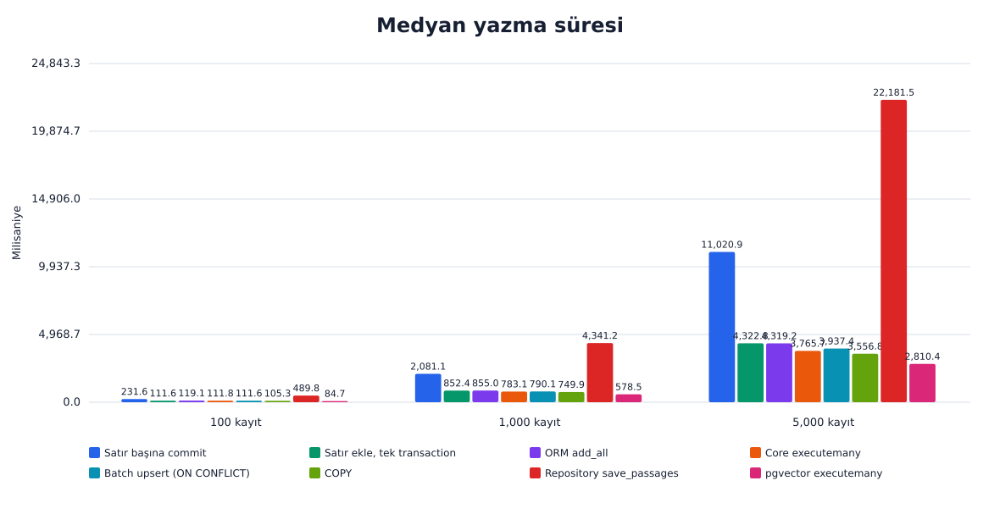
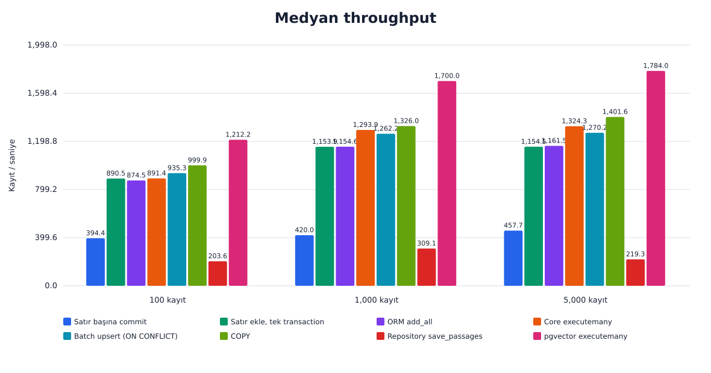
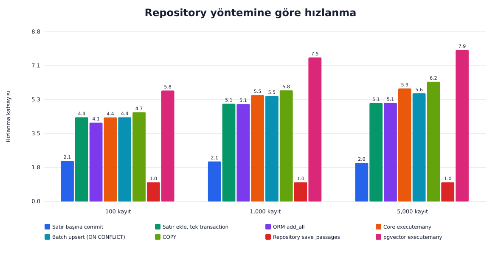
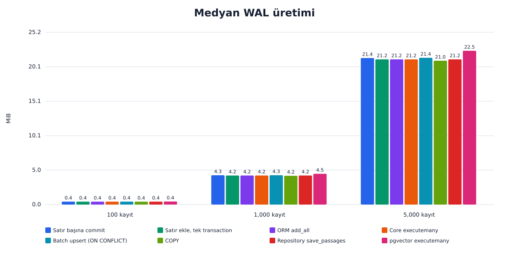

# PostgreSQL Veritabanı Toplu Yazma Testi

## Amaç

Bu deney, passage kayıtlarının satır başına commit edilmesi, tek transaction içinde yazılması ve toplu yazılması arasındaki süre, throughput, WAL, I/O ve SQL çağrısı farklarını aynı veri üzerinde ölçer. Ayrıca embedding'in JSONB yerine native pgvector sütununda tutulmasının yazma maliyetine etkisini karşılaştırır.

## Kısa sonuç

Aday batch upsert, mevcut repository yoluna göre 5.495x (1,000 kayıt), 5.634x (5,000 kayıt) hızlandı. Yüzde 50 çakışmalı ek deneyde aynı boyutlarda hızlanma 6.106x, 5.136x oldu. Karşılaştırma tabanı olan mevcut repository yolu 100 kayıtta 168-179 ms ve 434-518 ms olmak üzere çift tepeli ölçüldüğü için bu boyut manşet oranına alınmamıştır. Ana matriste 300/300, ek matriste 60/60 koşu veri bütünlüğü doğrulamasını geçti. Ölçümlerin tamamı üretim kodu değiştirilmeden alınmıştır; ölçülen aday yöntemin `Repository.save_passages` içine uygulanması ayrı bir değişikliktir ve kendi testleriyle birlikte sunulmaktadır.

## Test edilen mimari

Üretimdeki `PassageRow.embedding` alanı PostgreSQL `JSONB` olarak tutulmaktadır ve kolların çoğu bu şema üzerinde çalışır. Karşılaştırma için aynı sütunları taşıyan, yalnızca embedding tipi `vector(768)` olan `passages_vector` tablosu oluşturulmuş ve tek bir kol bu tabloya yazmıştır. İki tablo aynı birincil anahtar, aynı tekillik kısıtı ve aynı yardımcı indeksleri taşır, böylece aradaki tek değişken embedding tipidir.

## Deney ortamı

| Alan | Değer |
|---|---|
| Test tarihi (UTC) | 2026-08-27T12:59:22.820548+00:00 |
| İşletim sistemi | Ubuntu 22.04.5 LTS |
| CPU | Intel(R) Xeon(R) W-2145 CPU @ 3.70GHz |
| Çekirdek | 8 fiziksel, 16 mantıksal |
| RAM | 125.5 GiB |
| Python | 3.11.16 |
| PostgreSQL | PostgreSQL 16.15 (Debian 16.15-1.pgdg12+2) |
| SQLAlchemy | 2.0.52 |
| asyncpg | 0.31.0 |
| Docker | Docker version 29.7.2, build a7dcaa6 |
| Docker Compose | Docker Compose version v5.5.0 |
| Container image | `pgvector/pgvector:pg16` |
| Benchmark taban commit'i | `a82c4b666c543b34126ecc731cd8f660429da5a8` |
| Ölçüm sırasında çalışma ağacı | Değişiklik içeriyordu |
| İzole hedef | `127.0.0.1:55433/bulk_benchmark` |

Sonuçlar bu makinenin CPU, disk, kernel, Docker ve PostgreSQL koşullarına özeldir.

## Karşılaştırılan yöntemler

1. `row_commit_each`: Her satır için INSERT ve commit.
2. `row_add_one_transaction`: ORM satır eklemeleri, tek transaction ve commit.
3. `orm_add_all`: SQLAlchemy `add_all`, tek transaction ve commit.
4. `core_executemany`: SQLAlchemy Core executemany, tek transaction ve commit.
5. `core_upsert_batched`: `INSERT ... ON CONFLICT DO UPDATE`, 1,000 satırlık batch'ler, tek transaction ve commit. Repository ile aynı idempotent semantiği taşıyan tek bulk yöntem.
6. `copy_records`: asyncpg `copy_records_to_table` ile PostgreSQL COPY protokolü.
7. `repository_save_passages`: Mevcut repository yöntemi; her passage için varlık sorgusu, ORM yazımı ve sonda tek commit.
8. `vector_executemany`: 4. yöntemle aynı statement şekli, ama native pgvector sütununa yazar. Şema karşılaştırması içindir, yöntem karşılaştırması değil.
9. `core_upsert_batched_reingest`: 5. yöntemle aynı kod, ama tablo bu chunk'ları zaten tutarken çalışır. Upsert'in UPDATE dalını ölçer.
10. `repository_save_passages_reingest`: 7. yöntemle aynı kod, aynı dolu tablo üzerinde. 9. yöntemin karşılaştırma tabanı budur.

## Veri seti ve ölçüm yöntemi

Kayıt sayıları 100, 1,000, 5,000; her kayıt 512 metin karakteri ve 768 elemanlı embedding içerir. Her veri boyutu ve yöntem için 1 warm-up ile 10 ölçüm tekrarı yapılmıştır. Süre yalnızca yazma yöntemini ve commit işlemini kapsar; TRUNCATE, checkpoint, istatistik sorguları ve doğrulama ölçüm dışındadır.

## Adil karşılaştırma önlemleri

- Her yöntem ve boyutta aynı deterministik passage ve embedding verisi kullanıldı.
- Her koşudan önce her iki tablo da TRUNCATE ile aynı başlangıç durumuna getirildi, böylece JSONB kolları ile pgvector kolu aynı veritabanı durumundan başladı.
- Aynı engine, bağlantı havuzu ve session factory kullanıldı.
- 10 tekrarda yöntem sırası deterministik Latin rotasyonuyla tam konum dengesi sağlayacak biçimde döndürüldü.
- Her veri boyutu kendi tam veri setiyle ayrıca warm-up edildi.
- Payload serileştirmesi her kolda ölçüm penceresinin içinde bırakıldı. ORM kolları parametre bağlarken serileştirir; COPY ve pgvector kolları da kendi payload'ını ölçülen bölümde üretir.
- Başarılı sayılmak için kayıt, embedding boyutu, içerik hash'i, kimlik, chunk ve NULL kontrollerinin tamamının geçmesi istendi.
- WAL doğrudan başlangıç ve bitiş LSN farkından; I/O ise ölçüm dışı checkpoint sonrası `pg_stat_io` farkından hesaplandı.
- Her `pg_stat_io` okumasından önce `pg_stat_force_next_flush()` çağrıldı ve bağlantı havuzu tek bağlantıya sabitlendi. Gerekçesi aşağıdaki ölçüm notunda açıklanmıştır.

## Ölçüm notu: pg_stat_io tahsisi

PostgreSQL backend'e özel I/O sayaçlarını paylaşılan belleğe saniyede en fazla bir kez yazar. `pg_stat_clear_snapshot()` yalnızca okuyucunun görünümünü tazeler, backend'in bekleyen sayaçlarını yayımlamaz. Bu nedenle bir saniyeden kısa süren ölçüm pencereleri kendi I/O'sunu sıfır olarak raporlar ve yükü bir sonraki pencereye taşır. Bu deneyin ilk sürümünde tam olarak bu olmuştu: bir saniyenin altında biten koşuların büyük bölümü sıfır `extends` bildirmişti, ki boş tabloya yazarken bu fiziksel olarak imkansızdır. Ölçüm penceresinin ardından aynı backend'de `pg_stat_force_next_flush()` çağrılarak ve tüm yazma işi tek bağlantıya sabitlenerek düzeltildi. Aşağıdaki I/O tablosu bu düzeltmeden sonra üretilmiştir.

## Başlangıç, bitiş ve veri bütünlüğü

| Kayıt hedefi | Ham koşu | Başlangıç aralığı | Bitiş aralığı | Geçerli koşu |
|---:|---:|---:|---:|---:|
| 100 | 100 | 0 - 100 | 100 - 100 | 100/100 |
| 1,000 | 100 | 0 - 1000 | 1,000 - 1,000 | 100/100 |
| 5,000 | 100 | 0 - 5000 | 5,000 - 5,000 | 100/100 |

## Süre ve throughput sonuçları

| Kayıt | Yöntem | Şema | Yol | Ortalama ms | Medyan ms | Min ms | Maks ms | Std sapma ms | Medyan kayıt/sn | Satır commit'e göre | Repository'ye göre |
|---:|---|---|---|---:|---:|---:|---:|---:|---:|---:|---:|
| 100 | `row_commit_each` | JSONB | Insert | 230.738 | 231.577 | 166.481 | 274.502 | 32.940 | 431.919 | 1.000x | 2.115x |
| 100 | `row_add_one_transaction` | JSONB | Insert | 111.306 | 111.620 | 83.006 | 126.569 | 12.672 | 896.756 | 2.075x | 4.388x |
| 100 | `orm_add_all` | JSONB | Insert | 113.755 | 119.146 | 82.712 | 126.035 | 13.624 | 839.793 | 1.944x | 4.111x |
| 100 | `core_executemany` | JSONB | Insert | 106.605 | 111.818 | 93.906 | 113.643 | 7.567 | 894.316 | 2.071x | 4.380x |
| 100 | `core_upsert_batched` | JSONB | Insert | 112.709 | 111.615 | 95.015 | 151.773 | 15.540 | 896.012 | 2.075x | 4.388x |
| 100 | `copy_records` | JSONB | Insert | 103.016 | 105.311 | 93.651 | 110.189 | 6.580 | 949.573 | 2.199x | 4.651x |
| 100 | `repository_save_passages` | JSONB | Insert | 396.029 | 489.796 | 168.481 | 518.045 | 156.147 | 204.171 | 0.473x | 1.000x |
| 100 | `vector_executemany` | pgvector | Insert | 84.421 | 84.712 | 58.772 | 94.381 | 10.934 | 1,180.479 | 2.734x | 5.782x |
| 100 | `core_upsert_batched_reingest` | JSONB | Re-ingest | 111.050 | 115.159 | 100.463 | 121.442 | 8.490 | 868.378 | - | 5.411x |
| 100 | `repository_save_passages_reingest` | JSONB | Re-ingest | 568.666 | 623.078 | 337.662 | 654.324 | 119.907 | 160.590 | - | 1.000x |
| 1,000 | `row_commit_each` | JSONB | Insert | 2,126.326 | 2,081.126 | 1,862.507 | 2,426.216 | 211.171 | 480.860 | 1.000x | 2.086x |
| 1,000 | `row_add_one_transaction` | JSONB | Insert | 852.599 | 852.356 | 815.884 | 867.179 | 15.977 | 1,173.247 | 2.442x | 5.093x |
| 1,000 | `orm_add_all` | JSONB | Insert | 858.818 | 855.007 | 813.499 | 938.554 | 33.031 | 1,169.605 | 2.434x | 5.077x |
| 1,000 | `core_executemany` | JSONB | Insert | 783.963 | 783.080 | 765.440 | 816.629 | 18.536 | 1,277.008 | 2.658x | 5.544x |
| 1,000 | `core_upsert_batched` | JSONB | Insert | 790.889 | 790.088 | 760.411 | 845.859 | 22.570 | 1,265.692 | 2.634x | 5.495x |
| 1,000 | `copy_records` | JSONB | Insert | 748.432 | 749.857 | 735.864 | 762.705 | 8.331 | 1,333.591 | 2.775x | 5.789x |
| 1,000 | `repository_save_passages` | JSONB | Insert | 4,168.075 | 4,341.190 | 1,793.503 | 5,331.030 | 1,132.773 | 230.436 | 0.479x | 1.000x |
| 1,000 | `vector_executemany` | pgvector | Insert | 579.394 | 578.521 | 561.667 | 597.075 | 11.635 | 1,728.585 | 3.597x | 7.504x |
| 1,000 | `core_upsert_batched_reingest` | JSONB | Re-ingest | 854.967 | 836.783 | 809.190 | 906.757 | 38.542 | 1,195.213 | - | 6.071x |
| 1,000 | `repository_save_passages_reingest` | JSONB | Re-ingest | 4,656.535 | 5,080.353 | 2,342.888 | 6,579.834 | 1,836.121 | 203.139 | - | 1.000x |
| 5,000 | `row_commit_each` | JSONB | Insert | 10,862.755 | 11,020.898 | 9,772.879 | 11,924.132 | 769.337 | 453.696 | 1.000x | 2.013x |
| 5,000 | `row_add_one_transaction` | JSONB | Insert | 4,324.293 | 4,322.806 | 4,293.669 | 4,345.558 | 14.940 | 1,156.657 | 2.549x | 5.131x |
| 5,000 | `orm_add_all` | JSONB | Insert | 4,256.874 | 4,319.248 | 4,094.957 | 4,330.340 | 105.128 | 1,157.609 | 2.552x | 5.136x |
| 5,000 | `core_executemany` | JSONB | Insert | 3,832.494 | 3,765.698 | 3,747.977 | 3,949.045 | 97.034 | 1,327.777 | 2.927x | 5.890x |
| 5,000 | `core_upsert_batched` | JSONB | Insert | 3,977.222 | 3,937.428 | 3,762.446 | 4,143.312 | 124.443 | 1,269.865 | 2.799x | 5.634x |
| 5,000 | `copy_records` | JSONB | Insert | 3,555.523 | 3,556.829 | 3,542.352 | 3,568.101 | 9.672 | 1,405.747 | 3.099x | 6.236x |
| 5,000 | `repository_save_passages` | JSONB | Insert | 21,733.875 | 22,181.537 | 16,274.530 | 28,300.275 | 3,937.804 | 225.413 | 0.497x | 1.000x |
| 5,000 | `vector_executemany` | pgvector | Insert | 2,844.099 | 2,810.353 | 2,775.374 | 3,005.179 | 83.686 | 1,779.138 | 3.922x | 7.893x |
| 5,000 | `core_upsert_batched_reingest` | JSONB | Re-ingest | 4,144.511 | 4,128.390 | 3,931.813 | 4,291.697 | 103.300 | 1,211.126 | - | 5.646x |
| 5,000 | `repository_save_passages_reingest` | JSONB | Re-ingest | 23,879.066 | 23,309.316 | 17,183.163 | 32,707.497 | 4,741.337 | 214.584 | - | 1.000x |

`repository_save_passages` idempotent upsert semantiği çalıştırır, ama 1-4. ve 6. yöntemler düz insert yapar. Bu kollara göre hesaplanan hızlanma bu nedenle yöntem farkının yanında semantik farkı da içerir. Semantiği eşit olan tek karşılaştırma `core_upsert_batched` ile `repository_save_passages` arasındakidir.







## İstemci tarafı serileştirme tavanı

Her yöntem, PostgreSQL tek bayt görmeden önce embedding'i aktarım biçimine çevirmek zorundadır. Bu maliyet veritabanından bağımsızdır ve hiçbir yazma yöntemi bunu ortadan kaldıramaz, dolayısıyla ulaşılabilir en iyi süreyi sınırlar.

| Kayıt | JSON serileştirme ms | pgvector literal ms | En hızlı JSONB kolu ms | Serileştirmenin payı |
|---:|---:|---:|---:|---:|
| 100 | 26.529 | 35.507 | 105.311 (`copy_records`) | 25.2% |
| 1,000 | 268.684 | 358.835 | 749.857 (`copy_records`) | 35.8% |
| 5,000 | 1,349.593 | 1,778.092 | 3,556.829 (`copy_records`) | 37.9% |

## Re-ingest: upsert'in UPDATE dalı

Yukarıdaki kolların tamamı boş tabloya yazar. Üretimde bir belge yeniden işlendiğinde aynı `(source_version_id, chunk_index)` çiftleri tabloda zaten vardır ve `ON CONFLICT DO UPDATE` INSERT dalını değil UPDATE dalını çalıştırır. Bu bölümdeki iki kol, tablo bu chunk'ları farklı içerikle tutarken çalışır; önceden doldurma ölçüm dışındadır. Her koşuda satırların gerçekten üzerine yazıldığı doğrulanır.

| Kayıt | Medyan ms, mevcut yöntem | Medyan ms, batch upsert | Hızlanma | Insert yoluna göre upsert maliyeti | WAL MiB, mevcut | WAL MiB, upsert |
|---:|---:|---:|---:|---:|---:|---:|
| 100 | 623.078 | 115.159 | 5.411x | +3.2% | 0.831 | 0.836 |
| 1,000 | 5,080.353 | 836.783 | 6.071x | +5.9% | 8.269 | 8.323 |
| 5,000 | 23,309.316 | 4,128.390 | 5.646x | +4.8% | 41.330 | 41.597 |

## WAL, boyut ve I/O sonuçları

| Kayıt | Yöntem | Şema | Yol | Medyan WAL MiB | Heap artışı MiB | İndeks artışı MiB | TOAST ve yardımcı MiB | Toplam artış MiB | I/O yazma | I/O yazma ms | Extend | Extend ms | Fsync | Fsync ms |
|---:|---|---|---|---:|---:|---:|---:|---:|---:|---:|---:|---:|---:|---:|
| 100 | `row_commit_each` | JSONB | Insert | 0.427 | 0.094 | 0.047 | 0.352 | 0.492 | 69 | 0.300 | 63 | 0.816 | 12 | 1.156 |
| 100 | `row_add_one_transaction` | JSONB | Insert | 0.421 | 0.094 | 0.047 | 0.352 | 0.492 | 69 | 0.333 | 63 | 0.721 | 12 | 1.167 |
| 100 | `orm_add_all` | JSONB | Insert | 0.423 | 0.094 | 0.047 | 0.352 | 0.492 | 69 | 0.330 | 63 | 0.712 | 12 | 1.175 |
| 100 | `core_executemany` | JSONB | Insert | 0.424 | 0.094 | 0.047 | 0.352 | 0.492 | 69 | 0.322 | 63 | 0.704 | 12 | 1.167 |
| 100 | `core_upsert_batched` | JSONB | Insert | 0.428 | 0.094 | 0.047 | 0.352 | 0.492 | 69 | 0.329 | 63 | 0.736 | 12 | 1.125 |
| 100 | `copy_records` | JSONB | Insert | 0.419 | 0.094 | 0.047 | 0.352 | 0.492 | 69 | 0.365 | 63 | 0.291 | 12 | 1.232 |
| 100 | `repository_save_passages` | JSONB | Insert | 0.422 | 0.094 | 0.047 | 0.352 | 0.492 | 69 | 0.421 | 63 | 1.799 | 12 | 1.469 |
| 100 | `vector_executemany` | pgvector | Insert | 0.446 | 0.094 | 0.047 | 0.445 | 0.586 | 79 | 0.371 | 75 | 0.981 | 12 | 1.197 |
| 100 | `core_upsert_batched_reingest` | JSONB | Re-ingest | 0.836 | 0.086 | 0.016 | 0.289 | 0.391 | 109 | 0.466 | 50 | 0.598 | 9 | 1.753 |
| 100 | `repository_save_passages_reingest` | JSONB | Re-ingest | 0.831 | 0.086 | 0.016 | 0.289 | 0.391 | 109 | 0.675 | 50 | 1.817 | 9 | 1.640 |
| 1,000 | `row_commit_each` | JSONB | Insert | 4.284 | 0.875 | 0.250 | 3.031 | 4.156 | 538 | 2.106 | 532 | 6.823 | 12 | 1.585 |
| 1,000 | `row_add_one_transaction` | JSONB | Insert | 4.242 | 0.875 | 0.250 | 3.031 | 4.156 | 538 | 2.040 | 532 | 4.351 | 12 | 1.520 |
| 1,000 | `orm_add_all` | JSONB | Insert | 4.245 | 0.875 | 0.250 | 3.031 | 4.156 | 538 | 2.059 | 532 | 4.399 | 12 | 1.494 |
| 1,000 | `core_executemany` | JSONB | Insert | 4.243 | 0.875 | 0.250 | 3.031 | 4.156 | 538 | 2.041 | 532 | 4.400 | 12 | 1.664 |
| 1,000 | `core_upsert_batched` | JSONB | Insert | 4.291 | 0.875 | 0.250 | 3.031 | 4.156 | 538 | 2.053 | 532 | 4.508 | 12 | 1.623 |
| 1,000 | `copy_records` | JSONB | Insert | 4.204 | 1.000 | 0.250 | 3.031 | 4.281 | 540 | 2.300 | 548 | 2.287 | 12 | 1.388 |
| 1,000 | `repository_save_passages` | JSONB | Insert | 4.243 | 0.875 | 0.250 | 3.031 | 4.156 | 538 | 2.890 | 532 | 17.648 | 12 | 1.571 |
| 1,000 | `vector_executemany` | pgvector | Insert | 4.492 | 0.875 | 0.250 | 4.008 | 5.133 | 661 | 2.491 | 657 | 4.458 | 12 | 1.703 |
| 1,000 | `core_upsert_batched_reingest` | JSONB | Re-ingest | 8.323 | 0.867 | 0.242 | 2.969 | 4.078 | 1,046 | 4.534 | 522 | 4.828 | 9 | 1.099 |
| 1,000 | `repository_save_passages_reingest` | JSONB | Re-ingest | 8.269 | 0.867 | 0.242 | 2.969 | 4.078 | 1,046 | 5.351 | 522 | 16.143 | 9 | 1.170 |
| 5,000 | `row_commit_each` | JSONB | Insert | 21.399 | 4.344 | 1.086 | 14.922 | 20.352 | 2,611 | 12.463 | 2,605 | 34.389 | 12 | 2.836 |
| 5,000 | `row_add_one_transaction` | JSONB | Insert | 21.209 | 4.344 | 1.086 | 14.922 | 20.352 | 2,611 | 11.924 | 2,605 | 20.841 | 12 | 2.811 |
| 5,000 | `orm_add_all` | JSONB | Insert | 21.208 | 4.344 | 1.086 | 14.922 | 20.352 | 2,611 | 11.976 | 2,605 | 20.625 | 12 | 2.664 |
| 5,000 | `core_executemany` | JSONB | Insert | 21.209 | 4.344 | 1.086 | 14.922 | 20.352 | 2,611 | 11.748 | 2,605 | 20.786 | 12 | 2.589 |
| 5,000 | `core_upsert_batched` | JSONB | Insert | 21.439 | 4.344 | 1.086 | 14.922 | 20.352 | 2,611 | 12.381 | 2,605 | 22.250 | 12 | 2.637 |
| 5,000 | `copy_records` | JSONB | Insert | 21.006 | 4.500 | 1.086 | 14.922 | 20.508 | 2,613 | 12.968 | 2,625 | 10.913 | 12 | 2.263 |
| 5,000 | `repository_save_passages` | JSONB | Insert | 21.212 | 4.344 | 1.086 | 14.922 | 20.352 | 2,611 | 14.186 | 2,605 | 76.719 | 12 | 2.391 |
| 5,000 | `vector_executemany` | pgvector | Insert | 22.466 | 4.344 | 1.086 | 19.805 | 25.234 | 3,234 | 16.303 | 3,230 | 20.290 | 12 | 2.792 |
| 5,000 | `core_upsert_batched_reingest` | JSONB | Re-ingest | 41.597 | 4.344 | 1.164 | 14.859 | 20.367 | 5,184 | 28.540 | 2,607 | 24.743 | 9 | 2.900 |
| 5,000 | `repository_save_passages_reingest` | JSONB | Re-ingest | 41.330 | 4.344 | 1.164 | 14.859 | 20.367 | 5,184 | 30.066 | 2,607 | 75.829 | 9 | 2.656 |



Aynı tabloya yazan kollarda kayıt içeriği aynı olduğu için heap, indeks ve toplam relation artışı da aynıdır; yöntemlerden hiçbiri daha az kalıcı veri yazmaz. Boyut ve I/O sütunları her kolun kendi hedef tablosundan okunur, bu yüzden pgvector kolunun değerleri JSONB kollarıyla doğrudan değil şema karşılaştırması olarak okunmalıdır. TOAST ve yardımcı alan, toplam relation artışından ana heap ve ana indeks artışının çıkarılmasıyla hesaplanmıştır; büyük JSONB embedding değerlerinin önemli bölümü bu alandadır.

## SQL statement ve commit sayıları

| Kayıt | Yöntem | Medyan SQL statement | Executemany | Commit |
|---:|---|---:|---:|---:|
| 100 | `row_commit_each` | 100 | 0 | 100 |
| 100 | `row_add_one_transaction` | 1 | 1 | 1 |
| 100 | `orm_add_all` | 1 | 1 | 1 |
| 100 | `core_executemany` | 1 | 1 | 1 |
| 100 | `core_upsert_batched` | 1 | 1 | 1 |
| 100 | `copy_records` | 1 | 0 | 1 |
| 100 | `repository_save_passages` | 200 | 0 | 1 |
| 100 | `vector_executemany` | 1 | 1 | 1 |
| 100 | `core_upsert_batched_reingest` | 1 | 1 | 1 |
| 100 | `repository_save_passages_reingest` | 200 | 0 | 1 |
| 1,000 | `row_commit_each` | 1,000 | 0 | 1,000 |
| 1,000 | `row_add_one_transaction` | 1 | 1 | 1 |
| 1,000 | `orm_add_all` | 1 | 1 | 1 |
| 1,000 | `core_executemany` | 1 | 1 | 1 |
| 1,000 | `core_upsert_batched` | 1 | 1 | 1 |
| 1,000 | `copy_records` | 1 | 0 | 1 |
| 1,000 | `repository_save_passages` | 2,000 | 0 | 1 |
| 1,000 | `vector_executemany` | 1 | 1 | 1 |
| 1,000 | `core_upsert_batched_reingest` | 1 | 1 | 1 |
| 1,000 | `repository_save_passages_reingest` | 2,000 | 0 | 1 |
| 5,000 | `row_commit_each` | 5,000 | 0 | 5,000 |
| 5,000 | `row_add_one_transaction` | 1 | 1 | 1 |
| 5,000 | `orm_add_all` | 1 | 1 | 1 |
| 5,000 | `core_executemany` | 1 | 1 | 1 |
| 5,000 | `core_upsert_batched` | 5 | 5 | 1 |
| 5,000 | `copy_records` | 1 | 0 | 1 |
| 5,000 | `repository_save_passages` | 10,000 | 0 | 1 |
| 5,000 | `vector_executemany` | 1 | 1 | 1 |
| 5,000 | `core_upsert_batched_reingest` | 5 | 5 | 1 |
| 5,000 | `repository_save_passages_reingest` | 10,000 | 0 | 1 |

`copy_records` SQLAlchemy cursor katmanını atladığı için statement sayısı ayrıca sayılmıştır; tek COPY protokol gidiş dönüşü bir statement olarak raporlanır.

## Bulgular

- 100 kayıtta en düşük medyan süre `copy_records` ile 105.311 ms ölçüldü. Semantiği repository ile eşleşen `core_upsert_batched` 111.615 ms ile mevcut repository yöntemine göre 4.388x, satır başına commit'e göre 2.075x hızlandı. En hızlı kolun satır başına commit'e göre medyan WAL azalması yüzde 2.02 oldu.
- 1,000 kayıtta en düşük medyan süre `copy_records` ile 749.857 ms ölçüldü. Semantiği repository ile eşleşen `core_upsert_batched` 790.088 ms ile mevcut repository yöntemine göre 5.495x, satır başına commit'e göre 2.634x hızlandı. En hızlı kolun satır başına commit'e göre medyan WAL azalması yüzde 1.87 oldu.
- 5,000 kayıtta en düşük medyan süre `copy_records` ile 3,556.829 ms ölçüldü. Semantiği repository ile eşleşen `core_upsert_batched` 3,937.428 ms ile mevcut repository yöntemine göre 5.634x, satır başına commit'e göre 2.799x hızlandı. En hızlı kolun satır başına commit'e göre medyan WAL azalması yüzde 1.84 oldu.
- `row_add_one_transaction` ile `orm_add_all`, SQLAlchemy'nin PostgreSQL insertmanyvalues/executemany yolunda tek statement ve tek commit üretmesi nedeniyle birbirine yakın sonuç verdi.
- Idempotent olmanın bedeli küçüktür: `core_upsert_batched`, çakışma çözümü yapmayan `core_executemany` ile üç boyutta da -0.2%, +0.9%, +4.6% fark verdi. Bulk yazıma geçerken repository semantiğinden vazgeçmek için ölçülmüş bir gerekçe yoktur.
- COPY protokolü beklendiği kadar ayrışmadı: `copy_records`, `core_executemany` ile arasında 5.8%, 4.2%, 5.5% fark bıraktı. Sebebi, aşağıdaki serileştirme tavanıdır; iki yöntem de aynı istemci tarafı JSON maliyetini öder ve COPY yalnızca sunucu tarafındaki farkı kazanır.
- Re-ingest yolunda kazanç korunuyor: dolu tabloya yazarken batch upsert, mevcut yönteme göre 5.41x, 6.07x, 5.65x hızlıydı. UPDATE dalı INSERT dalından pahalı (+3.2%, +5.9%, +4.8%), ama bu maliyet iki yöntemde de ortaya çıkar ve aradaki farkı kapatmıyor.
- Ölçülen en büyük tekil kazanç yöntem değil şema değişikliğinden geldi: native `vector` sütununa yazan `vector_executemany`, aynı statement şekliyle JSONB'ye yazan `core_executemany` yöntemine göre 1.32x, 1.35x, 1.34x hızlıydı. Karşılığında tablo 19%, 23%, 24% daha fazla yer kapladı, çünkü pgvector değerleri JSONB gibi TOAST sıkıştırmasından yararlanmaz.
- Satır başına commit WAL'ı yaklaşık yüzde 1 artırdı; asıl fark süre, statement ve commit sayısında oluştu. Bulk yazımın gerekçesi depolama tasarrufu değildir.
- Mevcut repository yöntemi kayıt başına bir SELECT ve autoflush kaynaklı bir INSERT üretti. Bu nedenle statement sayısı `2N`, commit sayısı 1 oldu.
- Repository sürelerinin standart sapması diğer yöntemlerden yüksektir. Bu yöntem için ortalama yerine medyan karar metriği olarak daha dayanıklıdır.

## Mevcut repository yönteminin darboğazı

`save_passages`, her passage için `(source_version_id, chunk_index)` varlık sorgusu çalıştırır. Session autoflush davranışı önceki bekleyen INSERT'i sonraki SELECT öncesinde gönderir. Sonuçta N kayıt için 2N ağ gidiş dönüşü oluşur. Tek commit kullanılması WAL ve commit maliyetini sınırlar, fakat sorgu sayısını sınırlamaz. `INSERT ... ON CONFLICT DO UPDATE` aynı idempotent sonucu batch başına tek statement ile üretir.

## Kısmi çakışma: karışık INSERT ve UPDATE yolu

Her veri setindeki çift indeksli chunk'lar farklı içerikle önceden yazıldı. Ölçülen çağrı aynı transaction içinde satırların yüzde 50'sini güncelledi ve yüzde 50'sini ekledi. Ön dolum ve doğrulama süre dışında bırakıldı; iki yöntemin sırası her tekrarda ters çevrildi.

| Toplam kayıt | Önceden var | Yeni | Mevcut repository medyan ms | Aday bulk medyan ms | Hızlanma | Mevcut SQL | Bulk SQL | Geçerli koşu |
|---:|---:|---:|---:|---:|---:|---:|---:|---:|
| 100 | 50 | 50 | 229.381 | 111.721 | 2.053x | 200 | 1 | 20/20 |
| 1,000 | 500 | 500 | 4,939.510 | 808.906 | 6.106x | 2,000 | 1 | 20/20 |
| 5,000 | 2,500 | 2,500 | 20,760.830 | 4,042.180 | 5.136x | 10,000 | 5 | 20/20 |

Her hücre 10 kez ölçüldü ve 1 warm-up yapıldı. Sonuç, farkın yalnız tamamen boş veya tamamen dolu tabloya özgü olup olmadığını sınar.

Ham sonuç: `results/postgres_bulk_insert_partial.json`

## Güvenilirlik sınırları

- Sonuçlar tek bir makine ve tek container üzerinde alınmıştır.
- Re-ingest kollarında tablo, ölçüm dışında kalan bir dolum adımıyla hazırlanır. Bu satırlar taze yazıldığı için üretimdeki bir tablonun parçalanma ve autovacuum durumunu birebir temsil etmez.
- Her hücrede 10 ölçüm vardır; özellikle repository yönteminde yüksek varyans gözlendi.
- 100 kayıtta `repository_save_passages` dağılımı çift tepelidir: 3 koşu 168-179 ms, 7 koşu 434-518 ms. Medyan, bölünmenin nereye denk geldiğine göre kayar; bu boyuttaki hızlanma oranı bu nedenle nokta tahmini olarak kullanılamaz. Kümelenme koşu sırasıyla ilişkilendirilemedi ve nedeni belirlenemedi. Daha büyük veri boyutlarında dağılım tek tepelidir.
- `pg_stat_io` checkpoint ile fiziksel yazmaya zorlanmış ve her okumadan önce flush edilmiştir, ancak kernel ve depolama katmanı zamanlaması tamamen ayrıştırılamaz.
- Ana re-ingest kolları tüm satırların çakıştığı durumu ölçer; yüzde 50 çakışmalı karışık yol ayrı ek deneyde ölçülmüştür.
- Eşzamanlı yazarlar, lock contention, bağlantı kaybı ve transaction retry davranışı bu matriste yoktur.
- pgvector kolu yalnızca yazma maliyetini ölçer. HNSW veya IVFFlat vektör indeksi oluşturulmamıştır; indeksli bir tabloda yazma maliyeti belirgin biçimde artar.
- pgvector'e COPY protokolüyle yazmak asyncpg için binary codec gerektirdiğinden bu matriste yoktur.

## Üretim için aday ve karar noktaları

Ölçümler bulk yazımın değerlendirilmesini gerekçelendirir. Teknik aday yöntem `core_upsert_batched`, yani 1,000 satırlık batch'lerle `INSERT ... ON CONFLICT DO UPDATE`. Bu yöntem repository'nin idempotent güncelleme semantiğini korur ve ölçülen tek eşdeğer semantikli bulk yoldur. `copy_records` daha hızlı olabilir fakat çakışma çözümü sunmaz; upsert gerektiren bir yolda ancak geçici tabloya COPY ve ardından tek MERGE ile kullanılabilir, bu da bu deneyin dışındadır.

Uygulama öncesinde gerekli görülen regresyon ve güvenlik kontrolleri ve bunların hangi testle karşılandığı:

- Yeni ve mevcut passage karışımında alanların doğru insert/update edilmesi: `test_mixed_batch_inserts_new_chunks_and_updates_existing_ones`.
- Tekrarlanan `(source_version_id, chunk_index)` davranışı: `test_duplicate_chunks_in_one_call_keep_first_id_and_last_content`.
- Batch ortasında hata olduğunda tam rollback: `test_a_failing_batch_leaves_no_earlier_batch_behind`, ki test önce ilk batch'in gerçekten gönderildiğini doğrular.
- Batch sınırının uygulanması: `test_save_passages_sends_one_statement_per_batch_and_commits_once`, 2N+1 kayıtta üç statement ve tek commit.
- Eşzamanlı writer ve deadlock: `tests/test_passage_persistence_postgres.py`, gerçek PostgreSQL üzerinde. Kilit sırası kaldırıldığında testin `DeadlockDetectedError` ürettiği doğrulanmıştır, yani sıralama önlemi varsayım değil ölçülmüş bir gerekliliktir.
- SQLite ile PostgreSQL farkı: ana suite SQLite üzerinde, eşzamanlılık dosyası PostgreSQL üzerinde koşar; iki dialect de aynı `on_conflict_do_update` yolunu kullanır.
- Yetkilendirme beklentilerinin korunması: `save_passages` `run_id` almadığı için `_OwnershipEnforced` sarmalamasının dışındadır ve imzası değişmemiştir.
- Kapsanmayan tek başlık, bağlantı kaybı ve üst katman retry politikasıdır; entegrasyon PR'ının ayrı risk başlığıdır.

## Yeniden çalıştırma

```bash
docker compose -f research/bulk-insert/compose.yml up -d --wait postgres
PYTHONPATH=src .venv311/bin/python scripts/benchmark_bulk_insert.py \
  --sizes 100 1000 5000 --repeats 10 --warmups 1 \
  --dimensions 768 --text-chars 512 --upsert-batch 1000 \
  --output research/bulk-insert/results/postgres_bulk_insert.json
PYTHONPATH=src .venv311/bin/python scripts/benchmark_partial_conflict.py \
  --sizes 100 1000 5000 --repeats 10 --warmups 1 \
  --dimensions 768 --text-chars 512 --upsert-batch 1000 \
  --output research/bulk-insert/results/postgres_bulk_insert_partial.json
PYTHONPATH=src .venv311/bin/python scripts/report_bulk_insert.py
```

Ham sonuç: `results/postgres_bulk_insert.json`

Özet CSV: `results/postgres_bulk_insert_summary.csv`

## Teknik sonuç

Bu makinede embedding içeren yazma yükü için tek transaction toplu yazım açık biçimde daha hızlıdır. Repository ile aynı idempotent semantiği taşıyan `core_upsert_batched`, mevcut repository yöntemine göre medyan sürede 4.388x, 5.495x, 5.634x hızlanma sağlamıştır. WAL ve nihai tablo boyutu kazancı küçük olduğundan üretim gerekçesi depolama azalması değil, ağ gidiş dönüşü ve transaction maliyetinin azaltılmasıdır. Kazancın bir tavanı vardır: en hızlı kolun süresinin kayda değer bir bölümü istemci tarafı embedding serileştirmesidir ve bunu hiçbir yazma yöntemi düşürmez. Native pgvector sütunu bu tavanı sunucu tarafında düşürür, karşılığında disk kullanımını artırır; bu ayrı bir şema kararıdır ve bu deneyin kapsamı dışındadır. Verilerin işaret ettiği teknik aday, idempotent upsert semantiği ve batch sınırları korunarak bulk repository yoludur. Üretim kodu bu rapor kapsamında değiştirilmemiştir; entegrasyon kararı aşağıdaki kontrollerle birlikte verilmelidir.

Bu rapor `postgres_bulk_insert.json` dosyasındaki ölçümlerden yeniden üretilebilir.
