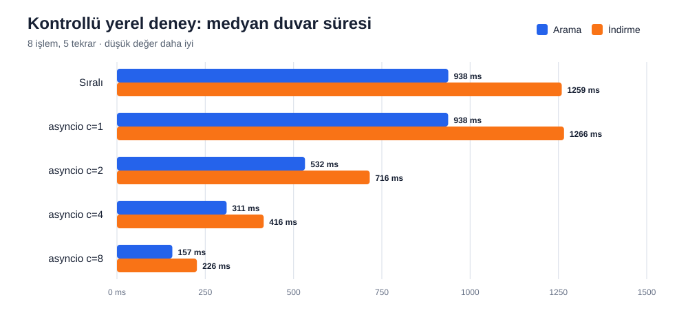
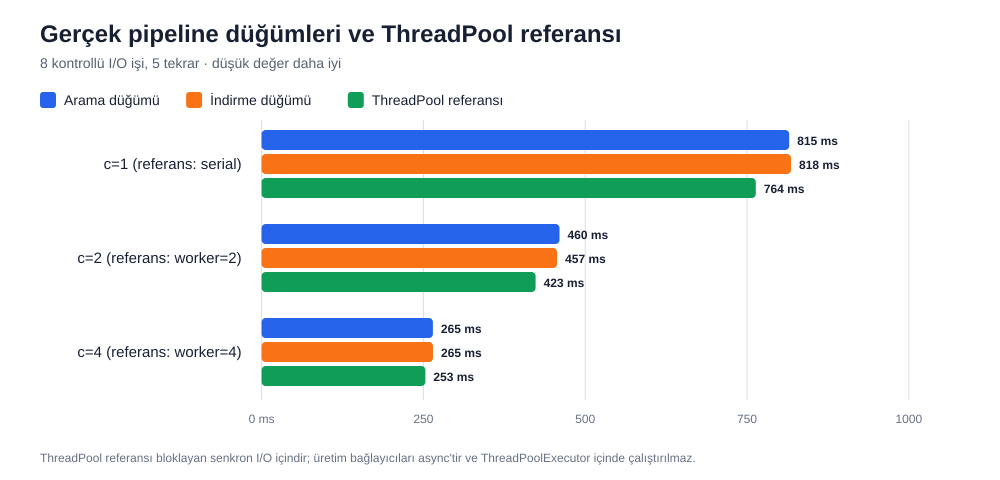
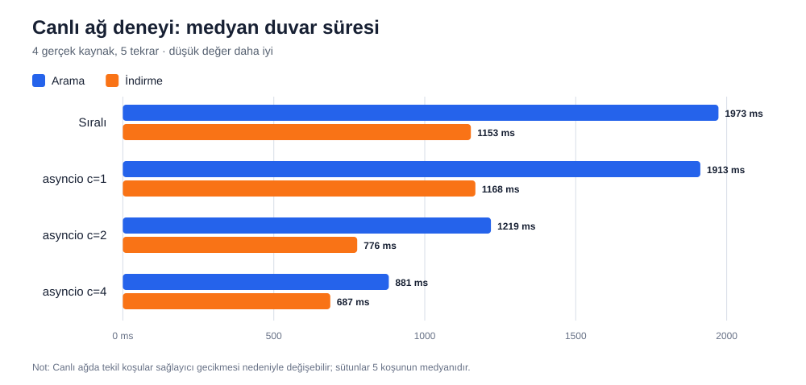

# Konnektör I/O eşzamanlılık deneyi

> **Teslimat türü:** Performans deneyi, regresyon testleri ve karar raporu.
> Üretim hattına yeni bir eşzamanlılık mekanizması eklenmemiştir; incelenen
> `pipeline.py` sürümü arama ve indirme adımlarında zaten semaphore ile sınırlı
> asyncio görevleri kullanmaktadır.

| Kayıt | Değer |
|---|---|
| Deney tarihi | 26 Ağustos 2026 |
| Branch | `developments-supplementer` |
| Başlangıç commit'i | `cc40d76` |
| Yerel benchmark sürümü | `connector_io_local_v1` |
| Canlı benchmark sürümü | `connector_io_live_v1` |
| Pipeline benchmark sürümü | `pipeline_connector_io_v1` |
| Son doğrulama | 489 test başarılı, lint başarılı |

## Yönetici özeti

| Soru | Kısa cevap |
|---|---|
| Eşzamanlılık faydalı mı? | Evet. Gerçek pipeline düğümlerinde c=4 ile 3,08–3,09× hızlanma görüldü. Canlı ağda kazanç var ama tek sayı değil bant: c=4 için arama 1,83–2,73×, indirme 1,61–2,36× (medyanlar 2,24× ve 1,68×). |
| Ulaşılabilecek en iyi süreye varıldı mı? | Canlı deneyde evet: c=4'te duvar süresi en yavaş tek çağrının süresine 0,3 ms farkla oturdu, yani çağrılar tam örtüştü. Kontrollü deneyde koşu başına sabit 75–80 ms ek yük var. |
| Canlı sayılar ne kadar oynak? | Çok. Aynı beş tekrarın içinde arama c=2 bir kez 0,72×, yani sıralıdan yavaş çıktı. Ayrıntı "Canlı ölçümün koşudan koşuya değişkenliği" bölümünde. |
| Sonuçlar değişti mi? | Hayır. Test edilen eşleşmelerde sonuç parmak izi eşdeğerliği %100'dü. |
| Hata oranı arttı mı? | Hayır. Canlı 160 çağrıda 0 hata; kontrollü hata/timeout sonuçları iki yöntemde aynıydı. |
| Merge yeni koşuyu hızlandıracak mı? | Hayır, doğrudan böyle bir iddia kurulamaz. Mevcut kod zaten eşzamanlı; bu çalışma mevcut seçimin faydasını doğrular. |
| GitHub'a konmaya hazır mı? | Evet, deney teslimatı olarak hazırdır. Bir üretim optimizasyon patch'i olarak sunulmamalıdır. |
| Önerilen ayar | Mevcut arama c=8 ve indirme c=4 değerlerini şimdilik koru; gerçek kullanım telemetrisiyle tekrar değerlendir. |

## Karar özeti

Arama ve indirme adımlarında sınırlı `asyncio` eşzamanlılığı anlamlı süre kazancı
sağladı ve test edilen sonuçları değiştirmedi. Mevcut uygulama zaten
`asyncio.Semaphore` ile sınırlandırılmış görevler kullanıyor. Bu deney sonucunda
üretim kodunda yöntem değişikliğine gerek görülmedi:

- Arama için mevcut `search_concurrency=8` korunabilir. Sekiz işlemli kontrollü
  deneyde c=8, sıralı çalışmaya göre 5,98 kat hızlıydı. Canlı deney yalnızca dört
  bağlayıcı içerdiğinden c=8'i canlı olarak doğrulamaz.
- İndirme için mevcut `acquisition_concurrency=4` korunabilir. Canlı deneyde c=4,
  sıralı çalışmaya göre medyan duvar süresinde 1,68 kat; asyncio c=1'e göre 1,70
  kat hızlanma sağladı.
- Asenkron HTTP bağlayıcılarını `ThreadPoolExecutor` içine almak önerilmez.
  Bağlayıcı arayüzleri zaten `async` ve ağ çağrıları `httpx.AsyncClient` kullanıyor.
  Bloklayan ayrıştırma bölümleri ise `acquisition.py` içinde zaten
  `asyncio.to_thread` ile iş parçacığına aktarılıyor. Ölçüm de bunu destekliyor:
  aynı iş yükünde ThreadPool worker=4 ile 3,02 kat, pipeline düğümlerinde asyncio
  c=4 ile 3,08 ile 3,09 kat hızlanma çıktı; iki yöntem aynı yerde duruyor.

## Kabul kriterleri

| Kriter | Sonuç | Kanıt |
|---|---|---|
| Sıralı ve eşzamanlı süreler ölçülebiliyor | Geçti | Yerel ve canlı ham JSON dosyaları |
| Arama concurrency sınırı uygulanıyor | Geçti | Pipeline testinde `max_in_flight == 2` |
| İndirme concurrency sınırı uygulanıyor | Geçti | Pipeline testinde `max_in_flight == 2` |
| Sonuç içeriği korunuyor | Geçti | Parmak izi eşdeğerliği %100 |
| Hata ve timeout görev bazında raporlanıyor | Geçti | Kontrollü `2 başarılı + 1 hata + 1 timeout` deneyi |
| Gerçek ağda düşük hacimli doğrulama yapıldı | Geçti | 160 çağrı, 0 hata |
| Deney tekrar üretilebilir | Geçti | Komutlar, scriptler, ortam ve ham veri kaydedildi |
| Gerçek pipeline süreleri karşılaştırıldı | Geçti | `_search_node` ve `_acquire_node`, c=1/2/4, 5 tekrar |
| ThreadPool karşılaştırması yapıldı | Geçti | Bloklayan senkron I/O referansında serial ve worker=2/4 |

## Kapsam ve ortam

- Ortam: Python 3.11.15. `platform.platform()` dizesi
  `Windows-10-10.0.26200-SP0` döndürüyor; 26200 yapısı aslında Windows 11'dir,
  bu fark ölçüm sonuçlarını etkilemez.
- GPU: kullanılmadı ve gerekli değil
- Yerel deney: ağsız, deterministik gecikmeler, 8 arama + 8 indirme işlemi,
  1 ısınma ve 5 ölçüm tekrarı
- Canlı deney: 5 tekrar, her tekrar için sıralı ve asyncio c=1/2/4,
  yapılandırma sırası tek/çift tekrarlarda ters çevrildi
- Pipeline deneyi: gerçek `_search_node` ve `_acquire_node`, 8 kontrollü I/O işi,
  1 ısınma ve c=1/2/4 için 5 ölçüm tekrarı
- ThreadPool referansı: aynı 8 bloklayan senkron I/O işi, serial ve worker=2/4,
  1 ısınma ve 5 ölçüm tekrarı
- Arama kaynakları: OpenAlex, Crossref, arXiv, Europe PMC; kaynak başına en fazla
  3 sonuç
- İndirme hedefleri: RFC 9110, IANA example domains, python.org/about ve WCAG 2.2
- Çağrı zaman aşımı: 45 saniye

Canlı deneyde toplam 160 dış çağrı yapıldı:
`2 aşama × 4 yapılandırma × 5 tekrar × 4 işlem`. Tüm çağrılar başarılıydı.

## Kontrollü yerel sonuçlar

Süreler 5 tekrarın medyanıdır. Aralık min–maks, MAD ise medyandan mutlak sapmanın
medyanıdır. Hızlanma sütunu aynı aşamadaki sıralı çalışmaya göredir
(JSON'daki `speedup_vs_serial` alanı).



### Arama: 8 işlem (toplam simüle gecikme 900 ms)

| Yöntem | Medyan ms (min–maks) | MAD ms | İşlem/sn | Sıralıya göre | Maks. eşzamanlı | Sonuç eşdeğerliği |
|---|---:|---:|---:|---:|---:|---:|
| Sıralı | 938,2 (932,4–965,2) | 5,8 | 8,53 | 1,00× | 1 | %100 |
| asyncio c=1 | 937,9 (933,3–947,4) | 4,0 | 8,53 | 1,00× | 1 | %100 |
| asyncio c=2 | 532,3 (512,1–567,8) | 13,1 | 15,03 | 1,76× | 2 | %100 |
| asyncio c=4 | 310,5 (294,8–324,5) | 13,9 | 25,76 | 3,02× | 4 | %100 |
| asyncio c=8 | 156,8 (155,6–171,2) | 0,9 | 51,02 | 5,98× | 8 | %100 |

### İndirme: 8 işlem (toplam simüle gecikme 1200 ms)

| Yöntem | Medyan ms (min–maks) | MAD ms | İşlem/sn | Sıralıya göre | Maks. eşzamanlı | Sonuç eşdeğerliği |
|---|---:|---:|---:|---:|---:|---:|
| Sıralı | 1259,4 (1247,6–1273,3) | 11,8 | 6,35 | 1,00× | 1 | %100 |
| asyncio c=1 | 1265,8 (1233,8–1268,0) | 1,6 | 6,32 | 0,99× | 1 | %100 |
| asyncio c=2 | 715,7 (684,2–729,2) | 13,5 | 11,18 | 1,76× | 2 | %100 |
| asyncio c=4 | 415,5 (398,6–417,2) | 1,7 | 19,25 | 3,03× | 4 | %100 |
| asyncio c=8 | 226,4 (215,6–248,6) | 10,8 | 35,34 | 5,56× | 8 | %100 |

Her concurrency artışındaki medyan süre azalması aramada sırasıyla %43,24,
%41,67 ve %49,50; indirmede %43,46, %41,94 ve %45,52 oldu. İndirmede asyncio
c=1'in sıralıya göre 0,99 kat çıkması, tek eşzamanlılıkta görev kurulumunun küçük
bir ek yük getirdiğini gösteriyor; fark 6,4 ms ve sıralı koşunun MAD bandının
(11,8 ms) içinde. Bu deney bekleme sürelerini kontrollü tutar; servis kota ve
yavaşlama davranışını modellemez.

## Gerçek pipeline düğümleri ve ThreadPool referansı

Bu bölüm simüle bağlayıcılarla değil, `pipeline.py` içindeki gerçek
`_search_node` ve `_acquire_node` fonksiyonlarıyla ölçülmüştür. İş yükü sekiz
kontrollü I/O işidir (60, 80, 100, 120, 70, 90, 110, 130 ms). Hızlanma sütunu
aynı düğümdeki c=1 koşusuna göredir.



### `_search_node`

| Yöntem | Medyan ms (min–maks) | MAD ms | İşlem/sn | c=1'e göre | Maks. eşzamanlı | Sonuç eşdeğerliği |
|---|---:|---:|---:|---:|---:|---:|
| asyncio c=1 | 815,3 (797,4–817,6) | 1,9 | 9,81 | 1,00× | 1 | %100 |
| asyncio c=2 | 460,4 (443,4–473,7) | 11,6 | 17,38 | 1,77× | 2 | %100 |
| asyncio c=4 | 264,7 (237,9–277,5) | 12,8 | 30,22 | 3,08× | 4 | %100 |

### `_acquire_node`

| Yöntem | Medyan ms (min–maks) | MAD ms | İşlem/sn | c=1'e göre | Maks. eşzamanlı | Sonuç eşdeğerliği |
|---|---:|---:|---:|---:|---:|---:|
| asyncio c=1 | 817,9 (795,6–830,2) | 11,9 | 9,78 | 1,00× | 1 | %100 |
| asyncio c=2 | 456,6 (386,1–468,0) | 8,6 | 17,52 | 1,79× | 2 | %100 |
| asyncio c=4 | 264,8 (234,6–282,0) | 17,1 | 30,21 | 3,09× | 4 | %100 |

Her iki düğümde de `max_in_flight` değeri yapılandırılan sınırla birebir aynı
çıktı, yani semaphore sınırı gerçekten uygulanıyor. Beş tekrarın hepsinde sonuç
parmak izi aynıydı (`deterministic_results: true`); c=2 ve c=4 çıktıları c=1
çıktısıyla eşdeğerdi.

### ThreadPool referansı (bloklayan senkron I/O)

Aynı sekiz iş, bu kez bloklayan senkron çağrılarla ve `ThreadPoolExecutor` ile
ölçüldü. Bu yalnızca bir referanstır: üretim bağlayıcıları `async` olduğu için
ThreadPoolExecutor içinde çalıştırılmıyor.

| Yöntem | Medyan ms (min–maks) | MAD ms | İşlem/sn | Sıralıya göre | Maks. eşzamanlı | Sonuç eşdeğerliği |
|---|---:|---:|---:|---:|---:|---:|
| Sıralı (bloklayan) | 763,5 (762,5–763,8) | 0,3 | 10,48 | 1,00× | 1 | %100 |
| ThreadPool worker=2 | 423,4 (422,5–423,8) | 0,4 | 18,90 | 1,80× | 2 | %100 |
| ThreadPool worker=4 | 253,0 (252,2–253,7) | 0,2 | 31,62 | 3,02× | 4 | %100 |

Dört eşzamanlı işte ThreadPool 3,02 kat, asyncio pipeline düğümleri 3,08 ile 3,09
kat hızlandı. İki yöntem ölçüm gürültüsü içinde aynı yerde. Kazanç iş
parçacığından değil, I/O beklemelerinin üst üste binmesinden geliyor; bu yüzden
zaten `async` olan bağlayıcıları iş parçacığına taşımanın ölçülebilir bir faydası
yok.

## Canlı ağ sonuçları

Hızlanma sütunu, medyan duvar sürelerinin oranıdır. Dış ağ değişkenliğini görünür
kılmak için aralık ve MAD birlikte verilmiştir.



### Arama: 4 gerçek bağlayıcı

| Yöntem | Medyan ms (min–maks) | MAD ms | İşlem/sn | Sıralıya göre | Maks. eşzamanlı | Hata |
|---|---:|---:|---:|---:|---:|---:|
| Sıralı | 1972,7 (1610,5–2811,6) | 106,6 | 2,03 | 1,00× | 1 | 0 |
| asyncio c=1 | 1912,6 (1538,9–2201,6) | 261,6 | 2,09 | 1,03× | 1 | 0 |
| asyncio c=2 | 1219,2 (863,7–2847,7) | 298,1 | 3,28 | 1,62× | 2 | 0 |
| asyncio c=4 | 881,0 (813,1–1029,1) | 61,9 | 4,54 | 2,24× | 4 | 0 |

Asyncio c=1'den c=2'ye geçiş medyan süreyi %36,26, c=2'den c=4'e geçiş %27,74
azalttı. Aynı tekrar içindeki sıralı/asyncio süreleri eşleştirildiğinde c=2
hızlanmasının medyanı 1,69×, c=4 hızlanmasının medyanı 2,30× oldu.

### İndirme: 4 gerçek URL

| Yöntem | Medyan ms (min–maks) | MAD ms | İşlem/sn | Sıralıya göre | Maks. eşzamanlı | Hata |
|---|---:|---:|---:|---:|---:|---:|
| Sıralı | 1152,7 (1105,1–2094,6) | 47,5 | 3,47 | 1,00× | 1 | 0 |
| asyncio c=1 | 1167,7 (1158,1–1691,4) | 9,7 | 3,42 | 0,99× | 1 | 0 |
| asyncio c=2 | 776,4 (713,2–1024,2) | 34,9 | 5,15 | 1,49× | 2 | 0 |
| asyncio c=4 | 687,2 (588,3–887,7) | 54,3 | 5,82 | 1,68× | 4 | 0 |

Asyncio c=1'den c=2'ye geçiş medyan süreyi %33,51, c=2'den c=4'e geçiş %11,49
azalttı. Eşleşmiş hızlanma medyanları c=2 için 1,49×, c=4 için 1,89× oldu. c=4
hâlâ kazanç sağlıyor fakat ikinci artışın marjinal getirisi belirgin biçimde
düşük: dört indirme hedefinden biri (RFC 9110, c=4'te medyan 686,9 ms) tek başına
toplam sürenin altını çiziyor, dolayısıyla eşzamanlılığı artırmak bu iş yükünde en
yavaş hedefin süresinin altına inemiyor.

## Kaynak bazında canlı gecikme

Aşağıdaki değerler c=4 yapılandırmasındaki 5 çağrının medyan ve min–maks
gecikmeleridir.

| Aşama | Kaynak/hedef | Medyan ms (min–maks) | Başarılı/Toplam |
|---|---|---:|---:|
| Arama | arXiv | 144,9 (128,7–162,3) | 5/5 |
| Arama | Crossref | 584,3 (526,5–1028,5) | 5/5 |
| Arama | Europe PMC | 312,9 (281,2–742,3) | 5/5 |
| Arama | OpenAlex | 880,9 (812,9–925,8) | 5/5 |
| İndirme | IANA | 96,1 (74,0–361,8) | 5/5 |
| İndirme | python.org | 254,0 (147,1–362,0) | 5/5 |
| İndirme | RFC 9110 | 686,9 (588,1–887,5) | 5/5 |
| İndirme | WCAG 2.2 | 258,6 (222,1–572,0) | 5/5 |

IANA'nın 361,8 ms, Europe PMC'nin 742,3 ms ve Crossref'in 1028,5 ms tepe
değerleri kendi medyanlarının sırasıyla 3,8 · 2,4 · 1,8 katı. Bu, canlı ağ
sonuçlarının neden yalnızca tek koşum veya minimum süreyle yorumlanmaması
gerektiğini gösteriyor. Aynı etki duvar sürelerinde de görünüyor: arama asyncio
c=2 bir tekrarda 2847,7 ms'ye çıkmış, bu yüzden o satırın maksimumu sıralı
çalışmanın maksimumundan bile yüksek. Karar sütunu olarak medyan kullanılmasının
sebebi budur.

## Ölçülen süre teorik sınıra ne kadar yakın

Hızlanmanın "iyi" olup olmadığına karar vermek için ulaşılabilir en iyi sürenin
ne olduğunu bilmek gerekir. Bağımsız I/O işlerinde bu sınır, işlerin eşzamanlılık
sınırına en dengeli dağıtıldığı durumdaki toplam süredir; dört eşzamanlı işçiye
verilen sekiz kontrollü iş için 190,0 ms, tek işçi için 760,0 ms.

| Aşama | Yapılandırma | Teorik en iyi | Ölçülen medyan | Fark | Verim |
|---|---|---:|---:|---:|---:|
| `_search_node` | c=1 | 760,0 ms | 815,3 ms | +55,3 ms | %93,2 |
| `_search_node` | c=2 | 380,0 ms | 460,4 ms | +80,4 ms | %82,5 |
| `_search_node` | c=4 | 190,0 ms | 264,7 ms | +74,7 ms | %71,8 |
| `_acquire_node` | c=1 | 760,0 ms | 817,9 ms | +57,9 ms | %92,9 |
| `_acquire_node` | c=2 | 380,0 ms | 456,6 ms | +76,6 ms | %83,2 |
| `_acquire_node` | c=4 | 190,0 ms | 264,8 ms | +74,8 ms | %71,7 |
| ThreadPool referansı | serial | 760,0 ms | 763,5 ms | +3,5 ms | %99,5 |
| ThreadPool referansı | worker=2 | 380,0 ms | 423,4 ms | +43,4 ms | %89,8 |
| ThreadPool referansı | worker=4 | 190,0 ms | 253,0 ms | +63,0 ms | %75,1 |

Buradaki fark **eşzamanlılıkla büyümüyor, sabit kalıyor**: c=2'de 80,4 ms,
c=4'te 74,7 ms. Yani ek yük iş başına değil koşu başına oluşuyor. Verim
yüzdesinin %93'ten %72'ye düşmesinin sebebi ek yükün artması değil, teorik
sürenin 760 ms'den 190 ms'ye inmesi; aynı sabit maliyet küçülen bir payda
içinde daha büyük görünüyor. Bu, kontrollü deneydeki işlerin 60 ile 130 ms
arasında, yani kasıtlı olarak kısa tutulmuş olmasının doğrudan sonucudur.

Gerçek ağ gecikmeleriyle bu etki kaybolur. Canlı deneyde c=4'te ulaşılabilecek
en iyi süre, dört çağrının en yavaşının süresidir; ölçülen duvar süresi tam
olarak oraya oturdu:

| Aşama | En yavaş tek çağrı | c=4 duvar süresi | Fark |
|---|---|---:|---:|
| Arama | OpenAlex 880,9 ms | 881,0 ms | +0,1 ms |
| İndirme | RFC 9110 686,9 ms | 687,2 ms | +0,3 ms |

Yani canlı koşuda dört çağrı **tam olarak üst üste bindi** ve eşzamanlılıktan
alınabilecek kazancın tamamı alındı. Kalan süre yöntemden değil, en yavaş
sağlayıcıdan geliyor.

Bu aynı zamanda canlı hızlanmaların neden 4× değil de 1,68× ve 2,24× olduğunu
açıklıyor. Tam örtüşmede ulaşılabilecek en yüksek hızlanma, gecikmeler
toplamının en yavaş çağrıya oranıdır:

| Aşama | Gecikmeler toplamı | En yavaş çağrı | Teorik maks. hızlanma | Ölçülen |
|---|---:|---:|---:|---:|
| Arama | 1922,9 ms | 880,9 ms | 2,18× | 2,24× |
| İndirme | 1295,6 ms | 686,9 ms | 1,89× | 1,68× |

Aramada ölçülen değerin teorik tavanı biraz aşması, oranların farklı
yapılandırmaların medyanlarından hesaplanmasından kaynaklanıyor; sıralı koşunun
medyanı ile c=4 koşusunun gecikme medyanları aynı tekrarlardan gelmiyor. İki sayı
pratikte aynı yeri gösteriyor.

Sonuç olarak dört hedeften biri tek başına toplamın yarısını taşıyorsa
(indirmede RFC 9110 %53,0, aramada OpenAlex %45,8), eşzamanlılık ne kadar
artırılırsa artırılsın ikiye katlamanın ötesine geçilemez. **Bu bir eksiklik
değil, iş yükünün doğal sınırı.** Daha fazla kazanç eşzamanlılık ayarından değil,
yavaş kaynağın kendisinden (timeout, önbellek, kaynak seçimi) çıkarılabilir.

## Canlı ölçümün koşudan koşuya değişkenliği

Canlı sayılar tek bir değer gibi okunmamalıdır. Aynı deneyin içinde, aynı beş
tekrarda, hızlanma geniş bir bantta oynuyor. Aşağıdaki değerler aynı tekrardaki
sıralı ve asyncio sürelerinin eşleştirilmesiyle hesaplandı
(`paired_speedup_*` alanları), yani ağdaki genel yavaşlamanın etkisi zaten
sadeleştirilmiş hâlde.

| Aşama | Yapılandırma | Eşleşmiş hızlanma medyanı | En düşük | En yüksek | Maks/min |
|---|---|---:|---:|---:|---:|
| Arama | asyncio c=2 | 1,69× | 0,72× | 2,31× | 3,19 |
| Arama | asyncio c=4 | 2,29× | 1,83× | 2,73× | 1,49 |
| İndirme | asyncio c=2 | 1,49× | 1,36× | 2,04× | 1,50 |
| İndirme | asyncio c=4 | 1,89× | 1,61× | 2,36× | 1,47 |

Aramada c=2'nin beş tekrardan birinde 0,72× çıkması, o tekrarda eşzamanlı
çalışmanın sıralıdan **yavaş** olduğu anlamına gelir. Sebep yöntem değil, o anda
Crossref'in 2847 ms'ye çıkmasıdır: dört işten biri yavaşladığında c=2'de kuyruk
oluşuyor. Aynı etki duvar sürelerinin yayılımında da görünüyor; arama asyncio
c=2 yapılandırmasının en yavaş tekrarı en hızlısının 3,30 katı, buna karşılık c=4
yalnızca 1,27 katı.

Bu yüzden bu rapordaki canlı sayılar **bant olarak** okunmalıdır: c=4 için arama
1,83 ile 2,73 kat arası, indirme 1,61 ile 2,36 kat arası. Tek bir medyanı
"sistemin hızlanması" diye aktarmak yanıltıcı olur.

Bu oynaklık tek bir oturumun içindedir; ayrı oturumlar arasındaki fark ayrıca
ölçülmedi. Karar seviyesinde bir canlı sayı gerekiyorsa deney günün farklı
saatlerinde en az üç ayrı oturumda koşulmalı ve sonuç yine aralık olarak
verilmelidir. Kontrollü yerel deney ile pipeline deneyi bu belirsizlikten
etkilenmez; onların gecikmeleri deterministiktir ve tekrarlar arası yayılım
küçüktür (ThreadPool referansında maks/min farkı 1,01'in altında).

## Doğruluk, sınır ve hata davranışı

- Yerel deneyde her yapılandırmanın sıralı çalışmayla sonuç parmak izi eşleşmesi
  %100'dü.
- Canlı deneyde her eşleşmiş tekrarda sonuç parmak izi eşleşmesi %100'dü; 160
  çağrıda 0 hata oluştu.
- Pipeline deneyinde her düğümün c=2 ve c=4 çıktısı c=1 çıktısıyla eşdeğerdi ve
  beş tekrarın tamamı aynı parmak izini verdi.
- Kontrollü hata deneyinde her iki aşama ve her iki çalışma biçimi de beklenen
  `2 başarılı + 1 hata + 1 zaman aşımı` sonucunu korudu. Bir çağrının hatası diğer
  görevleri iptal etmedi.
- Üretim hattına yönelik testler arama ve indirme semaphore sınırını c=2'de tam
  olarak uyguladığını doğruladı (`max_in_flight == 2`).
- Yeni testlerle birlikte tüm proje test paketi çalıştırıldı: `489 passed`.
  Görülen 2 uyarı Starlette/httpx deprecation ve Pydantic forward-reference
  uyarılarıdır; bu taskın eklediği koddan kaynaklanmaz.

## Eleştirel hazır olma değerlendirmesi

Bu deney aşağıdaki iddiaları destekler:

- Aynı sayıda bağımsız I/O işi olduğunda sınırlı asyncio eşzamanlılığı sıralı
  çalışmadan daha kısa toplam süre üretebilir.
- Mevcut `pipeline.py` arama ve indirme concurrency ayarlarına uyar.
- Test edilen hata ve timeout'lar bağımsız benchmark görevlerinin sonuçlarını
  bozmaz.
- Bu iş yükünde ThreadPoolExecutor'a geçmek asyncio'ya göre ek kazanç sağlamaz.

Bu deney aşağıdaki iddiaları desteklemez:

- Her yeni araştırma koşusunun önceki sürümden daha hızlı olacağı. Üretim kodunda
  yeni hızlandırma yoktur ve gerçek koşularda iş sayısı, önbellek ve servis yanıtı
  değişir.
- c=8'in gerçek sağlayıcılarda her zaman güvenli veya en hızlı olduğu. Canlı
  deney dört bağlayıcıyla c=4'e kadar ölçüldü.
- Sağlayıcıların 429/rate-limit, retry/backoff ve uzun süreli yük altındaki
  davranışı. Bu çalışma bilinçli olarak düşük hacimlidir.
- Beklenmeyen bir `AcquisitionService.acquire()` istisnasının pipeline tarafından
  izole edildiği. Servis normal başarısızlıkları `AcquiredDocument(success=False)`
  olarak döndürüyor; ancak pipeline'daki görev gövdesinde beklenmeyen istisnayı
  belgeye dönüştüren ek bir koruma yoktur. Bu, ayrı bir dayanıklılık iyileştirmesi
  olarak ele alınabilir.
- CPU ve bellek maliyetinin değişmediği. Bunlar I/O taskının kapsamı dışında
  bırakıldı.

Dolayısıyla kapanış önerisi: bu taskı “mevcut asyncio scatter-gather yaklaşımı
ölçüldü ve doğrulandı” sonucu ile kapatmak uygundur. “Yeni hızlandırma implemente
edildi” ifadesi kullanılmamalıdır.

## Tekrarlama

Repo kökünde, proje sanal ortamı aktifken:

```powershell
python scripts/benchmark_connector_io.py --repeats 5 --warmups 1 --concurrency 1 2 4 8
python scripts/benchmark_connector_io_live.py --repeats 5 --limit 3
python scripts/benchmark_pipeline_connector_io.py --repeats 5 --warmups 1 --concurrency 1 2 4
python scripts/plot_connector_io.py
python -m pytest tests/test_connector_io_concurrency.py -q
ruff check scripts/benchmark_connector_io.py scripts/benchmark_connector_io_live.py scripts/benchmark_pipeline_connector_io.py scripts/plot_connector_io.py tests/test_connector_io_concurrency.py
```

Her benchmark scripti çıktısını `results/` altına yazar, son komut ise o
dosyalardan `assets/` altındaki üç grafiği üretir. Çıktı yolu `--output` ile
değiştirilebilir.

Ham veriler:

- `results/local_benchmark.json`: her tekrarın duvar süresi, çağrı gecikmesi,
  throughput, durum ve parmak izi; ayrıca kontrollü hata/timeout denemesi
- `results/live_benchmark.json`: her dış çağrının gecikmesi, kaynak sonucu,
  hata, yöntem ve parmak izi
- `results/pipeline_benchmark.json`: gerçek `_search_node` / `_acquire_node`
  koşuları ve bloklayan senkron I/O için ThreadPool referansı

## Sınırlamalar

Bu, düşük hacimli bir doğrulama deneyidir; servisleri yük testine sokmaz. Beş
tekrar güven aralığı çıkarmak için küçük bir örneklemdir. DNS/TLS önbelleği,
internet rotası ve sağlayıcı tarafındaki anlık yavaşlamalar canlı süreleri
etkiler; ölçülen oynaklık "Canlı ölçümün koşudan koşuya değişkenliği" bölümünde
sayılarla verildi ve canlı sonuçların bant olarak okunmasını gerektiriyor.
Arama c=8 yalnızca kontrollü yerel deneyle doğrulandı; gerçek c=8 testi
en az sekiz bağımsız bağlayıcı/görev ve sağlayıcı kota gözlemiyle ayrıca
çalıştırılmalıdır. Pipeline ve ThreadPool ölçümleri gerçek üretim fonksiyonlarını
çağırır ama I/O gecikmeleri kontrollüdür; gerçek sağlayıcı gecikme dağılımını
temsil etmez.
