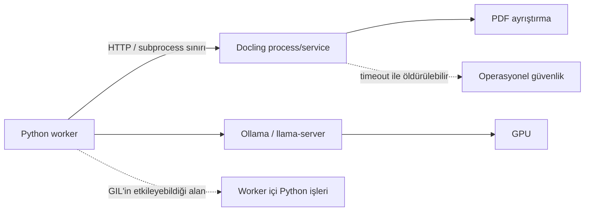

# Free-threaded Python ve C-extension uyumluluğu: sonuç raporu

**Tarih:** 3 Eylül 2026

**Kapsam:** Python 3.13+ free-threaded ortamda NumPy, PyTorch ve Docling zincirinin
çok iş parçacığı altında çökme, kilitlenme ve çıktı tutarlılığı açısından
değerlendirilmesi.

**Sonuç:** NumPy ve PyTorch free-threaded kapıları geçti; Docling kolu production pin
setindeki upstream wheel/native packaging engeli nedeniyle **blocked-with-evidence**
durumunda kapatılmalıdır.

NumPy ve PyTorch için free-threaded kapılar geçti. Docling tarafı ise test edilmeden
bırakılmadı; production pin seti CPython free-threaded ortamda kurulmaya çalışıldı,
bağımlılık zinciri paketleme sınırına kadar götürüldü ve engelin bizim uygulama
kodumuzdan değil upstream wheel/native build tarafındaki olgunluk eksikliğinden geldiği
kanıtlandı.

## Yönetici özeti

Bu çalışma iki soruya cevap verdi:

1. **Free-threaded Python bugün bu platforma performans kazancı sağlar mı?**
   Hayır. Python worker içinde GIL ile ilişkili serileşme ölçüldü, ancak gerçek koşularda
   worker CPU payı çok küçük kaldı. Gözlenen ana kapasite sınırı LLM/`llama-server` ve
   tek GPU tarafında.

2. **NumPy, PyTorch ve Docling free-threaded ortamda güvenle çalıştırılabiliyor mu?**
   Kısmen. NumPy ve PyTorch CPython 3.14.7 free-threaded ortamda import, GIL durumu,
   çok-thread stres ve klasik/free-threaded çıktı karşılaştırma kapılarını geçti.
   Docling production zinciri ise free-threaded ortamda kurulamadı; bu nedenle Docling
   için runtime stres sonucu varmış gibi raporlanmamalı.

Bu yüzden öneri şudur: **free-threaded Python geçişi yapılmasın; Docling için upstream
`cp314t` wheel desteği beklenene kadar görev kanıtlı engel olarak kapatılsın.**

## Production mimarisi açısından anlamı

Docling bu platformda worker thread'i içinde çalışan sıradan bir kütüphane gibi
kullanılmıyor. Ağır PDF ayrıştırma ayrı interpreter/process/service yolunda çalışıyor.
Bu bilinçli bir tasarım kararı: süreyi aşan bir thread bellek ve GPU kaynağını bırakmadan
çalışmaya devam edebilir; ayrı process ise güvenli biçimde öldürülebilir.



Bu nedenle Docling'i free-threaded worker içine taşımak bu platformda doğal bir optimizasyon
değil; mevcut öldürülebilir-timeout güvenliğini zayıflatabilecek bir mimari değişikliktir.

## Test edilenler ve sonuç

| Alan | Ne yapıldı? | Sonuç |
|---|---|---|
| CPython free-threaded ortam | CPython 3.14.7 free-threaded yorumlayıcı kuruldu; GIL'in kapalı başladığı doğrulandı | Geçti |
| NumPy | NumPy 2.5.2 free-threaded ortama kuruldu; import sonrası GIL kapalı kaldı; 1/2/4/8 thread CPU stres matrisi çalıştı | Geçti |
| PyTorch | PyTorch 2.13.0+cpu free-threaded ortama kuruldu; import sonrası GIL kapalı kaldı; tensor ve ortak model inference stresleri çalıştı | Geçti |
| Klasik/free-threaded karşılaştırma | Aynı Python 3.14.7 sürümünün klasik ve free-threaded ortamlarında NumPy/PyTorch digestleri karşılaştırıldı | Geçti |
| Docling free-threaded kurulum | Production pin setiyle Docling zinciri free-threaded ortamda kurulmaya çalışıldı | Engelli |
| Docling klasik çalışma kapısı | `.venv-docling` içinde gerçek Docling ile düşük riskli CPU thread matrisi çalıştırıldı | Geçti |
| CUDA/Docling production stres | CUDA kolu GPU nedeniyle değil, Docling free-threaded kurulum engeli nedeniyle çalıştırılmadı; GPU erişimi bu raporun kabul kararını değiştirmiyor | Engelli — sebep paketleme |

## NumPy ve PyTorch bulguları

Free-threaded ortamda dört workload çalıştırıldı:

- NumPy integer matmul
- NumPy float linalg/ufunc
- PyTorch tensor işlemleri
- PyTorch ortak model inference

Matris 1/2/4/8 thread seviyelerinde, her vaka ayrı child process içinde ve timeout/crash
sınıflandırmasıyla koştu. Native iç thread sayıları 1'e sabitlendi; böylece test Python
thread davranışını daha temiz ölçtü.

Özet sonuç:

| Ölçüt | Sonuç |
|---|---:|
| Free-threaded workload sayısı | 4 |
| Thread seviyeleri | 1, 2, 4, 8 |
| Toplam yüksek tekrarlı operasyon | 600.000 |
| Geçen vaka | 16 / 16 |
| Çökme / sinyal ile kapanma | 0 |
| Timeout / deadlock şüphesi | 0 |
| Digest ayrışması | 0 |
| Import sonrası GIL'in yeniden açılması | Görülmedi |

Bu sonuç NumPy ve PyTorch için olumlu bir C-extension uyumluluk sinyalidir.

Kapıların yanında ikinci bir gözlem çıktı: GIL kapalıyken bu workload'lar gerçekten
paralelleşti. Aynı koşunun operasyon/saniye değerleri, 1 thread'e göre 8 thread'de:

| Workload | 1 thread | 8 thread | Ölçeklenme |
|---|---:|---:|---:|
| NumPy integer matmul | 228,8 op/sn | 1.800,7 op/sn | **7,87×** |
| NumPy float linalg/ufunc | 24.426 op/sn | 163.700 op/sn | **6,70×** |
| PyTorch tensor | 580,4 op/sn | 4.427,5 op/sn | **7,63×** |
| PyTorch model inference | 5.291,6 op/sn | 27.523,6 op/sn | **5,20×** |

Bu, klasik yorumlayıcıda ölçülen parse hattı tablosunun tam tersidir (aşağıda: 16
thread'de 0,27–0,96×). Yani free-threading bu kütüphanelerde yalnız "çökmüyor" değil,
amaçladığı paralelliği de veriyor.

**İki sınır birlikte okunmalı.** Bu bir throughput benchmark'ı değildir; workload'lar
deterministik güvenlik/stres kapılarıdır ve native iç thread sayıları 1'e sabitlenmiştir.
Daha önemlisi, bunlar bu platformun production çağrıları da değildir: `src/` altında
NumPy'a veya PyTorch'a doğrudan tek bir çağrı yoktur — ikisi de yalnız Docling'in altında
çalışır. Dolayısıyla bu iki kütüphane için sonuç **kütüphane düzeyinde** geçerlidir;
platformun production yolunun free-threaded kanıtı Docling'e bağlıdır ve o kol engellidir.

## Docling bulguları

Docling tarafında engel runtime aşamasında değil, kurulum/paketleme aşamasında ortaya
çıktı. Production Docling zinciri CPython 3.14 free-threaded ortamda denendi ve
bağımlılık zinciri paketleme sınırına kadar götürüldü.

Buradaki eksik, bizim repoda unutulmuş bir ayar veya makinede kurulmamış sıradan bir paket
değildir. Sorun, production'da kullandığımız Docling sürümü ve onun native bağımlılıklarının
free-threaded Python etiketi olan `cp314t` için hazır wheel yayımlamaması veya kaynak
kurulumda free-threaded CPython ile uyumsuz build varsayımlarına sahip olmasıdır. Bu yüzden
“desteği beklemek”, kendi kodumuzda bir TODO beklemek değil; Docling ve alt bağımlılıklarının
resmi paketleme desteğinin olgunlaşmasını beklemek anlamına gelir.

| Bağımlılık alanı | Gözlenen sorun |
|---|---|
| `docling-parse` | Native CMake/Ninja zincirinde `cp314t` kuruluma uygun hazır yol yok; qpdf/zlib/jpeg çözümleme engeli |
| `tokenizers` | Production pin için free-threaded wheel boşluğu |
| `safetensors` | Production pin için free-threaded wheel boşluğu |
| `opencv-python` | Production pin için free-threaded wheel boşluğu |
| `pyclipper` / `rapidocr` zinciri | Free-threaded wheel boşluğu |
| tree-sitter grammar paketleri | Limited API ve free-threaded build uyumsuzluğu; deneysel patch ile aşılabildi ama bu production kanıtı sayılmaz |

Bu aşamada Docling'i yamalı bir zincirle kurmaya devam etmek teknik olarak mümkün olabilir,
ama elde edilecek sonuç production uyumluluk kanıtı olmaz. “Yamayla çalıştı” cevabı,
bu görevin sorduğu “production pin seti free-threaded ortamda güvenilir mi?” sorusunu
karşılamaz.

Yine de gerçek Docling runner'ı boş bırakılmadı. `.venv-docling` içinde klasik
yorumlayıcıda (CPython 3.10.12, Docling 2.120.1) gerçek bir PDF ile sınırlı CPU thread
matrisi koşuldu. Girdi `turkce_makale.pdf` (6 sayfa, sha256 `d77d8ac2…`), thread başına
1 tekrar, CPU accelerator ve tek native thread:

| Mod | Thread | Sonuç | Süre | Digest |
|---|---:|---|---:|---|
| shared converter | 1 | Geçti | 61,0 sn | Aynı |
| shared converter | 2 | Geçti | 70,2 sn | Aynı |
| per-thread converter | 1 | Geçti | 64,5 sn | Aynı |
| per-thread converter | 2 | Geçti | 76,5 sn | Aynı |

Bu testte çökme, timeout veya markdown digest ayrışması görülmedi. Klasik yorumlayıcıda
`sys._is_gil_enabled()` bulunmadığı için GIL kapısı bu kolda "API yok" olarak kaydedildi
(`gil_status_api_available: false`); kapı yalnız klasik kolda gevşetildi, free-threaded
kolda `None` hâlâ başarısızlık sayılır.

Bu koşunun iki bilinçli sınırı var: test edilen sürüm production pin'i olan **2.121.0
değil 2.120.1**, ve matris 1/2 thread ile sınırlı tutuldu. İkisi de kasıtlı — amaç
Docling'in thread davranışı hakkında iddia üretmek değil, runner'ın gerçek Docling ile
işlediğini ve wheel'ler yayımlandığında karşılaştırma kapısının hazır olduğunu
göstermektir. Bu bir free-threaded Docling kanıtı değildir.

## Performans bağlamı

Bu uyumluluk çalışmasının öncesinde, aynı altyapıyla GIL ölçeklenme çalışması yapıldı.
Sonuçları burada özet biçimde tutuluyor, çünkü "geçiş yapılmasın" kararının ölçülmüş
dayanağı budur.

**Ölçüm aracı önce kendi üstünde doğrulandı.** Davranışı önceden bilinen üç kontrol, 4
thread'de beklenen değerleri verdi: GIL bırakan iş **3,99×**, I/O benzeri iş **3,99×**,
saf Python işi **0,33×**. Yani araç paralelliği görebiliyor; aşağıdaki sonuç harness'ın
thread çalıştıramamasından gelmiyor.

**Parse hattındaki altı gerçek production çağrısı ölçeklenmedi.** `s(16)`, 16 thread ile
tamamlanan iş miktarının tek thread'e oranıdır; ideal değer 16'dır. CPython 3.11.16,
16 çekirdek, 5 thread seviyesi, 20 tekrar, toplam 600 ölçüm:

| Çağrı | s(16) | GIL oranı |
|---|---:|---:|
| `passages.chunk_document` | 0,27 | 0,782 |
| `critic.evaluate_pages` | 0,33 | 0,784 |
| `gate.bayrakla` | 0,33 | 0,738 |
| `merge.birlestir` | 0,34 | 0,835 |
| `gate.sayfa_secici` | 0,35 | 0,811 |
| `inspector.extract_pages` | 0,96 | 0,650 |

**Ölçeklenmeme GIL ile ilişkili.** Normal profil ile yalnız GIL tutan örnekleri gösteren
profil karşılaştırıldı: saf Python kontrolünde oran **0,698**, GIL bırakan kontrolde
**0,088**. Altı gerçek çağrı 0,650–0,835 aralığında, yani GIL tutan kontrol grubuna
yakın çıktı; ayrıca CPU zamanı yaklaşık tek çekirdekte tavan yaptı. Sonuç ikinci bir
rastgele sıra ve yapısal olarak farklı ikinci bir PDF ile tekrarlandı.

**Ama GIL'in erişebildiği alan küçük.** İki gerçek araştırma koşusunda bileşen CPU
tüketimi:

| Bileşen | Hafif koşu ort. CPU | Ağır koşu ort. CPU | Ağır koşu zirve |
|---|---:|---:|---:|
| `llama-server` | 6,694 çekirdek | 4,219 çekirdek | 8,015 |
| Docling | 0,031 | 0,207 | 1,761 |
| Python worker | 0,010 | 0,032 | 1,264 |
| Sistem toplamı | 6,968 | 5,288 | 14,365 |

İki ölçüm birlikte okunduğunda karar netleşiyor: **GIL parse hattında ölçülebilir bir
sınırdır, fakat bugün sistem kapasitesini belirleyen sınır değildir.** Worker'ın toplam
CPU içindeki ortalama payı küçük; GIL'in etkileyebileceği pay ise worker'ın tamamından
da büyük olamaz. Eğer amaç hız veya kapasiteyse öncelik GIL değil, LLM/GPU yerleşimi ve
model eşzamanlılığı olmalıdır.

Bu bölümün sınırları: bileşen ölçümleri iki koşu ve tek donanım yapılandırmasıyla
sınırlıdır, farklı koşu pencerelerinden geldikleri için tek bir kesin yüzdeye
indirgenmemelidir, ve dört eşzamanlı gerçek koşu birlikte profillenmemiştir.

## Neden task passed değil?

Görev metni Docling'i de Python 3.13+ free-threaded ortamda çoklu iş parçacığı altında
test etmeyi istiyor. Docling production pin seti bu ortama kurulamadığı için bu koşul
tamamlandı denemez. Bu durum yerel kurulum eksiği değil, kullanılan üçüncü taraf paket
zincirinin free-threaded Python için henüz resmi wheel/native build desteği vermemesidir.

Buna rağmen bu bir eksik test değil, kanıtlı engeldir:

- Free-threaded yorumlayıcı kuruldu.
- NumPy ve PyTorch aynı ortamda başarıyla test edildi.
- Docling production zinciri kurulmaya çalışıldı.
- Engelin bizim koddan değil, upstream wheel/native packaging tarafından geldiği
  gösterildi.
- Yamalı zincirle devam etmenin production kanıtı üretmeyeceği değerlendirildi.
- Klasik gerçek Docling runner'ı ayrıca çalıştırılarak test altyapısının gerçek Docling
  ile işlediği doğrulandı.

Sonuç olarak NumPy ve PyTorch için free-threaded C-extension uyumluluk kapıları geçmiştir.
Docling için ise production pin seti CPython free-threaded ortamda resmi wheel/native
packaging engeli nedeniyle kurulamadığından, çalışma tam başarı olarak değil kanıtlı
ekosistem engeli olarak değerlendirilmelidir.

## Mevcut sistem için öneri

1. **Free-threaded Python'a geçiş yapılmamalı.** Bugünkü darboğaz Python worker değil.
2. **Docling mevcut ayrı process/service mimarisinde kalmalı.** Bu yol güvenli timeout
   ve kaynak temizliği için daha doğru.
3. **Docling free-threaded konusu upstream wheel desteği çıkana kadar beklemeli.**
   Üçüncü taraf paketleri yamalayarak production uyumluluk iddiası kurulmasın.
4. **Performans için sonraki ölçüm LLM/GPU tarafında yapılmalı.** `llama-server` yaklaşık
   8 çekirdekte tavana yaklaşıyor; gerçek kapasite kazancı orada aranmalı.

## Kanıt dosyaları

| Dosya | İçerik |
|---|---|
| `research/gil-scaling/results/free_threaded_stress_soak.json` | NumPy/PyTorch free-threaded yüksek tekrarlı CPU stres sonucu |
| `research/gil-scaling/results/classic_314_stress_reference.json` | Aynı workload'ların klasik CPython 3.14 referansı |
| `research/gil-scaling/results/free_threaded_docling_install.json` | Docling free-threaded kurulum engeli ve kapanış kararı |
| `research/gil-scaling/results/classic_docling_stress_cpu_limited.json` | Gerçek Docling klasik CPU limited matrix sonucu |
| `research/gil-scaling/results/classic_docling_stress_inductor_error.json` | Production ayarı eklenmeden önce yakalanan Torch Inductor/g++ hatası |
| `research/gil-scaling/results/classic_docling_stress_smoke.json` | Docling runner'ın ilk uçtan uca duman testi |
| `research/gil-scaling/artifacts/docling-parse-7.15.0-patched-cmake/` | Deneysel `docling-parse` CMake patch izleri |
| `OPEN_ITEMS.md` madde 35 | Docling free-threaded engelinin repo genel açık iş kaydı |

Performans bağlamı bölümündeki sayıların kaynakları:

| Dosya | İçerik |
|---|---|
| `research/gil-scaling/results/harness_self_check.json` | Ölçüm aracının üç kontrol üzerindeki öz denetimi (3,99× / 0,33×) |
| `research/gil-scaling/results/thread_scaling_summary.json` | Altı parse çağrısının 1/2/4/8/16 thread ölçeklenme özeti |
| `research/gil-scaling/results/thread_scaling.json` | Aynı ölçümün 600 satırlık ham verisi |
| `research/gil-scaling/results/gil_ratio.json` | Normal ve yalnız-GIL profillerinden okunan GIL oranları |
| `research/gil-scaling/results/replication_seed2.json`, `replication_pdf2.json` | İkinci rastgele sıra ve ikinci PDF ile tekrar |
| `research/gil-scaling/results/run_breakdown.json` | Geçmiş koşuların worker CPU dağılımı |
| `research/gil-scaling/results/container_cpu_hafif.json`, `container_cpu_agir.json` | Hafif ve ağır koşuda bileşen CPU ölçümü |

## Yeniden çalıştırma

Ortamı kurma:

```bash
UV_CACHE_DIR=/tmp/research-platform-uv-cache \
UV_PYTHON_INSTALL_DIR=/tmp/research-platform-python \
  uv python install 3.14t

UV_CACHE_DIR=/tmp/research-platform-uv-cache \
UV_PYTHON_INSTALL_DIR=/tmp/research-platform-python \
  uv venv --python 3.14t /tmp/research-platform-venv314t
```

Deneyleri koşma:

```bash
# Ortam ön kontrolü: build, GIL durumu, importlar, native modüller
/tmp/research-platform-venv314t/bin/python scripts/probe_free_threaded_compat.py \
  --out research/gil-scaling/results/free_threaded_probe_torch.json

# NumPy/PyTorch yüksek tekrarlı CPU matrisi (600.000 operasyon)
/tmp/research-platform-venv314t/bin/python scripts/run_free_threaded_stress.py \
  --reps 10000 --timeout 900 \
  --reference research/gil-scaling/results/classic_314_stress_reference.json \
  --out research/gil-scaling/results/free_threaded_stress_soak.json

# Gerçek Docling ile klasik CPU matrisi
.venv-docling/bin/python scripts/run_free_threaded_docling_stress.py \
  --pdf research/pdf-parser/corpus/kendi/turkce_makale.pdf \
  --modes shared,per_thread --threads 1,2 --reps 1 \
  --out research/gil-scaling/results/classic_docling_stress_cpu_limited.json
```

## Doğrulama

Son doğrulama komutları başarıyla çalıştı:

```bash
# Bu çalışmanın hedefli testleri
.venv311/bin/python -m pytest \
  tests/test_free_threaded_compat_probe.py \
  tests/test_free_threaded_stress.py \
  tests/test_free_threaded_docling_stress.py -q

# GIL ölçüm araçları ve workload sözleşmesi
.venv311/bin/python -m pytest \
  tests/test_gil_workload_contract.py \
  tests/test_thread_scaling_harness.py \
  tests/test_container_cpu_sampler.py -q

# Tüm proje paketi ve lint
.venv311/bin/python -m pytest -q
.venv311/bin/python -m ruff check \
  scripts/run_free_threaded_docling_stress.py \
  tests/test_free_threaded_docling_stress.py
```

Sonuç:

| Kontrol | Sonuç |
|---|---|
| Free-threaded hedefli testler | **21 geçti** |
| GIL ölçüm aracı testleri | **33 geçti** |
| Tüm proje test paketi | **784 geçti** |
| Değişen dosyalarda Ruff | **Temiz** |
| JSON sonuç dosyaları | **Geçerli** |
| Production kaynak kodu değişikliği | **Yok** |

Tam paketteki tek uyarı, mevcut Starlette `TestClient` kullanımının gelecekte
değişeceğini bildiren ve bu çalışmadan bağımsız bir deprecation uyarısıdır.
